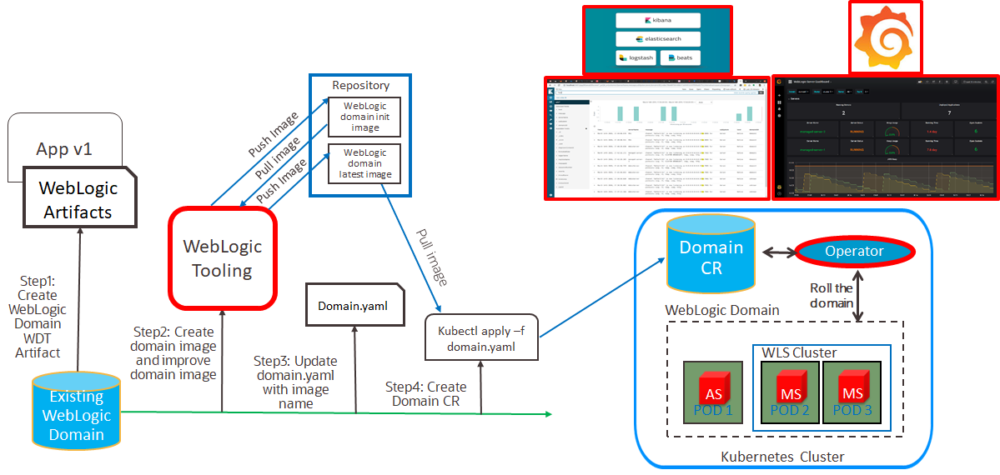
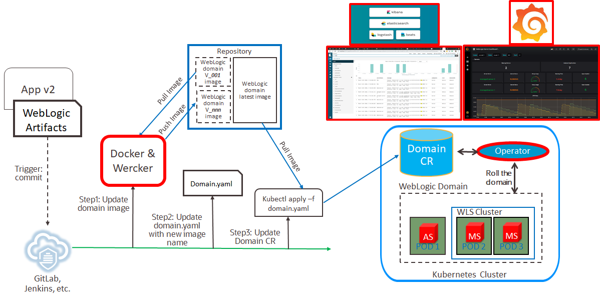

# Welcome to Oracle WebLogic Move and Improve Hands On Lab #

## About this hands-on Hands On Lab ##

This Hands On Lab main purpose is to show how to modernization of existing WebLogic Domain so that WebLogic's user will be able to experience WebLogic's improvement in this agile era. This hands on lab is made based on the [WebLogic Kubernetes Operator Documentation](https://oracle.github.io/weblogic-kubernetes-operator/) also various references and has been tested by May 2020. If you have any questions or inquiries please email me to tazlambert@gmail.com.

**Note:** This is a work in progress tutorial, will be updating as soon as finding some interesting topic to add.

The Hands On Lab will demonstrates:
+ **Move and improve existing WebLogic Domain** using [Weblogic Deploy Tooling](https://github.com/oracle/weblogic-deploy-tooling) and [WebLogic Image Tool](https://github.com/oracle/weblogic-image-tool). WebLogic improve is done by REST enabling Weblogic metrics for monitoring using [WebLogic Monitoring Exporter](https://github.com/oracle/weblogic-monitoring-exporter) and making WebLogic Log into JSON to be consumed by Elasticsearch using [WebLogic Logging Exporter](https://github.com/oracle/weblogic-logging-exporter) 
+ **Automating WebLogic Domain Lifecycle in CI/CD process**, which will include working with [Oracle Cloud Infrastructure](https://docs.cloud.oracle.com/en-us/iaas/Content/GSG/Concepts/baremetalintro.htm), [Oracle Container Pipelines/Wercker](https://docs.oracle.com/en/cloud/iaas/wercker-cloud/wercm/), [Oracle Container Engine for Kubernetes](https://docs.cloud.oracle.com/en-us/iaas/Content/ContEng/Concepts/contengoverview.htm), [Github](https://github.com/), [Oracle Registry](https://docs.cloud.oracle.com/en-us/iaas/Content/Registry/Concepts/registryoverview.htm), and lastly [WebLogic Kubernetes Operator](https://github.com/oracle/weblogic-kubernetes-operator).

This lab is designed for people with some experience with OCI, Kubernetes, WebLogic, and no experience with WebLogic Tooling, Container Registry, Docker and want to learn the core concepts and basics of how to run WebLogic JEE application on Kubernetes environment.

## Prerequisites ##

+ **[Oracle Cloud Infrastructure](https://cloud.oracle.com/en_US/cloud-infrastructure)** enabled account. The tutorial has been tested using [Trial account](https://myservices.us.oraclecloud.com/mycloud/signup) (as of April, 2020).
+ **Linux Desktop with Oracle Cloud Infrastructure CLI, kubectl, helm.** Preferred to have bastion host in OCI
+ **[Docker](https://hub.docker.com/signup) account.**
+ **[Github](https://github.com/join) account.**
+ **[Oracle Container Pipeline](https://app.wercker.com/users/new?return_url=/) account.**
+ **[Oracle Support](https://support.oracle.com/portal/) account.**

## Two major topics to be covered in this tutorial: ##

### Moving Existing WebLogic Domain into Docker Image and Improve WebLogic Domain's Monitoring and Logging ###

This will demonstrate the process of moving existing WebLogic domain into docker image using WDT and WIT. The domain will contain demo Web Application which is a simple JSP page which shows WebLogic Domain's MBean attributes. During moving process, improvement process also being done by adding new monitoring and logging capability using WME and WLE. Below is the illustration

1. [Create existing WebLogic domain artifact backup](tutorials/create.domain.artifact.md)
2. [Create Docker image from existing WebLogic domain](tutorials/create.domain.docker.image.md)
3. [Setup Oracle Kubernetes Engine to orchestrate the Docker image](tutorials/setup.oke.md)
4. [Setup WebLogic Kubernetes Operator to orchestrate WebLogic in Kubernetes](tutorials/setup.wko.md)
5. [Update Docker image to improve existing WebLogic domain](tutorials/update.domain.docker.image.md)

### Automate WebLogic WebLogic Domain Lifecycle in CI/CD process on Kubernetes  ###

This will demonstrate how to enable CI/CD process on the WebLogic domain, where everytime there is a new code commit in the code repository the whole process of creating image, deploying image will be done automatically, below is the illustrationg

1. [Setup Oracle Container Pipelines (Wercker) to Enable CI/CD for WebLogic Application](tutorials/setup.oracle.pipeline.md)
2. [Setup Prometheus and Grafana for WebLogic Monitoring](tutorials/setup.prometheus.grafana.md)
3. [Deploy WebLogic Domain to Kubernetes](tutorials/deploy.weblogic.md)
4. [Deploy Ingress Load Balancer for WebLogic in Kubernetes](tutorials/deploy.load.balancer.md)
5. [Scaling WebLogic Cluster](tutorials/scale.weblogic.md)
6. [Override JDBC Datasource parameters](tutorials/override.jdbc.md)
7. [Update Web Application](tutorials/update.application.md)
8. [Assigning WebLogic Pods to Nodes](tutorials/node.selector.md)
9. [Assigning WebLogic Pods to Licensed Nodes](tutorials/node.selector.license.md)

## Components ##

By the time this hands on lab created below are the tools that being used and its version:

### WebLogic Tooling ###
+ **[Oracle Weblogic Deploy Tooling (WDT) v1.8.1](https://github.com/oracle/weblogic-deploy-tooling/releases/tag/weblogic-deploy-tooling-1.8.1)** 
+ **[Oracle Weblogic Image Tooling (WIT) v1.8.5](https://github.com/oracle/weblogic-image-tool/releases/tag/release-1.8.5)** 
+ **[Oracle Weblogic Monitoring Exporter (WME) v1.1.2](https://github.com/oracle/weblogic-monitoring-exporter/releases/tag/v1.1.2)** 
+ **[Oracle Weblogic Logging Exporter (WLE) v1.0.0](https://github.com/oracle/weblogic-logging-exporter/releases/tag/v1.0.0)** 
+ **[Oracle Weblogic Kubernetes Operator (WKO) v2.5.0](https://github.com/oracle/weblogic-kubernetes-operator/releases/tag/v2.5.0)** 
### Others Tooling ###
+ **[Oracle Command Line Interface (OCI) v2.10.1](https://github.com/oracle/oci-cli/releases/tag/v2.10.1)**
+ **[Kubectl v1.18.0](https://github.com/kubernetes/kubectl/releases/tag/kubernetes-1.18.0)**  
+ **[Helm v2.16.6](https://github.com/helm/helm/releases/tag/v2.16.6)** 
+ **[Kubernetes v1.15.7](https://docs.cloud.oracle.com/en-us/iaas/releasenotes/changes/37013251-39b2-4c08-8536-906d76bba789/)** 
+ **[Kube Prometheus v0.3.0](https://github.com/coreos/kube-prometheus/releases/tag/v0.3.0)** 
+ **[Elasticsearch v6.8.0](https://github.com/elastic/elasticsearch/releases/tag/v6.8.0)** 
+ **[Kibana v6.8.0](https://github.com/elastic/kibana/releases/tag/v6.8.0)** 

## References ##

1. [Automating WebLogic Deployment - CI/CD with WebLogic Tooling](https://blogs.oracle.com/weblogicserver/automating-weblogic-deployment-cicd-with-weblogic-tooling)
2. [Oracle WebLogic Server Kubernetes Operator Documentation](https://oracle.github.io/weblogic-kubernetes-operator/)
3. [Oracle WebLogic Server Deploy Tooling](https://github.com/oracle/weblogic-deploy-tooling/blob/master/README.md)
4. [Oracle WebLogic Image Tool](https://github.com/oracle/weblogic-image-tool/blob/master/README.md)
5. [Oracle WebLogic Monitoring Exporter](https://github.com/oracle/weblogic-monitoring-exporter/blob/master/README.md)
6. [Oracle WebLogic Logging Exporter](https://github.com/oracle/weblogic-logging-exporter/blob/master/README.md)
7. [Oracle Weblogic Server Kubernetes Operator Samples](https://github.com/oracle/weblogic-kubernetes-operator/tree/master/kubernetes/samples)
8. [Oracle WebLogic Tutorial](https://github.com/nagypeter/weblogic-operator-tutorial)
9. [End to end example of monitoring WebLogic Server in Kubernetes](https://blogs.oracle.com/weblogicserver/end-to-end-example-of-monitoring-weblogic-server-with-grafana-dashboards-on-the-oci-container-engine-for-kubernetes)
10.[Using Prometheus to Automatically Scale WebLogic Clusters on Kubernetes](https://blogs.oracle.com/weblogicserver/using-prometheus-to-automatically-scale-weblogic-clusters-on-kubernetes-v5)
11.[Scaling a WebLogic cluster](https://github.com/oracle/weblogic-kubernetes-operator/blob/master/site/v1.1/scaling.md) 

## License ##
Copyright (c) 2020 Oracle and/or its affiliates
The Universal Permissive License (UPL), Version 1.0
