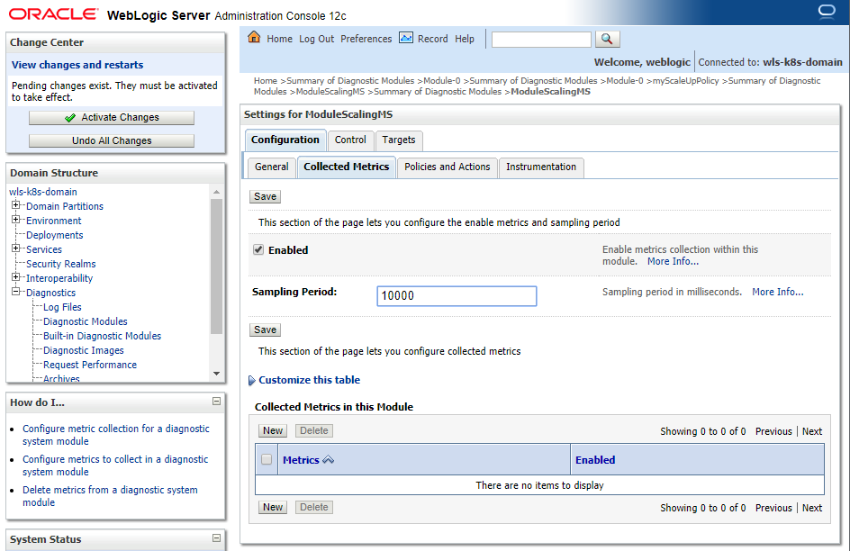

# Auto Scaling WebLogic Cluster using WLDF #

#### Scaling WebLogic cluster ####

The WebLogic Diagnostics Framework (WLDF) is a suite of services and APIs that collect and surface metrics that provide visibility into server and application performance. To support automatic scaling of WebLogic clusters in Kubernetes, WLDF provides the Policies and Actions component, which lets you write policy expressions for automatically executing scaling operations on a cluster. These policies monitor one or more types of WebLogic Server metrics, such as memory, idle threads, and CPU load. When the configured threshold in a policy is met, the policy is triggered, and the corresponding scaling action is executed. The WebLogic Server Kubernetes Operator project provides a shell script, scalingAction.sh, for use as a Script Action, which illustrates how to issue a request to the operator’s REST endpoint.

For this labs we are going to monitor http sessions of testwebapp application that we deploy to scale up or scale down and we are going to copy the original scalingAction.sh into 2 shell script; one is to scale up, scalingActionUp.sh, and one to scale down, scalingActionDown.sh. Here is the original parameter (line 7-17) that is needed to be change:
```
# script parameters
scaling_action=""
wls_domain_uid=""
wls_cluster_name=""
wls_domain_namespace="default"
operator_service_name="internal-weblogic-operator-svc"
operator_namespace="weblogic-operator"
operator_service_account="weblogic-operator"
scaling_size=1
access_token=""
kubernetes_master="https://${KUBERNETES_SERVICE_HOST}:${KUBERNETES_SERVICE_PORT}"
```
The script `scalingAction.sh`, specified in the WLDF script action above, needs the appropriate RBAC permissions granted for the service account user (in the namespace in which the WebLogic domain is deployed) in order to query the Kubernetes API server for both configuration and runtime information of the domain custom resource. The following is an example YAML file for creating the appropriate Kubernetes cluster role bindings:

```
cat << EOF | kubectl apply -f -
kind: ClusterRole
apiVersion: rbac.authorization.k8s.io/v1beta1
metadata:
  name: weblogic-domain-cluster-role
rules:
- apiGroups: ["weblogic.oracle"]
  resources: ["domains"]
  verbs: ["get", "list", "update"]
---
kind: ClusterRoleBinding
apiVersion: rbac.authorization.k8s.io/v1beta1
metadata:
  name: domain-cluster-rolebinding
subjects:
- kind: ServiceAccount
  name: default
  namespace: wls-k8s-domain-ns
  apiGroup: ""
roleRef:
  kind: ClusterRole
  name: weblogic-domain-cluster-role
  apiGroup: "rbac.authorization.k8s.io"
---
kind: RoleBinding
apiVersion: rbac.authorization.k8s.io/v1beta1
metadata:
  name: weblogic-domain-operator-rolebinding
  namespace: weblogic-operator-ns
subjects:
- kind: ServiceAccount
  name: default
  namespace: wls-k8s-domain-ns
  apiGroup: ""
roleRef:
  kind: ClusterRole
  name: cluster-admin
  apiGroup: "rbac.authorization.k8s.io"
EOF  
```
For scalingActionUp.sh it will be:
```
echo "called scalingActionUp.sh" >> scalingActionUp.log

# environment variable from admin-server pod ENV

KUBERNETES_SERVICE_HOST=10.96.0.1
KUBERNETES_SERVICE_PORT=443
INTERNAL_OPERATOR_CERT=LS0tLS1CRUdJTiBDRVJUSUZJQ0FURS0tLS0tCk1JSUR5ekNDQXJPZ0F3SUJBZ0lFYkdpTVREQU5CZ2txaGtpRzl3MEJBUXNGQURBY01Sb3dHQVlEVlFRREV4RjMNClpXSnNiMmRwWXkxdmNHVnlZWFJ2Y2pBZUZ3MHlNREExTVRBd05qRTFOVE5hRncwek1EQTFNRGd3TmpFMU5UTmENCk1Cd3hHakFZQmdOVkJBTVRFWGRsWW14dloybGpMVzl3WlhKaGRHOXlNSUlCSWpBTkJna3Foa2lHOXcwQkFRRUYNCkFBT0NBUThBTUlJQkNnS0NBUUVBcjhkei9ybFMrb2xyTEdacWdSWW1OL3crY0JaRXg4WU0wY2Z2RTY2dlcwa00NCjVja1c3LzFaS0g1SmlzTmlXWHQ4dkpWVTZhbnlBSE51WnpzMnBGT2NydVJMcld0djljK0oyTFg5WkR4N2s0WFcNCjZyR09ObkRoem40c1BCZ0crRCs3M0VMUW4zVkhoR3NwbWZua3JqdEFOSzRGczJqT0Jib0hNa0hLYWIrUTZSb0ENCmhVL2VFT21NczJEcDg1TmlTdXFlTDNVeFFURFZ2ZTJRRlhlWWdyQkl6ODJ4OWZkcXJOem5pN0toU09BbXpxOCsNCmtlL3hlYlU3OFVDMzR3MjZYWGNnVHI0RmdPTkpCaGdpZDZqUVl5V2RoTDRoZWRiUUM4dWtkaUJvak1PdFl1bE8NCmoxdUs3S2c1Z3lEcjF4cktBMlpUY01OM2NkTzFZUHVqL3BRcnNjQU45UUlEQVFBQm80SUJFekNDQVE4d0hRWUQNClZSME9CQllFRlBoaUY2ejYxaHIrYUtpN3NlSUdobGhDR0hLaU1Bc0dBMVVkRHdRRUF3SUQrRENCNEFZRFZSMFINCkJJSFlNSUhWZ2g1cGJuUmxjbTVoYkMxM1pXSnNiMmRwWXkxdmNHVnlZWFJ2Y2kxemRtT0NNMmx1ZEdWeWJtRnMNCkxYZGxZbXh2WjJsakxXOXdaWEpoZEc5eUxYTjJZeTUzWldKc2IyZHBZeTF2Y0dWeVlYUnZjaTF1YzRJM2FXNTANClpYSnVZV3d0ZDJWaWJHOW5hV010YjNCbGNtRjBiM0l0YzNaakxuZGxZbXh2WjJsakxXOXdaWEpoZEc5eUxXNXoNCkxuTjJZNEpGYVc1MFpYSnVZV3d0ZDJWaWJHOW5hV010YjNCbGNtRjBiM0l0YzNaakxuZGxZbXh2WjJsakxXOXcNClpYSmhkRzl5TFc1ekxuTjJZeTVqYkhWemRHVnlMbXh2WTJGc01BMEdDU3FHU0liM0RRRUJDd1VBQTRJQkFRQUENCjdzMnB5dk1FSG9lTGR6ZGN1NHk1VmtBZWdiVHlTR2MwTWUwUkR0elNBUVB6N0lCQllNLzg0R2ZkZGlmVWxwSkUNCnM1RGdmOWcxb2hzN0JBWDNZNlFOTVI3c2tDQ2o2OEUzK0RRSkpBUUUvbXhEak9mTnBvUGl3Z1QzMUcxSzdmelANCk40OUQ4Y09VZjNyTmVDaWhvREV6dDRROFlNb0RybHd6WTNzVnRDZXRLdzV3d1h1Ry9FakI2dEhwL2FXeGFSTE8NCndmMVN6RmVBTllmMDdrVkl4ZE5wbFV5RFdLYVN4VUhEYnhvM3d0YzBaQm1sU1VYNEFCZlRtOU1HZzZOcGp1ZlkNClpEOUVDNE40T2xGU0REYmpLSXBHL0Z0RTJXdHR4cHBrbGZLSDdzS3I0V1JlY2hCclBsNk9MNDVJUlFCdkVSZDkNCnhSZlNVWEJ2bFQ5Q3BHcG1ZZmN4Ci0tLS0tRU5EIENFUlRJRklDQVRFLS0tLS0K

# script parameters
scaling_action="scaleUp"
wls_domain_uid="wls-k8s-domain"
wls_cluster_name="cluster-1"
wls_domain_namespace="wls-k8s-domain-ns"
operator_service_name="internal-weblogic-operator-svc"
operator_namespace="weblogic-operator-ns"
operator_service_account="weblogic-operator-sa"
scaling_size=1
access_token=""
kubernetes_master="https://${KUBERNETES_SERVICE_HOST}:${KUBERNETES_SERVICE_PORT}"
```
For scalingActionDown.sh it will be:
```
echo "called scalingActionDown.sh" >> scalingActionDown.log

# environment variable from admin-server pod ENV

KUBERNETES_SERVICE_HOST=10.96.0.1
KUBERNETES_SERVICE_PORT=443
INTERNAL_OPERATOR_CERT=LS0tLS1CRUdJTiBDRVJUSUZJQ0FURS0tLS0tCk1JSUR5ekNDQXJPZ0F3SUJBZ0lFYkdpTVREQU5CZ2txaGtpRzl3MEJBUXNGQURBY01Sb3dHQVlEVlFRREV4RjMNClpXSnNiMmRwWXkxdmNHVnlZWFJ2Y2pBZUZ3MHlNREExTVRBd05qRTFOVE5hRncwek1EQTFNRGd3TmpFMU5UTmENCk1Cd3hHakFZQmdOVkJBTVRFWGRsWW14dloybGpMVzl3WlhKaGRHOXlNSUlCSWpBTkJna3Foa2lHOXcwQkFRRUYNCkFBT0NBUThBTUlJQkNnS0NBUUVBcjhkei9ybFMrb2xyTEdacWdSWW1OL3crY0JaRXg4WU0wY2Z2RTY2dlcwa00NCjVja1c3LzFaS0g1SmlzTmlXWHQ4dkpWVTZhbnlBSE51WnpzMnBGT2NydVJMcld0djljK0oyTFg5WkR4N2s0WFcNCjZyR09ObkRoem40c1BCZ0crRCs3M0VMUW4zVkhoR3NwbWZua3JqdEFOSzRGczJqT0Jib0hNa0hLYWIrUTZSb0ENCmhVL2VFT21NczJEcDg1TmlTdXFlTDNVeFFURFZ2ZTJRRlhlWWdyQkl6ODJ4OWZkcXJOem5pN0toU09BbXpxOCsNCmtlL3hlYlU3OFVDMzR3MjZYWGNnVHI0RmdPTkpCaGdpZDZqUVl5V2RoTDRoZWRiUUM4dWtkaUJvak1PdFl1bE8NCmoxdUs3S2c1Z3lEcjF4cktBMlpUY01OM2NkTzFZUHVqL3BRcnNjQU45UUlEQVFBQm80SUJFekNDQVE4d0hRWUQNClZSME9CQllFRlBoaUY2ejYxaHIrYUtpN3NlSUdobGhDR0hLaU1Bc0dBMVVkRHdRRUF3SUQrRENCNEFZRFZSMFINCkJJSFlNSUhWZ2g1cGJuUmxjbTVoYkMxM1pXSnNiMmRwWXkxdmNHVnlZWFJ2Y2kxemRtT0NNMmx1ZEdWeWJtRnMNCkxYZGxZbXh2WjJsakxXOXdaWEpoZEc5eUxYTjJZeTUzWldKc2IyZHBZeTF2Y0dWeVlYUnZjaTF1YzRJM2FXNTANClpYSnVZV3d0ZDJWaWJHOW5hV010YjNCbGNtRjBiM0l0YzNaakxuZGxZbXh2WjJsakxXOXdaWEpoZEc5eUxXNXoNCkxuTjJZNEpGYVc1MFpYSnVZV3d0ZDJWaWJHOW5hV010YjNCbGNtRjBiM0l0YzNaakxuZGxZbXh2WjJsakxXOXcNClpYSmhkRzl5TFc1ekxuTjJZeTVqYkhWemRHVnlMbXh2WTJGc01BMEdDU3FHU0liM0RRRUJDd1VBQTRJQkFRQUENCjdzMnB5dk1FSG9lTGR6ZGN1NHk1VmtBZWdiVHlTR2MwTWUwUkR0elNBUVB6N0lCQllNLzg0R2ZkZGlmVWxwSkUNCnM1RGdmOWcxb2hzN0JBWDNZNlFOTVI3c2tDQ2o2OEUzK0RRSkpBUUUvbXhEak9mTnBvUGl3Z1QzMUcxSzdmelANCk40OUQ4Y09VZjNyTmVDaWhvREV6dDRROFlNb0RybHd6WTNzVnRDZXRLdzV3d1h1Ry9FakI2dEhwL2FXeGFSTE8NCndmMVN6RmVBTllmMDdrVkl4ZE5wbFV5RFdLYVN4VUhEYnhvM3d0YzBaQm1sU1VYNEFCZlRtOU1HZzZOcGp1ZlkNClpEOUVDNE40T2xGU0REYmpLSXBHL0Z0RTJXdHR4cHBrbGZLSDdzS3I0V1JlY2hCclBsNk9MNDVJUlFCdkVSZDkNCnhSZlNVWEJ2bFQ5Q3BHcG1ZZmN4Ci0tLS0tRU5EIENFUlRJRklDQVRFLS0tLS0K

# script parameters
scaling_action="scaleDown"
wls_domain_uid="wls-k8s-domain"
wls_cluster_name="cluster-1"
wls_domain_namespace="wls-k8s-domain-ns"
operator_service_name="internal-weblogic-operator-svc"
operator_namespace="weblogic-operator-ns"
operator_service_account="weblogic-operator-sa"
scaling_size=1
access_token=""
kubernetes_master="https://${KUBERNETES_SERVICE_HOST}:${KUBERNETES_SERVICE_PORT}"
```
For those two shell script we need to get the value of KUBERNETES_SERVICE_HOST, KUBERNETES_SERVICE_PORT, and INTERNAL_OPERATOR_CERT from the admin-server pod, which can be done by logging into the pod and use ENV command to show them.
```
kubectl exec -it wls-k8s-domain-admin-server -n wls-k8s-domain-ns -- /bin/bash
env
```
Expected result will be:
```
[oracle@wls-k8s-domain-admin-server wls-k8s-domain]$ env
LOCAL_ADMIN_PROTOCOL=t3
WLS_K8S_DOMAIN_ADMIN_SERVER_EXTERNAL_PORT_7001_TCP=tcp://10.96.213.13:7001
WLS_K8S_DOMAIN_ADMIN_SERVER_EXTERNAL_PORT_30012_TCP_ADDR=10.96.213.13
HOSTNAME=wls-k8s-domain-admin-server
WLS_K8S_DOMAIN_ADMIN_SERVER_EXTERNAL_SERVICE_HOST=10.96.213.13
KUBERNETES_PORT=tcp://10.96.0.1:443
KUBERNETES_PORT_443_TCP_PORT=443
TERM=xterm
WLS_K8S_DOMAIN_ADMIN_SERVER_EXTERNAL_PORT_30012_TCP_PORT=30012
ADMIN_NAME=admin-server
KUBERNETES_SERVICE_PORT=443
KUBERNETES_SERVICE_HOST=10.96.0.1
USER_MEM_ARGS=-Xms64m -Xmx256m
WLS_K8S_DOMAIN_ADMIN_SERVER_EXTERNAL_PORT=tcp://10.96.213.13:30012
LC_ALL=en_US.UTF-8
JAVA_OPTIONS=-Dweblogic.StdoutDebugEnabled=false
LS_COLORS=rs=0:di=01;34:ln=01;36:mh=00:pi=40;33:so=01;35:do=01;35:bd=40;33;01:cd=40;33;01:or=40;31;01:mi=01;05;37;41:su=37;41:sg=30;43:ca=30;41:tw=30;42:ow=34;42:st=37;44:ex=01;32:*.tar=01;31:*.tgz=01;31:*.arc=01;31:*.arj=01;31:*.taz=01;31:*.lha=01;31:*.lz4=01;31:*.lzh=01;31:*.lzma=01;31:*.tlz=01;31:*.txz=01;31:*.tzo=01;31:*.t7z=01;31:*.zip=01;31:*.z=01;31:*.Z=01;31:*.dz=01;31:*.gz=01;31:*.lrz=01;31:*.lz=01;31:*.lzo=01;31:*.xz=01;31:*.bz2=01;31:*.bz=01;31:*.tbz=01;31:*.tbz2=01;31:*.tz=01;31:*.deb=01;31:*.rpm=01;31:*.jar=01;31:*.war=01;31:*.ear=01;31:*.sar=01;31:*.rar=01;31:*.alz=01;31:*.ace=01;31:*.zoo=01;31:*.cpio=01;31:*.7z=01;31:*.rz=01;31:*.cab=01;31:*.jpg=01;35:*.jpeg=01;35:*.gif=01;35:*.bmp=01;35:*.pbm=01;35:*.pgm=01;35:*.ppm=01;35:*.tga=01;35:*.xbm=01;35:*.xpm=01;35:*.tif=01;35:*.tiff=01;35:*.png=01;35:*.svg=01;35:*.svgz=01;35:*.mng=01;35:*.pcx=01;35:*.mov=01;35:*.mpg=01;35:*.mpeg=01;35:*.m2v=01;35:*.mkv=01;35:*.webm=01;35:*.ogm=01;35:*.mp4=01;35:*.m4v=01;35:*.mp4v=01;35:*.vob=01;35:*.qt=01;35:*.nuv=01;35:*.wmv=01;35:*.asf=01;35:*.rm=01;35:*.rmvb=01;35:*.flc=01;35:*.avi=01;35:*.fli=01;35:*.flv=01;35:*.gl=01;35:*.dl=01;35:*.xcf=01;35:*.xwd=01;35:*.yuv=01;35:*.cgm=01;35:*.emf=01;35:*.axv=01;35:*.anx=01;35:*.ogv=01;35:*.ogx=01;35:*.aac=01;36:*.au=01;36:*.flac=01;36:*.mid=01;36:*.midi=01;36:*.mka=01;36:*.mp3=01;36:*.mpc=01;36:*.ogg=01;36:*.ra=01;36:*.wav=01;36:*.axa=01;36:*.oga=01;36:*.spx=01;36:*.xspf=01;36:
WLS_K8S_DOMAIN_ADMIN_SERVER_EXTERNAL_PORT_30012_TCP_PROTO=tcp
WLS_K8S_DOMAIN_ADMIN_SERVER_EXTERNAL_SERVICE_PORT_DEFAULT=7001
OPATCH_NO_FUSER=true
SERVER_OUT_IN_POD_LOG=true
AS_SERVICE_NAME=wls-k8s-domain-admin-server
DOMAIN_NAME=wls-k8s-domain
PATH=/usr/local/sbin:/usr/local/bin:/usr/sbin:/usr/bin:/sbin:/bin:/u01/jdk/bin:/u01/oracle/oracle_common/common/bin:/u01/oracle/wlserver/common/bin:/u01/oracle:$/u01/oracle/user_projects/domains/wls-k8s-domain/bin:/u01/oracle/user_projects/domains/wls-k8s-domain/bin
ADMIN_HOST=wlsadmin
WLS_K8S_DOMAIN_ADMIN_SERVER_EXTERNAL_PORT_7001_TCP_PROTO=tcp
DOMAIN_HOME=/u01/oracle/user_projects/domains/wls-k8s-domain
PWD=/u01/oracle/user_projects/domains/wls-k8s-domain
ADMIN_PORT=7001
SHUTDOWN_IGNORE_SESSIONS=false
JAVA_HOME=/u01/jdk
MANAGED_SERVER_PORT=8001
DOMAIN_UID=wls-k8s-domain
LOG_HOME=/shared/logs/wls-k8s-domain
LOCAL_ADMIN_PORT=7001
SERVICE_NAME=wls-k8s-domain-admin-server
INTERNAL_OPERATOR_CERT=LS0tLS1CRUdJTiBDRVJUSUZJQ0FURS0tLS0tCk1JSUR5ekNDQXJPZ0F3SUJBZ0lFYkdpTVREQU5CZ2txaGtpRzl3MEJBUXNGQURBY01Sb3dHQVlEVlFRREV4RjMNClpXSnNiMmRwWXkxdmNHVnlZWFJ2Y2pBZUZ3MHlNREExTVRBd05qRTFOVE5hRncwek1EQTFNRGd3TmpFMU5UTmENCk1Cd3hHakFZQmdOVkJBTVRFWGRsWW14dloybGpMVzl3WlhKaGRHOXlNSUlCSWpBTkJna3Foa2lHOXcwQkFRRUYNCkFBT0NBUThBTUlJQkNnS0NBUUVBcjhkei9ybFMrb2xyTEdacWdSWW1OL3crY0JaRXg4WU0wY2Z2RTY2dlcwa00NCjVja1c3LzFaS0g1SmlzTmlXWHQ4dkpWVTZhbnlBSE51WnpzMnBGT2NydVJMcld0djljK0oyTFg5WkR4N2s0WFcNCjZyR09ObkRoem40c1BCZ0crRCs3M0VMUW4zVkhoR3NwbWZua3JqdEFOSzRGczJqT0Jib0hNa0hLYWIrUTZSb0ENCmhVL2VFT21NczJEcDg1TmlTdXFlTDNVeFFURFZ2ZTJRRlhlWWdyQkl6ODJ4OWZkcXJOem5pN0toU09BbXpxOCsNCmtlL3hlYlU3OFVDMzR3MjZYWGNnVHI0RmdPTkpCaGdpZDZqUVl5V2RoTDRoZWRiUUM4dWtkaUJvak1PdFl1bE8NCmoxdUs3S2c1Z3lEcjF4cktBMlpUY01OM2NkTzFZUHVqL3BRcnNjQU45UUlEQVFBQm80SUJFekNDQVE4d0hRWUQNClZSME9CQllFRlBoaUY2ejYxaHIrYUtpN3NlSUdobGhDR0hLaU1Bc0dBMVVkRHdRRUF3SUQrRENCNEFZRFZSMFINCkJJSFlNSUhWZ2g1cGJuUmxjbTVoYkMxM1pXSnNiMmRwWXkxdmNHVnlZWFJ2Y2kxemRtT0NNMmx1ZEdWeWJtRnMNCkxYZGxZbXh2WjJsakxXOXdaWEpoZEc5eUxYTjJZeTUzWldKc2IyZHBZeTF2Y0dWeVlYUnZjaTF1YzRJM2FXNTANClpYSnVZV3d0ZDJWaWJHOW5hV010YjNCbGNtRjBiM0l0YzNaakxuZGxZbXh2WjJsakxXOXdaWEpoZEc5eUxXNXoNCkxuTjJZNEpGYVc1MFpYSnVZV3d0ZDJWaWJHOW5hV010YjNCbGNtRjBiM0l0YzNaakxuZGxZbXh2WjJsakxXOXcNClpYSmhkRzl5TFc1ekxuTjJZeTVqYkhWemRHVnlMbXh2WTJGc01BMEdDU3FHU0liM0RRRUJDd1VBQTRJQkFRQUENCjdzMnB5dk1FSG9lTGR6ZGN1NHk1VmtBZWdiVHlTR2MwTWUwUkR0elNBUVB6N0lCQllNLzg0R2ZkZGlmVWxwSkUNCnM1RGdmOWcxb2hzN0JBWDNZNlFOTVI3c2tDQ2o2OEUzK0RRSkpBUUUvbXhEak9mTnBvUGl3Z1QzMUcxSzdmelANCk40OUQ4Y09VZjNyTmVDaWhvREV6dDRROFlNb0RybHd6WTNzVnRDZXRLdzV3d1h1Ry9FakI2dEhwL2FXeGFSTE8NCndmMVN6RmVBTllmMDdrVkl4ZE5wbFV5RFdLYVN4VUhEYnhvM3d0YzBaQm1sU1VYNEFCZlRtOU1HZzZOcGp1ZlkNClpEOUVDNE40T2xGU0REYmpLSXBHL0Z0RTJXdHR4cHBrbGZLSDdzS3I0V1JlY2hCclBsNk9MNDVJUlFCdkVSZDkNCnhSZlNVWEJ2bFQ5Q3BHcG1ZZmN4Ci0tLS0tRU5EIENFUlRJRklDQVRFLS0tLS0K
NODEMGR_HOME=/u01/nodemanager
SHLVL=1
HOME=/home/oracle
WLS_K8S_DOMAIN_ADMIN_SERVER_EXTERNAL_PORT_7001_TCP_ADDR=10.96.213.13
SERVER_NAME=admin-server
SHUTDOWN_TYPE=Graceful
MANAGED_SERVER_NAME=
KUBERNETES_PORT_443_TCP_PROTO=tcp
KUBERNETES_SERVICE_PORT_HTTPS=443
ADMIN_USERNAME=
WLS_K8S_DOMAIN_ADMIN_SERVER_EXTERNAL_SERVICE_PORT=30012
WLS_K8S_DOMAIN_ADMIN_SERVER_EXTERNAL_PORT_7001_TCP_PORT=7001
WLS_K8S_DOMAIN_ADMIN_SERVER_EXTERNAL_PORT_30012_TCP=tcp://10.96.213.13:30012
SHUTDOWN_TIMEOUT=30
KUBERNETES_PORT_443_TCP_ADDR=10.96.0.1
ADMIN_PASSWORD=
ORACLE_HOME=/u01/oracle
KUBERNETES_PORT_443_TCP=tcp://10.96.0.1:443
WLS_K8S_DOMAIN_ADMIN_SERVER_EXTERNAL_SERVICE_PORT_T3CHANNEL=30012
_=/usr/bin/env
```
After those two shell scripts created then we need to copy those to the admin-server pod:
```
kubectl cp scalingActionUp.sh wls-k8s-domain-admin-server:/tmp -n wls-k8s-domain-ns
kubectl cp scalingActionDown.sh wls-k8s-domain-admin-server:/tmp -n wls-k8s-domain-ns
```
Then we need to login again to the admin-server pod again to put that in the appropriate directory:
```
kubectl exec -it wls-k8s-domain-admin-server -n wls-k8s-domain-ns -- /bin/bash
mkdir -p bin/scripts
cd bin/scripts
cp /tmp/scalingActionUp.sh .
cp /tmp/scalingActionDown.sh .
```
Then now we need to configure the WLDF part from WebLogic Console, open the console then from Domain Structure, choose the Diagnostics then Diagnostic Modules, then click new, in this page input the module name as below


Then from the newly created Modules we choose targets make sure to choose admin server and leave the cluster empty like belwo


Then we go back to the configuration part and choose collected metrics tab, for this labs we put the sampling period into 10000 (10s) and click New, like below:



In this page we choose serverRuntime like below:


Then click next and choose the MBean to be monitored, since we are going to monitor the sessions of the sample testwebapp applications then we choose like below:


This is the final part of collected metrics


Then we choose policies and actions tab, choose policies tab and click new,


Input the policy name and choose collected metrics in the tab like below:


Input the policy expression inside the textbox, the rules will be = For the cluster cluster-1, WLDF will monitor the OpenSessionsCurrentCount attribute of the WebAppComponentRuntimeMBean for the testwebapp application.  If the OpenSessionsCurrentCount is greater than or equal to 0.01 for 5 per cent of the Managed Server instances in the cluster, then the policy will be evaluated as true. Metrics will be collected at a sampling rate of 1 second, and the sample data will be averaged out over the specified 10 second period of time of the retention window. Below is for scaling up:
```
wls:ClusterGenericMetricRule("cluster-1","com.bea:Type=WebAppComponentRuntime,ApplicationRuntime=testwebapp,*","OpenSessionsCurrentCount",">=",0.01,5,"1 seconds","10 seconds")
```
Below is for scaling down:
```
wls:ClusterGenericMetricRule("cluster-1","com.bea:Type=WebAppComponentRuntime,ApplicationRuntime=testwebapp,*","OpenSessionsCurrentCount","<=",0.01,5,"1 seconds","10 seconds")
```


Then we choose every n seconds and every 1 seconds like below:


Then we configure alarm and alarm's reset policy like below:


Clik Finish first because we have not created the actions for this policy.


Now we go back to Policies and Actions we choose actions and click new:


Choose the type as script like below


Input the action name like below:


Input the working directory which will be the domain home and the script location like below:


So we need to create 2 actions each will use scalingActionUp.sh and scalingActionDown.sh like below:


Then we go back to Policies and Actions tab choose scaleUpPolicy, click actions the in the diagnostic actions choose scaleUpScript. we must do the same for scaleDownPolicy with scaleDownScript.


After this finish, you can just open the browser and access the load balancer service to go the testwebapp service port several times, or you can see that in the prometheus:


