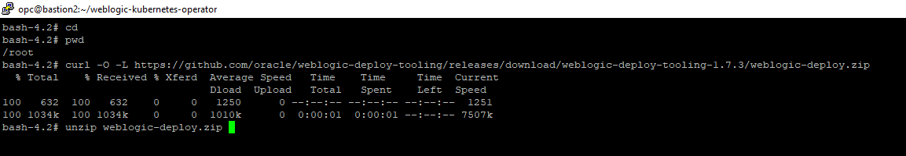
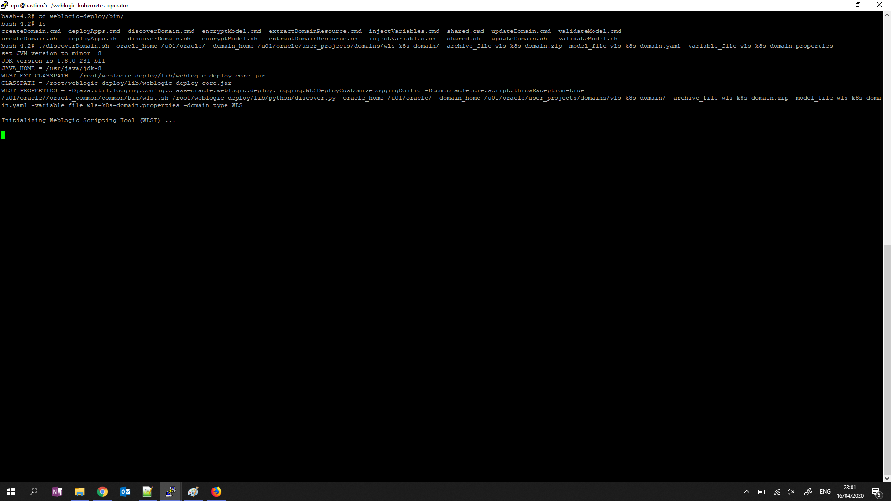
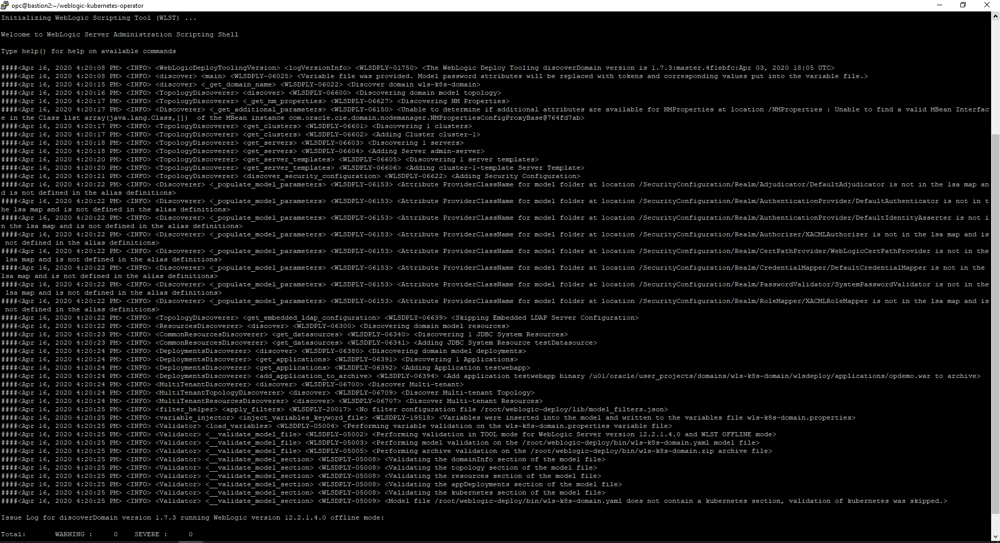

# Create Existing WebLogic domain artifact using Oracle WebLogic Deploy Tooling #

For this Hands on Lab we assume that there is existing WebLogic Domain that already running, with 1 demo Web Application deployment and 1 datasource. The WebLogic version that currently being used 12.2.1.4 and Oracle JDK 1.8.0_231 on Oracle Enterprise Linux 7.7 Slim version. From this domain we will create a docker image that will be stored inside OCIR and later can be deployed into OKE and it will be done using Oracle WebLogic Deploy Tooling.


The motivation for the [Oracle WebLogic Server Deploy Tooling](https://github.com/oracle/weblogic-deploy-tooling) is to remove the need to write WLST scripts for routine domain creation and application deployment tasks. Instead, the project team can write a declarative, metadata model describing the domain and applications (with their dependent resources), and use one or more of the single-purpose tools provided that perform domain lifecycle operations based on the content of the model. The goal is to make it easy to stand up environments and perform domain lifecycle operations in a repeatable fashion based on a metadata model that can be treated as source and evolve as the project evolves.

### Prerequisites ###

- Access to the existing WebLogic Domain OS

### Create WebLogic Domain Artifact ###

Login the to WebLogic Domain OS using appropriate user and locate the domain directory


After being able to login to the OS, the next step will be downloading weblogic deploying tool from [github site](https://github.com/oracle/weblogic-deploy-tooling/releases) choose the release that will be used, in this case 1.7.3, right click on the weblogic-deploy.zip and copy the link.


After that download it using curl command line then unzip the file.
```
curl -O -L https://github.com/oracle/weblogic-deploy-tooling/releases/download/weblogic-deploy-tooling-1.7.3/weblogic-deploy.zip  
```


Go to the extracted directory and go to bin folder and execute discover domain command to create the artifact, several parameter that being used are:
| Key | Value | Note |
|----------------|---------------------------------------------------------------------------|------------------------------------------------------------------------------------------------------------------------------------------------------------------|
| oracle_home | /u01/oracle/ |  The path location where oracle middleware was installed |
| domain_home | /u01/oracle/user_projects/domains/wls-k8s-domain/ | The path location where existing WebLogic Domain was installed |
| [archive_file](https://github.com/oracle/weblogic-deploy-tooling/blob/master/site/archive.md) | wls-k8s-domain.zip | The archive to deploy binaries and other file resources to the target domain  |
| [model_file](https://github.com/oracle/weblogic-deploy-tooling#the-metadata-model) | wls-k8s-domain.yaml | The file to describe the domain and applications |
| variable_file | wls-k8s-domain.properties | The file to store credential from the domain variable in the model_file |
```
./discoverDomain.sh -oracle_home /u01/oracle/ -domain_home /u01/oracle/user_projects/domains/wls-k8s-domain/ -archive_file wls-k8s-domain.zip -model_file wls-k8s-domain.yaml -variable_file wls-k8s-domain.properties 
```



Once the process is done, make sure there is no error and copy the artifact (wls-k8s-domain.zip, wls-k8s-domain.yaml, wls-k8s-domain.properties)
