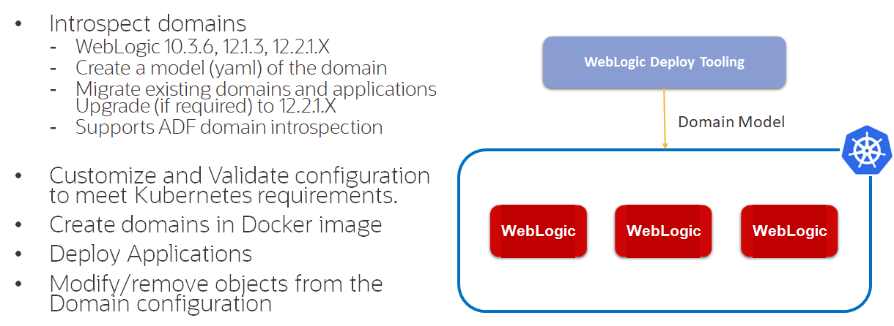
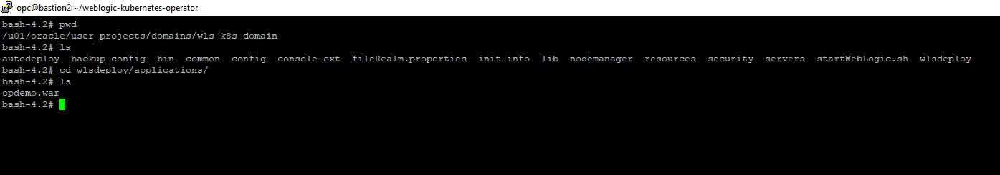
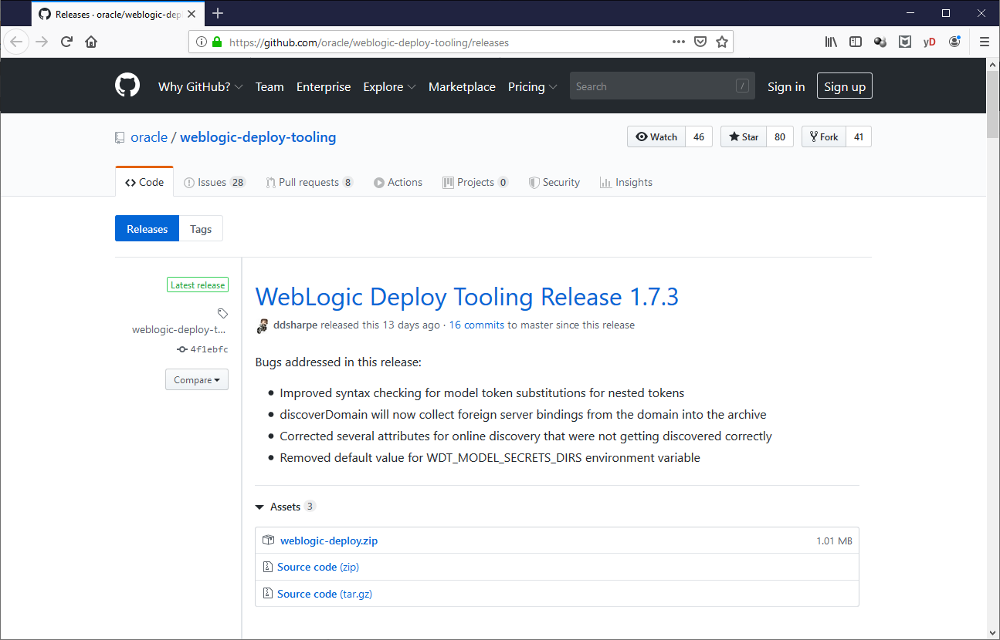

# Create existing WebLogic domain artifact backup #

For this Hands on Lab we assume that there is existing WebLogic Domain that already running, with 1 demo Web Application deployment and 1 datasource. The WebLogic version that currently being used 12.2.1.4 and Oracle JDK 1.8.0_231 on Oracle Enterprise Linux 7.7 Slim version. From this domain we will create a docker image that will be stored inside OCIR and later can be deployed into OKE and it will be done using Oracle WebLogic Deploy Tooling.



The motivation for the [Oracle WebLogic Server Deploy Tooling](https://github.com/oracle/weblogic-deploy-tooling) is to remove the need to write WLST scripts for routine domain creation and application deployment tasks. Instead, the project team can write a declarative, metadata model describing the domain and applications (with their dependent resources), and use one or more of the single-purpose tools provided that perform domain lifecycle operations based on the content of the model. The goal is to make it easy to stand up environments and perform domain lifecycle operations in a repeatable fashion based on a metadata model that can be treated as source and evolve as the project evolves.

### Prerequisites ###

- Access to the existing WebLogic Domain OS

### Create WebLogic Domain Artifact ###

Login the to WebLogic Domain OS using appropriate user and locate the domain directory



After being able to login to the OS, the next step will be downloading weblogic deploying tool from [github site](https://github.com/oracle/weblogic-deploy-tooling/releases) choose the release that will be used, in this case 1.7.3, right click on the weblogic-deploy.zip and copy the link.



After that download it using curl command line then unzip the file.
```
curl -O -L https://github.com/oracle/weblogic-deploy-tooling/releases/download/weblogic-deploy-tooling-1.7.3/weblogic-deploy.zip  
```
Below is the result:
```
[oracle@ee2c50d23970 ~]$ curl -O -L https://github.com/oracle/weblogic-deploy-tooling/releases/download/weblogic-deploy-tooling-1.7.3/weblogic-deploy.zip
  % Total    % Received % Xferd  Average Speed   Time    Time     Time  Current
                                 Dload  Upload   Total   Spent    Left  Speed
100   632  100   632    0     0    753      0 --:--:-- --:--:-- --:--:--   754
100 1034k  100 1034k    0     0   728k      0  0:00:01  0:00:01 --:--:--  728k
[oracle@ee2c50d23970 ~]$ unzip weblogic-deploy.zip
Archive:  weblogic-deploy.zip
   creating: weblogic-deploy/
```
Go to the extracted directory and go to bin folder and execute discover domain command to create the artifact, several parameter that being used are:
| Key | Value | Note |
|----------------|---------------------------------------------------------------------------|------------------------------------------------------------------------------------------------------------------------------------------------------------------|
| oracle_home | /u01/oracle/ |  The path location where oracle middleware was installed |
| domain_home | /u01/oracle/user_projects/domains/wls-k8s-domain/ | The path location where existing WebLogic Domain was installed |
| [archive_file](https://github.com/oracle/weblogic-deploy-tooling/blob/master/site/archive.md) | wls-k8s-domain.zip | The archive to deploy binaries and other file resources to the target domain  |
| [model_file](https://github.com/oracle/weblogic-deploy-tooling#the-metadata-model) | wls-k8s-domain.yaml | The file to describe the domain and applications |
```
./discoverDomain.sh -oracle_home /u01/oracle/ -domain_home /u01/oracle/user_projects/domains/wls-k8s-domain/ -archive_file wls-k8s-domain.zip -model_file wls-k8s-domain.yaml 
```
Below is the result:
```
[oracle@ee2c50d23970 bin]$ ./discoverDomain.sh -oracle_home /u01/oracle/ -domain_home /u01/oracle/user_projects/domains/wls-k8s-domain/ -archive_file wls-k8s-domain.zip -model_file wls-k8s-domain.yaml
set JVM version to minor  8
JDK version is 1.8.0_251-b08
JAVA_HOME = /u01/jdk
WLST_EXT_CLASSPATH = /home/oracle/weblogic-deploy/lib/weblogic-deploy-core.jar
CLASSPATH = /home/oracle/weblogic-deploy/lib/weblogic-deploy-core.jar
WLST_PROPERTIES = -Djava.util.logging.config.class=oracle.weblogic.deploy.logging.WLSDeployCustomizeLoggingConfig -Dcom.oracle.cie.script.throwException=true
/u01/oracle//oracle_common/common/bin/wlst.sh /home/oracle/weblogic-deploy/lib/python/discover.py -oracle_home /u01/oracle/ -domain_home /u01/oracle/user_projects/domains/wls-k8s-domain/ -archive_file wls-k8s-domain.zip -model_file wls-k8s-domain.yaml -domain_type WLS

Initializing WebLogic Scripting Tool (WLST) ...

Jython scans all the jar files it can find at first startup. Depending on the system, this process may take a few minutes to complete, and WLST may not return a prompt right away.

Welcome to WebLogic Server Administration Scripting Shell

Type help() for help on available commands

####<Apr 30, 2020 9:09:51 AM> <INFO> <WebLogicDeployToolingVersion> <logVersionInfo> <WLSDPLY-01750> <The WebLogic Deploy Tooling discoverDomain version is 1.7.3:master.4f1ebfc:Apr 03, 2020 18:05 UTC>
####<Apr 30, 2020 9:09:52 AM> <INFO> <discover> <main> <WLSDPLY-06024> <No variable file provided. Model passwords will contain the token '-- FIX ME --'>
####<Apr 30, 2020 9:10:16 AM> <INFO> <discover> <_get_domain_name> <WLSDPLY-06022> <Discover domain wls-k8s-domain>
####<Apr 30, 2020 9:10:16 AM> <INFO> <TopologyDiscoverer> <discover> <WLSDPLY-06600> <Discovering domain model topology>
####<Apr 30, 2020 9:10:21 AM> <INFO> <TopologyDiscoverer> <_get_nm_properties> <WLSDPLY-06627> <Discovering NM Properties>
####<Apr 30, 2020 9:10:21 AM> <INFO> <Discoverer> <_get_additional_parameters> <WLSDPLY-06150> <Unable to determine if additional attributes are available for NMProperties at location /NMProperties : Unable to find a valid MBean Interface in the Class list array(java.lang.Class,[])  of the MBean instance com.oracle.cie.domain.nodemanager.NMPropertiesConfigProxyBase@c76d874>
####<Apr 30, 2020 9:10:21 AM> <INFO> <TopologyDiscoverer> <get_clusters> <WLSDPLY-06601> <Discovering 1 clusters>
####<Apr 30, 2020 9:10:21 AM> <INFO> <TopologyDiscoverer> <get_clusters> <WLSDPLY-06602> <Adding Cluster cluster-1>
####<Apr 30, 2020 9:10:25 AM> <INFO> <TopologyDiscoverer> <get_servers> <WLSDPLY-06603> <Discovering 1 servers>
####<Apr 30, 2020 9:10:25 AM> <INFO> <TopologyDiscoverer> <get_servers> <WLSDPLY-06604> <Adding Server admin-server>
####<Apr 30, 2020 9:10:30 AM> <INFO> <TopologyDiscoverer> <get_server_templates> <WLSDPLY-06605> <Discovering 1 server templates>
####<Apr 30, 2020 9:10:30 AM> <INFO> <TopologyDiscoverer> <get_server_templates> <WLSDPLY-06606> <Adding cluster-1-template Server Template>
####<Apr 30, 2020 9:10:33 AM> <INFO> <TopologyDiscoverer> <discover_security_configuration> <WLSDPLY-06622> <Adding Security Configuration>
####<Apr 30, 2020 9:10:35 AM> <INFO> <Discoverer> <_populate_model_parameters> <WLSDPLY-06153> <Attribute ProviderClassName for model folder at location /SecurityConfiguration/Realm/Adjudicator/DefaultAdjudicator is not in the lsa map and is not defined in the alias definitions>
####<Apr 30, 2020 9:10:36 AM> <INFO> <Discoverer> <_populate_model_parameters> <WLSDPLY-06153> <Attribute ProviderClassName for model folder at location /SecurityConfiguration/Realm/AuthenticationProvider/DefaultAuthenticator is not in the lsa map and is not defined in the alias definitions>
####<Apr 30, 2020 9:10:37 AM> <INFO> <Discoverer> <_populate_model_parameters> <WLSDPLY-06153> <Attribute ProviderClassName for model folder at location /SecurityConfiguration/Realm/AuthenticationProvider/DefaultIdentityAsserter is not in the lsa map and is not defined in the alias definitions>
####<Apr 30, 2020 9:10:37 AM> <INFO> <Discoverer> <_populate_model_parameters> <WLSDPLY-06153> <Attribute ProviderClassName for model folder at location /SecurityConfiguration/Realm/Authorizer/XACMLAuthorizer is not in the lsa map and is not defined in the alias definitions>
####<Apr 30, 2020 9:10:37 AM> <INFO> <Discoverer> <_populate_model_parameters> <WLSDPLY-06153> <Attribute ProviderClassName for model folder at location /SecurityConfiguration/Realm/CertPathProvider/WebLogicCertPathProvider is not in the lsa map and is not defined in the alias definitions>
####<Apr 30, 2020 9:10:38 AM> <INFO> <Discoverer> <_populate_model_parameters> <WLSDPLY-06153> <Attribute ProviderClassName for model folder at location /SecurityConfiguration/Realm/CredentialMapper/DefaultCredentialMapper is not in the lsa map and is not defined in the alias definitions>
####<Apr 30, 2020 9:10:38 AM> <INFO> <Discoverer> <_populate_model_parameters> <WLSDPLY-06153> <Attribute ProviderClassName for model folder at location /SecurityConfiguration/Realm/PasswordValidator/SystemPasswordValidator is not in the lsa map and is not defined in the alias definitions>
####<Apr 30, 2020 9:10:39 AM> <INFO> <Discoverer> <_populate_model_parameters> <WLSDPLY-06153> <Attribute ProviderClassName for model folder at location /SecurityConfiguration/Realm/RoleMapper/XACMLRoleMapper is not in the lsa map and is not defined in the alias definitions>
####<Apr 30, 2020 9:10:39 AM> <INFO> <TopologyDiscoverer> <get_embedded_ldap_configuration> <WLSDPLY-06639> <Skipping Embedded LDAP Server Configuration>
####<Apr 30, 2020 9:10:39 AM> <INFO> <ResourcesDiscoverer> <discover> <WLSDPLY-06300> <Discovering domain model resources>
####<Apr 30, 2020 9:10:39 AM> <INFO> <CommonResourcesDiscoverer> <get_datasources> <WLSDPLY-06340> <Discovering 1 JDBC System Resources>
####<Apr 30, 2020 9:10:39 AM> <INFO> <CommonResourcesDiscoverer> <get_datasources> <WLSDPLY-06341> <Adding JDBC System Resource testDatasource>
####<Apr 30, 2020 9:10:42 AM> <INFO> <DeploymentsDiscoverer> <discover> <WLSDPLY-06380> <Discovering domain model deployments>
####<Apr 30, 2020 9:10:42 AM> <INFO> <DeploymentsDiscoverer> <get_applications> <WLSDPLY-06391> <Discovering 1 Applications>
####<Apr 30, 2020 9:10:42 AM> <INFO> <DeploymentsDiscoverer> <get_applications> <WLSDPLY-06392> <Adding Application testwebapp>
####<Apr 30, 2020 9:10:43 AM> <INFO> <DeploymentsDiscoverer> <add_application_to_archive> <WLSDPLY-06394> <Add application testwebapp binary /u01/oracle/user_projects/domains/wls-k8s-domain/wlsdeploy/applications/opdemo.war to archive>
####<Apr 30, 2020 9:10:43 AM> <INFO> <MultiTenantDiscoverer> <discover> <WLSDPLY-06700> <Discover Multi-tenant>
####<Apr 30, 2020 9:10:43 AM> <INFO> <MultiTenantTopologyDiscoverer> <discover> <WLSDPLY-06709> <Discover Multi-tenant Topology>
####<Apr 30, 2020 9:10:43 AM> <INFO> <MultiTenantResourcesDiscoverer> <discover> <WLSDPLY-06707> <Discover Multi-tenant Resources>
####<Apr 30, 2020 9:10:46 AM> <INFO> <filter_helper> <apply_filters> <WLSDPLY-20017> <No filter configuration file /home/oracle/weblogic-deploy/lib/model_filters.json>
####<Apr 30, 2020 9:10:46 AM> <INFO> <variable_injector> <inject_variables_keyword_file> <WLSDPLY-19519> <No variables were inserted into the model during variable replacement>
####<Apr 30, 2020 9:10:46 AM> <INFO> <Validator> <__validate_model_file> <WLSDPLY-05002> <Performing validation in TOOL mode for WebLogic Server version 12.2.1.4.0 and WLST OFFLINE mode>
####<Apr 30, 2020 9:10:46 AM> <INFO> <Validator> <__validate_model_file> <WLSDPLY-05003> <Performing model validation on the /home/oracle/weblogic-deploy/bin/wls-k8s-domain.yaml model file>
####<Apr 30, 2020 9:10:46 AM> <INFO> <Validator> <__validate_model_file> <WLSDPLY-05005> <Performing archive validation on the /home/oracle/weblogic-deploy/bin/wls-k8s-domain.zip archive file>
####<Apr 30, 2020 9:10:46 AM> <INFO> <Validator> <__validate_model_section> <WLSDPLY-05008> <Validating the domainInfo section of the model file>
####<Apr 30, 2020 9:10:47 AM> <INFO> <Validator> <__validate_model_section> <WLSDPLY-05008> <Validating the topology section of the model file>
####<Apr 30, 2020 9:10:47 AM> <INFO> <Validator> <__validate_model_section> <WLSDPLY-05008> <Validating the resources section of the model file>
####<Apr 30, 2020 9:10:47 AM> <INFO> <Validator> <__validate_model_section> <WLSDPLY-05008> <Validating the appDeployments section of the model file>
####<Apr 30, 2020 9:10:47 AM> <INFO> <Validator> <__validate_model_section> <WLSDPLY-05008> <Validating the kubernetes section of the model file>
####<Apr 30, 2020 9:10:47 AM> <INFO> <Validator> <__validate_model_section> <WLSDPLY-05009> <Model file /home/oracle/weblogic-deploy/bin/wls-k8s-domain.yaml does not contain a kubernetes section, validation of kubernetes was skipped.>

Issue Log for discoverDomain version 1.7.3 running WebLogic version 12.2.1.4.0 offline mode:

Total:       WARNING :     0    SEVERE :     0

discoverDomain.sh completed successfully (exit code = 0)
```
Once the process is done, make sure there is no error and copy the artifact (wls-k8s-domain.zip, wls-k8s-domain.yaml). However, before being able to use it, we need to make some changes in the model file, wls-k8s-domain.yaml, by changing the value of --FIX ME-- with the correct one:
```
domainInfo:
    AdminUserName: '--FIX ME--'
    AdminPassword: '--FIX ME--'
topology:
    Name: 'wls-k8s-domain'
    AdminServerName: 'admin-server'
    ProductionModeEnabled: true
    NMProperties:
        JavaHome: /u01/jdk
        weblogic.StartScriptName: startWebLogic.sh
    Cluster:
        'cluster-1':
            DynamicServers:
                ServerNamePrefix: 'managed-server'
                MaxDynamicClusterSize: 5
                CalculatedListenPorts: false
                ServerTemplate: 'cluster-1-template'
                DynamicClusterSize: 5
    Server:
        'admin-server':
            NetworkAccessPoint:
                T3Channel:
                    PublicPort: 30012
                    ListenPort: 30012
                    PublicAddress: kubernetes
    ServerTemplate:
        'cluster-1-template':
            ListenPort: 8001
            Cluster: 'cluster-1'
            SSL:
                ListenPort: 8100
    SecurityConfiguration:
        NodeManagerPasswordEncrypted: '--FIX ME--'
        CredentialEncrypted: '--FIX ME--'
        Realm:
            myrealm:
                Adjudicator:
                    DefaultAdjudicator:
                        DefaultAdjudicator:
                AuthenticationProvider:
                    DefaultAuthenticator:
                        DefaultAuthenticator:
                    DefaultIdentityAsserter:
                        DefaultIdentityAsserter:
                            ActiveType: [ AuthenticatedUser, 'weblogic-jwt-token' ]
                Authorizer:
                    XACMLAuthorizer:
                        XACMLAuthorizer:
                            PolicyDeploymentEnabled: true
                CertPathProvider:
                    WebLogicCertPathProvider:
                        WebLogicCertPathProvider:
                CredentialMapper:
                    DefaultCredentialMapper:
                        DefaultCredentialMapper:
                PasswordValidator:
                    SystemPasswordValidator:
                        SystemPasswordValidator:
                            MinNumericOrSpecialCharacters: 0
                            MinPasswordLength: 0
                RoleMapper:
                    XACMLRoleMapper:
                        XACMLRoleMapper:
resources:
    JDBCSystemResource:
        testDatasource:
            Target: 'cluster-1,admin-server'
            JdbcResource:
                JDBCConnectionPoolParams:
                    InitialCapacity: 0
                    TestTableName: SQL SELECT 1 FROM DUAL
                JDBCDataSourceParams:
                    JNDIName: jdbc/testDatasource
                JDBCDriverParams:
                    URL: 'jdbc:oracle:thin:@//xxx.xxx.x.xxx:1521/ORCLCDB'
                    PasswordEncrypted: '--FIX ME--'
                    DriverName: oracle.jdbc.OracleDriver
                    Properties:
                        user:
                            Value: scott
appDeployments:
    Application:
        testwebapp:
            SourcePath: wlsdeploy/applications/opdemo.war
            ModuleType: war
            Target: 'cluster-1'
```
| Key | Value | Note |
|----------------|---------------------------------------------------------------------------|------------------------------------------------------------------------------------------------------------------------------------------------------------------|
| AdminUserName | weblogic | WebLogic admin user |
| AdminPassword | welcome1 | WebLogic admin password |
| NodeManagerPasswordEncrypted | remove this parameter | Not needed so it will be removed |
| CredentialEncrypted | remove this parameter | Not needed so it will be removed  |
| PasswordEncrypted | welcome1 | datasource user password |

Which will make the model file like below:
#### Original WDT Model ####
```
domainInfo:
    AdminUserName: 'weblogic'
    AdminPassword: 'welcome1'
topology:
    Name: 'wls-k8s-domain'
    AdminServerName: 'admin-server'
    ProductionModeEnabled: true
    NMProperties:
        JavaHome: /u01/jdk
        weblogic.StartScriptName: startWebLogic.sh
    Cluster:
        'cluster-1':
            DynamicServers:
                ServerNamePrefix: 'managed-server'
                MaxDynamicClusterSize: 5
                CalculatedListenPorts: false
                ServerTemplate: 'cluster-1-template'
                DynamicClusterSize: 5
    Server:
        'admin-server':
            NetworkAccessPoint:
                T3Channel:
                    PublicPort: 30012
                    ListenPort: 30012
                    PublicAddress: kubernetes
    ServerTemplate:
        'cluster-1-template':
            ListenPort: 8001
            Cluster: 'cluster-1'
            SSL:
                ListenPort: 8100
    SecurityConfiguration:
        Realm:
            myrealm:
                Adjudicator:
                    DefaultAdjudicator:
                        DefaultAdjudicator:
                AuthenticationProvider:
                    DefaultAuthenticator:
                        DefaultAuthenticator:
                    DefaultIdentityAsserter:
                        DefaultIdentityAsserter:
                            ActiveType: [ AuthenticatedUser, 'weblogic-jwt-token' ]
                Authorizer:
                    XACMLAuthorizer:
                        XACMLAuthorizer:
                            PolicyDeploymentEnabled: true
                CertPathProvider:
                    WebLogicCertPathProvider:
                        WebLogicCertPathProvider:
                CredentialMapper:
                    DefaultCredentialMapper:
                        DefaultCredentialMapper:
                PasswordValidator:
                    SystemPasswordValidator:
                        SystemPasswordValidator:
                            MinNumericOrSpecialCharacters: 0
                            MinPasswordLength: 0
                RoleMapper:
                    XACMLRoleMapper:
                        XACMLRoleMapper:
resources:
    JDBCSystemResource:
        testDatasource:
            Target: 'cluster-1,admin-server'
            JdbcResource:
                JDBCConnectionPoolParams:
                    InitialCapacity: 0
                    TestTableName: SQL SELECT 1 FROM DUAL
                JDBCDataSourceParams:
                    JNDIName: jdbc/testDatasource
                JDBCDriverParams:
                    URL: 'jdbc:oracle:thin:@//xxx.xxx.x.xxx:1521/ORCLCDB'
                    PasswordEncrypted: 'welcome1'
                    DriverName: oracle.jdbc.OracleDriver
                    Properties:
                        user:
                            Value: scott
appDeployments:
    Application:
        testwebapp:
            SourcePath: wlsdeploy/applications/opdemo.war
            ModuleType: war
            Target: 'cluster-1'
```
