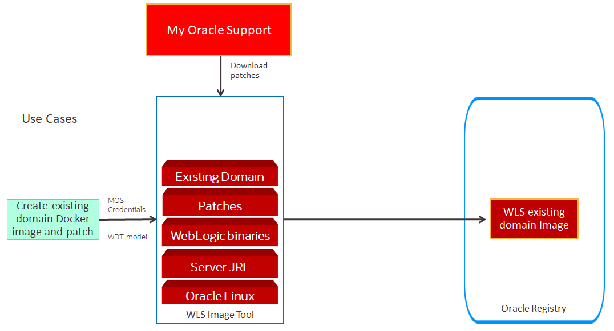
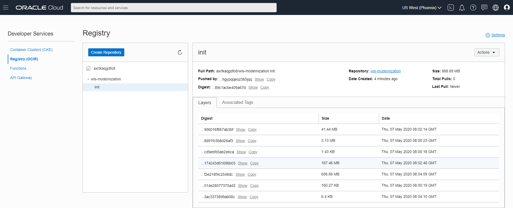

# Create Docker image from existing WebLogic domain #

For the continuation of this Hands on Lab we are going to use the existing WebLogic Domain artifact that was created, an archive and model from WDT script. In this part we will create a docker image using WebLogic Image Tool, also the process will add latest patch then finally will be stored inside OCIR as init image.



### Prerequisites ###

- Access to the bastion OS that will access OKE cluster and OCIR
- JAVA SDK and docker engine enabled OS
- WebLogic and Java SDK binary (from eDelivery)
- Oracle Support ID (email address)

#### Prepare OCIR access from bastion ####

Before we can store docker image to OCIR we need to get our Oracle Container Registry token. Token acts as password to container registry provided by Oracle Cloud Infrastructure.

1.  OCIR Password
    Open our OCI (Oracle Cloud Infrastructure) Console. If necessary Sign in again using our Cloud Services link we got in email during the registration process. Using the OCI console page click the user icon and select **User Settings**. On the left area of the User details page select the **Auth Tokens** item. Click the **Generate Token** to get a new token.

    

    Enter a description which allows us to easily identify the allocated token later. For example if we want to revoke then we have to find the proper token to delete. For example *ocir*.

    

    Now **copy and store(!)** your generated token for later, which will be use in bastion and Oracle Pipeline (Wercker). Click **Close**.

    

2.  OCIR Username 
    Since we are on the User details page please note the proper user name for later usage. We need to use this as part of username in order to login to OCI Registry for push and pull images.

    

    Another part for OCIR username is repository name that can retrieved by opening OCIR in Cloud Console

    
    

    In this case we need to keep value "axrtkaqgdfo8" as part for the login, and it is called as TENANCY for this hands on labs, which will make the username to access OCIR is axrtkaqgdfo8/oracleidentitycloudservice/john.p.smith@testing.com
    
3.  OCIR Server Address
    To get OCIR Server address, we must know the tenancy region location of the OCIR and OKE, which can be located on the top right of console then it will need to be combined in format <region-key>.ocir.io, the region-key mapping itself is located [here](https://docs.cloud.oracle.com/en-us/iaas/Content/Registry/Concepts/registryprerequisites.htm#Availab). Below, while creating repository that will be used during Hands on Lab, we can see that Region is US West (Phoenix), which makes the OCIR Server Address is phx.ocir.io

After all 3 components being gathered we can try to login to the OCIR repository using docker command.
```
docker login phx.ocir.io -u axrtkaqgdfo8/oracleidentitycloudservice/john.p.smith@testing.com
```
The expected result will be:
```
Password:
WARNING! Your password will be stored unencrypted in /home/opc/.docker/config.json.
Configure a credential helper to remove this warning. See
https://docs.docker.com/engine/reference/commandline/login/#credentials-store

Login Succeeded
```

#### Prepare Java SDK and Docker in bastion ####
First we need to download [Java SDK](https://www.oracle.com/java/technologies/javase-jdk8-downloads.html), in this case we choose 8u251, and upload that to bastion host in the directory /home/opc
```
gzip -d jdk-8u251-linux-x64.tar.gz
tar -xvf jdk-8u251-linux-x64.tar
vi .bashrc
```
Edit .bashrc file to put JDK binary into PATH and create JAVA_HOME like below:
```
# .bashrc

# Source global definitions
if [ -f /etc/bashrc ]; then
        . /etc/bashrc
fi

export JAVA_HOME=/home/opc/jdk1.8.0_251
export PATH=$JAVA_HOME/bin:$PATH

# Uncomment the following line if you don't like systemctl's auto-paging feature:
# export SYSTEMD_PAGER=

# User specific aliases and functions
```
Then after that 
```
source .bashrc
java -version
```
The expected output is like below
```
Java(TM) SE Runtime Environment (build 1.8.0_251-b08)
Java HotSpot(TM) 64-Bit Server VM (build 25.251-b08, mixed mode)
```
Most of the time, there is no out of the box docker capability, so we need to enable docker engine in the OS, otherwise we cannot login to OCIR repository. To do that you need to have sudo or root privileges, and do the following:
```
sudo yum install -y yum-utils zip unzip
sudo yum-config-manager --enable ol7_optional_latest
sudo yum-config-manager --enable ol7_addons
sudo yum install -y oraclelinux-developer-release-el7
sudo yum-config-manager --enable ol7_developer
sudo yum install -y docker-engine
sudo systemctl enable docker
sudo chkconfig docker on
```
Above commands will enable docker engine capability in bastion and auto start docker engine after reboot. Beside this, we need to check also the firewall and SELinux in the bastion OS, make sure it open the required ports.
```
sudo sed -i 's/^SELINUX=enforcing/SELINUX=disabled/' /etc/selinux/config
sudo /usr/sbin/setenforce 0
sudo systemctl stop firewalld
sudo systemctl disable firewalld
sudo reboot
```

#### Prepare WebLogic, Java SDK, and Domain Artifact in bastion ####
First we create one folder to keep the binaries and artifact:
```
[opc@bastion1 ~]$ mkdir /home/opc/mnt
```
Then download all these and upload it along with artifacts (wls-k8s-domain.zip and wls-k8s-domain.yaml):
- [Java SDK 8u251](https://www.oracle.com/java/technologies/javase-jdk8-downloads.html)
- [WebLogic Server 12.2.1.4](https://www.oracle.com/middleware/technologies/weblogic-server-installers-downloads.html)
- [WebLogic Imaging Tool 1.8.5](https://github.com/oracle/weblogic-image-tool/releases/download/release-1.8.5/imagetool.zip)
- [WebLogic Deployment Tool 1.8.1](https://github.com/oracle/weblogic-deploy-tooling/releases/download/weblogic-deploy-tooling-1.8.1/weblogic-deploy.zip)

#### Create Docker Image from existing domain artifacts in bastion ####
```
cd /home/opc/mnt
unzip imagetool.zip
cd imagetool/bin
chmod 755 *
./imagetool.sh cache addInstaller --type jdk --version 8u251 --path /home/opc/mnt/jdk-8u251-linux-x64.tar.gz
./imagetool.sh cache addInstaller --type wls --version 12.2.1.4.0 --path /home/opc/mnt/fmw_12.2.1.4.0_wls.jar
./imagetool.sh cache addInstaller --type wdt --version 1.8.1 --path /home/opc/mnt/weblogic-deploy.zip
./imagetool.sh create --jdkVersion 8u251 --version 12.2.1.4.0 --user john.p.smith@testing.com --password password2020 --wdtModel /home/opc/mnt/wls-k8s-domain.yaml --wdtArchive /home/opc/mnt/wls-k8s-domain.zip --wdtVersion 1.8.1 --wdtDomainHome /u01/oracle/user_projects/domains/wls-k8s-domain --tag phx.ocir.io/axrtkaqgdfo8/wls-modernization:init --latestPSU
```
| Key | Value | Note |
|----------------|---------------------------------------------------------------------------|------------------------------------------------------------------------------------------------------------------------------------------------------------------|
| jdkVersion | 8u251 | make sure same with addInstaller value |
| version | 12.2.1.4.0 | make sure same with addInstaller value |
| user | john.p.smith@testing.com | Oracle support username |
| password | password2020 | Oracle support password |
| wdtModel | /home/opc/mnt/wls-k8s-domain.yaml | location of existing WebLogic domain model |
| wdtArchive | /home/opc/mnt/wls-k8s-domain.zip | location of existing WebLogic domain archive |
| wdtVersion | 1.8.1 | make sure same with addInstaller value |
| wdtDomainHome | /u01/oracle/user_projects/domains/wls-k8s-domain | The desired WebLogic domain home in docker image |
| tag | phx.ocir.io/axrtkaqgdfo8/wls-modernization:init | Reflects where will the docker image will be stored in OCIR |
| latestPSU | flag only | Flag to make sure docker image will also update WebLogic binary with latest patches |

Below is the expected result for a success docker image creation process:
```
[INFO   ] Image Tool build ID: cafbdcea-4c4d-4307-b7b3-3cd285f0d49c
[INFO   ] Temporary directory used for docker build context: /home/opc/wlsimgbuilder_temp1721686485613246597
[INFO   ] copying /home/opc/mnt/jdk-8u251-linux-x64.tar.gz to build context folder.
[INFO   ] Using middleware installers (wls) version 12.2.1.4.0
[INFO   ] copying /home/opc/mnt/fmw_12.2.1.4.0_wls.jar to build context folder.
[INFO   ] copying /home/opc/mnt/weblogic-deploy.zip to build context folder.
[INFO   ] Finding patch number for latest PSU...
[INFO   ] Latest PSU patch number is 30970477
[INFO   ] Validating patches
[INFO   ] Validated patch 30970477 for release 600000000098910
[INFO   ] No patch conflicts detected
[INFO   ] Using patch 30970477_12.2.1.4.0 from cache: /home/opc/cache/p30970477_122140_Generic.zip
[INFO   ] Using patch 28186730_13.9.4.2.2 from cache: /home/opc/cache/p28186730_139422_Generic.zip
[INFO   ] docker cmd = docker build --force-rm=true --no-cache --tag phx.ocir.io/axrtkaqgdfo8/wls-move-improve:init /home/opc/wlsimgbuilder_temp1721686485613246597
Sending build context to Docker daemon  1.112GB

Step 1/48 : FROM oraclelinux:7-slim as OS_UPDATE
 ---> f23503228fa1
Step 2/48 : LABEL com.oracle.weblogic.imagetool.buildid="cafbdcea-4c4d-4307-b7b3-3cd285f0d49c"
 ---> Running in 39d818caf1fc
Removing intermediate container 39d818caf1fc
 ---> 8c42b2761897
Step 3/48 : USER root
 ---> Running in 2926013be048
Removing intermediate container 2926013be048
 ---> 8c0e37de5cf5
Step 4/48 : RUN yum -y --downloaddir= install gzip tar unzip libaio  && yum -y --downloaddir= clean all  && rm -rf /var/cache/yum/*  && rm -rf
 ---> Running in acc65204d49d
Loaded plugins: ovl
Resolving Dependencies
--> Running transaction check
---> Package gzip.x86_64 0:1.5-10.el7 will be installed
---> Package libaio.x86_64 0:0.3.109-13.el7 will be installed
---> Package tar.x86_64 2:1.26-35.el7 will be installed
---> Package unzip.x86_64 0:6.0-21.el7 will be installed
--> Finished Dependency Resolution

Dependencies Resolved

================================================================================
 Package        Arch           Version                 Repository          Size
================================================================================
Installing:
 gzip           x86_64         1.5-10.el7              ol7_latest         129 k
 libaio         x86_64         0.3.109-13.el7          ol7_latest          24 k
 tar            x86_64         2:1.26-35.el7           ol7_latest         845 k
 unzip          x86_64         6.0-21.el7              ol7_latest         171 k

Transaction Summary
================================================================================
Install  4 Packages

Total download size: 1.1 M
Installed size: 3.3 M
Downloading packages:
--------------------------------------------------------------------------------
Total                                              797 kB/s | 1.1 MB  00:01
Running transaction check
Running transaction test
Transaction test succeeded
Running transaction
  Installing : 2:tar-1.26-35.el7.x86_64                                     1/4
  Installing : unzip-6.0-21.el7.x86_64                                      2/4
  Installing : libaio-0.3.109-13.el7.x86_64                                 3/4
  Installing : gzip-1.5-10.el7.x86_64                                       4/4
  Verifying  : gzip-1.5-10.el7.x86_64                                       1/4
  Verifying  : libaio-0.3.109-13.el7.x86_64                                 2/4
  Verifying  : unzip-6.0-21.el7.x86_64                                      3/4
  Verifying  : 2:tar-1.26-35.el7.x86_64                                     4/4

Installed:
  gzip.x86_64 0:1.5-10.el7            libaio.x86_64 0:0.3.109-13.el7
  tar.x86_64 2:1.26-35.el7            unzip.x86_64 0:6.0-21.el7

Complete!
Loaded plugins: ovl
Cleaning repos: ol7_UEKR5 ol7_latest
Removing intermediate container acc65204d49d
 ---> d4a1a662124d
Step 5/48 : RUN if [ -z "$(getent group oracle)" ]; then hash groupadd &> /dev/null && groupadd oracle || exit -1 ; fi  && if [ -z "$(getent passwd oracle)" ]; then hash useradd &> /dev/null && useradd -g oracle oracle || exit -1; fi  && mkdir /u01  && chown oracle:oracle /u01
 ---> Running in 690f6628447a
Removing intermediate container 690f6628447a
 ---> 42f812e3563b
Step 6/48 : FROM OS_UPDATE as JDK_BUILD
 ---> 42f812e3563b
Step 7/48 : LABEL com.oracle.weblogic.imagetool.buildid="cafbdcea-4c4d-4307-b7b3-3cd285f0d49c"
 ---> Running in bf7df7d9b82c
Removing intermediate container bf7df7d9b82c
 ---> ede2c204140e
Step 8/48 : ENV JAVA_HOME=/u01/jdk
 ---> Running in 3cdb60766bd7
Removing intermediate container 3cdb60766bd7
 ---> 4195915d5fb0
Step 9/48 : COPY --chown=oracle:oracle jdk-8u251-linux-x64.tar.gz /tmp/imagetool/
 ---> 7104c8f9c0b3
Step 10/48 : USER oracle
 ---> Running in f975308a5dcc
Removing intermediate container f975308a5dcc
 ---> 1050ae7fd1d2
Step 11/48 : RUN tar xzf /tmp/imagetool/jdk-8u251-linux-x64.tar.gz -C /u01  && mv /u01/jdk* /u01/jdk  && rm -rf /tmp/imagetool
 ---> Running in 0a5e99f0e790
Removing intermediate container 0a5e99f0e790
 ---> 4828f9d5f3bb
Step 12/48 : FROM OS_UPDATE as WLS_BUILD
 ---> 42f812e3563b
Step 13/48 : LABEL com.oracle.weblogic.imagetool.buildid="cafbdcea-4c4d-4307-b7b3-3cd285f0d49c"
 ---> Running in dfa514d8c5cf
Removing intermediate container dfa514d8c5cf
 ---> 1331d3a394e6
Step 14/48 : ENV JAVA_HOME=/u01/jdk     ORACLE_HOME=/u01/oracle     OPATCH_NO_FUSER=true
 ---> Running in 1b9a4e8b8d06
Removing intermediate container 1b9a4e8b8d06
 ---> 075ae3fb9230
Step 15/48 : RUN mkdir -p /u01/oracle  && mkdir -p /u01/oracle/oraInventory  && chown oracle:oracle /u01/oracle/oraInventory  && chown oracle:oracle /u01/oracle
 ---> Running in 80bd67797bf1
Removing intermediate container 80bd67797bf1
 ---> 163cb7fb3497
Step 16/48 : COPY --from=JDK_BUILD --chown=oracle:oracle /u01/jdk /u01/jdk/
 ---> 4d8c5391a1fb
Step 17/48 : COPY --chown=oracle:oracle fmw_12.2.1.4.0_wls.jar wls.rsp /tmp/imagetool/
 ---> a249afc0778b
Step 18/48 : COPY --chown=oracle:oracle oraInst.loc /u01/oracle/
 ---> 21adf780c037
Step 19/48 : COPY --chown=oracle:oracle p28186730_139422_Generic.zip /tmp/imagetool/opatch/
 ---> b75f0376e297
Step 20/48 : COPY --chown=oracle:oracle patches/* /tmp/imagetool/patches/
 ---> 31f5793e7bd5
Step 21/48 : USER oracle
 ---> Running in 2f3e3a069f04
Removing intermediate container 2f3e3a069f04
 ---> a72f19145bcf
Step 22/48 : RUN   /u01/jdk/bin/java -Xmx1024m -jar /tmp/imagetool/fmw_12.2.1.4.0_wls.jar -silent ORACLE_HOME=/u01/oracle     -responseFile /tmp/imagetool/wls.rsp -invPtrLoc /u01/oracle/oraInst.loc -ignoreSysPrereqs -force -novalidation
 ---> Running in 890be2a0aaf0
Launcher log file is /tmp/OraInstall2020-04-30_08-08-50AM/launcher2020-04-30_08-08-50AM.log.
Extracting the installer . . . . . . . . . . . . . . . . . . . . . . . . . . . . . . . . . . . . . . . . Done
Checking if CPU speed is above 300 MHz.   Actual 1996.249 MHz    Passed
Checking swap space: must be greater than 512 MB.   Actual 8191 MB    Passed
Checking if this platform requires a 64-bit JVM.   Actual 64    Passed (64-bit not required)
Checking temp space: must be greater than 300 MB.   Actual 25368 MB    Passed
Preparing to launch the Oracle Universal Installer from /tmp/OraInstall2020-04-30_08-08-50AM
Log: /tmp/OraInstall2020-04-30_08-08-50AM/install2020-04-30_08-08-50AM.log
Setting ORACLE_HOME...
Copyright (c) 1996, 2019, Oracle and/or its affiliates. All rights reserved.
Reading response file..
Skipping Software Updates
Validations are disabled for this session.
Verifying data
Copying Files
Percent Complete : 10
Percent Complete : 20
Percent Complete : 30
Percent Complete : 40
Percent Complete : 50
Percent Complete : 60
Percent Complete : 70
Percent Complete : 80
Percent Complete : 90
Percent Complete : 100

The installation of Oracle Fusion Middleware 12c WebLogic Server and Coherence 12.2.1.4.0 completed successfully.
Logs successfully copied to /u01/oracle/oraInventory/logs.
Removing intermediate container 890be2a0aaf0
 ---> abcca8dd4f83
Step 23/48 : RUN cd /tmp/imagetool/opatch  && /u01/jdk/bin/jar -xf /tmp/imagetool/opatch/p28186730_139422_Generic.zip  && /u01/jdk/bin/java -jar /tmp/imagetool/opatch/6880880/opatch_generic.jar -silent -ignoreSysPrereqs -force -novalidation oracle_home=/u01/oracle
 ---> Running in ae56028d984a
Launcher log file is /tmp/OraInstall2020-04-30_08-16-11AM/launcher2020-04-30_08-16-11AM.log.
Extracting the installer . . . . . Done
Checking if CPU speed is above 300 MHz.   Actual 1996.249 MHz    Passed
Checking swap space: must be greater than 512 MB.   Actual 8191 MB    Passed
Checking if this platform requires a 64-bit JVM.   Actual 64    Passed (64-bit not required)
Checking temp space: must be greater than 300 MB.   Actual 25239 MB    Passed
Preparing to launch the Oracle Universal Installer from /tmp/OraInstall2020-04-30_08-16-11AM
Installation Summary


Disk Space : Required 35 MB, Available 25,204 MB
Feature Sets to Install:
        Next Generation Install Core 13.9.4.0.0
        OPatch 13.9.4.2.2
        OPatch Auto OPlan 13.9.4.2.2
        OPatch Auto FMW 13.9.4.2.2
Session log file is /tmp/OraInstall2020-04-30_08-16-11AM/install2020-04-30_08-16-11AM.log

Loading products list. Please wait.
 1%
 40%

Loading products. Please wait.
 42%
 43%
 44%
 45%
 46%
 48%
 49%
 50%
 51%
 52%
 54%
 55%
 56%
 57%
 58%
 60%
 61%
 62%
 63%
 64%
 65%
 67%
 68%
 69%
 70%
 71%
 72%
 74%
 75%
 76%
 77%
 78%
 80%
 81%
 82%
 83%
 84%
 85%
 87%
 88%
 89%
 90%
 91%
 92%
 94%
 95%
 96%
 97%
 98%
 99%

Updating Libraries


Starting Installations
 1%
 2%
 3%
 4%
 5%
 6%
 7%
 8%
 9%
 10%
 11%
 12%
 13%
 14%
 15%
 16%
 17%
 18%
 19%
 20%
 21%
 22%
 23%
 24%
 25%
 26%
 27%
 28%
 29%
 30%
 31%
 32%
 33%
 34%
 35%
 36%
 37%
 38%
 39%
 40%
 41%
 42%
 43%
 44%
 45%
 46%
 47%
 48%
 49%
 50%
 51%
 52%
 53%
 54%
 55%
 56%
 57%
 58%
 59%
 60%
 61%
 62%
 63%
 64%
 65%
 66%
 67%
 68%
 69%
 70%
 71%
 72%
 73%
 74%
 75%
 76%
 77%
 78%
 79%
 80%
 81%
 82%
 83%
 84%
 85%
 86%
 87%
 88%

Install pending

Installation in progress

 Component : oracle.commons.cli.commons.cli 1.3.1.0.0

Copying files for oracle.commons.cli.commons.cli 1.3.1.0.0

 Component : oracle.nginst.common 13.9.4.0.0

Copying files for oracle.nginst.common 13.9.4.0.0

 Component : oracle.nginst.core 13.9.4.0.0

Copying files for oracle.nginst.core 13.9.4.0.0

 Component : oracle.nginst.thirdparty 13.9.4.0.0

Copying files for oracle.nginst.thirdparty 13.9.4.0.0

 Component : oracle.swd.opatch 13.9.4.2.2

Copying files for oracle.swd.opatch 13.9.4.2.2

 Component : oracle.glcm.osys.core 13.9.1.0.0

Copying files for oracle.glcm.osys.core 13.9.1.0.0

 Component : oracle.glcm.oplan.core 13.9.4.2.0

Copying files for oracle.glcm.oplan.core 13.9.4.2.0

Install successful

Post feature install pending

Post Feature installing

 Feature Set : glcm_common_lib

Post Feature installing glcm_common_lib

 Feature Set : glcm_common_logging_lib

Post Feature installing glcm_common_logging_lib

 Feature Set : commons-cli_1.3.1.0.0

Post Feature installing commons-cli_1.3.1.0.0

 Feature Set : commons-cli

Post Feature installing commons-cli

 Feature Set : commons-compress_1.9.0.0.0

Post Feature installing commons-compress_1.9.0.0.0

 Feature Set : oracle.glcm.opatch.common.api.classpath

Post Feature installing oracle.glcm.opatch.common.api.classpath

 Feature Set : glcm_encryption_lib

Post Feature installing glcm_encryption_lib

 Feature Set : oracle.glcm.osys.core.classpath

Post Feature installing oracle.glcm.osys.core.classpath

 Feature Set : oracle.glcm.oplan.core.classpath

Post Feature installing oracle.glcm.oplan.core.classpath

 Feature Set : oracle.glcm.opatchauto.core.classpath

Post Feature installing oracle.glcm.opatchauto.core.classpath

 Feature Set : oracle.glcm.opatchauto.core.binary.classpath

Post Feature installing oracle.glcm.opatchauto.core.binary.classpath

 Feature Set : oracle.glcm.opatchauto.core.actions.classpath

Post Feature installing oracle.glcm.opatchauto.core.actions.classpath

 Feature Set : oracle.glcm.opatchauto.core.wallet.classpath

Post Feature installing oracle.glcm.opatchauto.core.wallet.classpath

 Feature Set : oracle.glcm.opatchauto.fmw.actions.classpath

Post Feature installing oracle.glcm.opatchauto.fmw.actions.classpath

Post feature install complete

String substitutions pending

String substituting

 Component : oracle.commons.cli.commons.cli 1.3.1.0.0

String substituting oracle.commons.cli.commons.cli 1.3.1.0.0

 Component : oracle.nginst.common 13.9.4.0.0

String substituting oracle.nginst.common 13.9.4.0.0

 Component : oracle.nginst.core 13.9.4.0.0

String substituting oracle.nginst.core 13.9.4.0.0

 Component : oracle.nginst.thirdparty 13.9.4.0.0

String substituting oracle.nginst.thirdparty 13.9.4.0.0

 Component : oracle.swd.opatch 13.9.4.2.2

String substituting oracle.swd.opatch 13.9.4.2.2

 Component : oracle.glcm.osys.core 13.9.1.0.0

String substituting oracle.glcm.osys.core 13.9.1.0.0

 Component : oracle.glcm.oplan.core 13.9.4.2.0

String substituting oracle.glcm.oplan.core 13.9.4.2.0

String substitutions complete

Link pending

Linking in progress

 Component : oracle.commons.cli.commons.cli 1.3.1.0.0

Linking oracle.commons.cli.commons.cli 1.3.1.0.0

 Component : oracle.nginst.common 13.9.4.0.0

Linking oracle.nginst.common 13.9.4.0.0

 Component : oracle.nginst.core 13.9.4.0.0

Linking oracle.nginst.core 13.9.4.0.0

 Component : oracle.nginst.thirdparty 13.9.4.0.0

Linking oracle.nginst.thirdparty 13.9.4.0.0

 Component : oracle.swd.opatch 13.9.4.2.2

Linking oracle.swd.opatch 13.9.4.2.2

 Component : oracle.glcm.osys.core 13.9.1.0.0

Linking oracle.glcm.osys.core 13.9.1.0.0

 Component : oracle.glcm.oplan.core 13.9.4.2.0

Linking oracle.glcm.oplan.core 13.9.4.2.0

Linking in progress

Link successful

Setup pending

Setup in progress

 Component : oracle.commons.cli.commons.cli 1.3.1.0.0

Setting up oracle.commons.cli.commons.cli 1.3.1.0.0

 Component : oracle.nginst.common 13.9.4.0.0

Setting up oracle.nginst.common 13.9.4.0.0

 Component : oracle.nginst.core 13.9.4.0.0

Setting up oracle.nginst.core 13.9.4.0.0

 Component : oracle.nginst.thirdparty 13.9.4.0.0

Setting up oracle.nginst.thirdparty 13.9.4.0.0

 Component : oracle.swd.opatch 13.9.4.2.2

Setting up oracle.swd.opatch 13.9.4.2.2

 Component : oracle.glcm.osys.core 13.9.1.0.0

Setting up oracle.glcm.osys.core 13.9.1.0.0

 Component : oracle.glcm.oplan.core 13.9.4.2.0

Setting up oracle.glcm.oplan.core 13.9.4.2.0

Setup successful

Save inventory pending

Saving inventory
 89%

Saving inventory complete
 90%

Configuration complete

 Component : oracle.glcm.oplan.core.classpath

Saving the inventory oracle.glcm.oplan.core.classpath

The install operation completed successfully.

Logs successfully copied to /u01/oracle/oraInventory/logs.
Removing intermediate container ae56028d984a
 ---> 2699c7042143
Step 24/48 : RUN /u01/oracle/OPatch/opatch napply -silent -oh /u01/oracle -phBaseDir /tmp/imagetool/patches  && /u01/oracle/OPatch/opatch util cleanup -silent -oh /u01/oracle
 ---> Running in 14211d04faad
Oracle Interim Patch Installer version 13.9.4.2.2
Copyright (c) 2020, Oracle Corporation.  All rights reserved.


Oracle Home       : /u01/oracle
Central Inventory : /u01/oracle/oraInventory
   from           : /u01/oracle/oraInst.loc
OPatch version    : 13.9.4.2.2
OUI version       : 13.9.4.0.0
Log file location : /u01/oracle/cfgtoollogs/opatch/opatch2020-04-30_08-18-12AM_1.log


OPatch detects the Middleware Home as "/u01/oracle"

Verifying environment and performing prerequisite checks...
OPatch continues with these patches:   30970477

Do you want to proceed? [y|n]
Y (auto-answered by -silent)
User Responded with: Y
All checks passed.

Please shutdown Oracle instances running out of this ORACLE_HOME on the local system.
(Oracle Home = '/u01/oracle')


Is the local system ready for patching? [y|n]
Y (auto-answered by -silent)
User Responded with: Y
Backing up files...
Applying interim patch '30970477' to OH '/u01/oracle'
ApplySession: Optional component(s) [ oracle.fmwconfig.common.wls.shared, 12.2.1.4.0 ] , [ oracle.webservices.wls.jaxrpc, 12.2.1.4.0 ]  not present in the Oracle Home or a higher version is found.

Patching component oracle.wls.common.cam.wlst, 12.2.1.4.0...

Patching component oracle.webservices.wls, 12.2.1.4.0...

Patching component oracle.wls.libraries, 12.2.1.4.0...

Patching component oracle.wls.shared.with.cam, 12.2.1.4.0...

Patching component oracle.fmwconfig.common.wls.shared.internal, 12.2.1.4.0...

Patching component oracle.wls.jrf.tenancy.common.sharedlib, 12.2.1.4.0...

Patching component oracle.webservices.base, 12.2.1.4.0...

Patching component oracle.wls.jrf.tenancy.ee.only.sharedlib, 12.2.1.4.0...

Patching component oracle.wls.admin.console.en, 12.2.1.4.0...

Patching component oracle.wls.admin.console.en, 12.2.1.4.0...

Patching component oracle.wls.core.app.server, 12.2.1.4.0...

Patching component oracle.wls.core.app.server, 12.2.1.4.0...
Patch 30970477 successfully applied.
Log file location: /u01/oracle/cfgtoollogs/opatch/opatch2020-04-30_08-18-12AM_1.log

OPatch succeeded.
Oracle Interim Patch Installer version 13.9.4.2.2
Copyright (c) 2020, Oracle Corporation.  All rights reserved.


Oracle Home       : /u01/oracle
Central Inventory : /u01/oracle/oraInventory
   from           : /u01/oracle/oraInst.loc
OPatch version    : 13.9.4.2.2
OUI version       : 13.9.4.0.0
Log file location : /u01/oracle/cfgtoollogs/opatch/opatch2020-04-30_08-23-11AM_1.log


OPatch detects the Middleware Home as "/u01/oracle"

Invoking utility "cleanup"
OPatch will clean up 'restore.sh,make.txt' files and 'scratch,backup' directories.
You will be still able to rollback patches after this cleanup.
Do you want to proceed? [y|n]
Y (auto-answered by -silent)
User Responded with: Y

Backup area for restore has been cleaned up. For a complete list of files/directories
deleted, Please refer log file.

OPatch succeeded.
Removing intermediate container 14211d04faad
 ---> c78dbc84d099
Step 25/48 : FROM WLS_BUILD as WDT_BUILD
 ---> c78dbc84d099
Step 26/48 : ARG WDT_ENCRYPTION_KEY
 ---> Running in 26f597222ea7
Removing intermediate container 26f597222ea7
 ---> 5cc8cc3849ad
Step 27/48 : LABEL com.oracle.weblogic.imagetool.buildid="cafbdcea-4c4d-4307-b7b3-3cd285f0d49c"
 ---> Running in 7e6efa7d5c46
Removing intermediate container 7e6efa7d5c46
 ---> 7771a8bceeb8
Step 28/48 : ENV WLSDEPLOY_PROPERTIES=" -Djava.security.egd=file:/dev/./urandom"         LC_ALL=${DEFAULT_LOCALE:-en_US.UTF-8}         DOMAIN_HOME=/u01/oracle/user_projects/domains/wls-k8s-domain
 ---> Running in 69762f546f80
Removing intermediate container 69762f546f80
 ---> feaf05950a6b
Step 29/48 : COPY --chown=oracle:oracle weblogic-deploy.zip /tmp/imagetool/
 ---> d4b9146416f3
Step 30/48 : RUN mkdir -p /u01/wdt     && chown oracle:oracle /u01/wdt
 ---> Running in 4121fe1f5c4c
Removing intermediate container 4121fe1f5c4c
 ---> 48534c0430b6
Step 31/48 : USER oracle
 ---> Running in dc7b1b88f26c
Removing intermediate container dc7b1b88f26c
 ---> 9ddac1c97a0b
Step 32/48 : RUN cd /u01/wdt     && mkdir models     && mkdir -p $(dirname /u01/oracle/user_projects/domains/wls-k8s-domain)
 ---> Running in fc0b00f78971
Removing intermediate container fc0b00f78971
 ---> 944c4737938c
Step 33/48 : COPY --chown=oracle:oracle wls-k8s-domain.yaml /u01/wdt/models/
 ---> 0035b4ddd800
Step 34/48 : COPY --chown=oracle:oracle wls-k8s-domain.zip /u01/wdt/models/
 ---> 6d98e36e6014
Step 35/48 : RUN unzip -q /tmp/imagetool/weblogic-deploy.zip -d /u01/wdt         && cd /u01/wdt/weblogic-deploy/bin         &&  ./createDomain.sh         -oracle_home /u01/oracle         -domain_home /u01/oracle/user_projects/domains/wls-k8s-domain         -domain_type WLS          -model_file /u01/wdt/models/wls-k8s-domain.yaml -archive_file /u01/wdt/models/wls-k8s-domain.zip
 ---> Running in 07f3a673f954
JDK version is 1.8.0_251-b08
JAVA_HOME = /u01/jdk
WLST_EXT_CLASSPATH = /u01/wdt/weblogic-deploy/lib/weblogic-deploy-core.jar
CLASSPATH = /u01/wdt/weblogic-deploy/lib/weblogic-deploy-core.jar
WLST_PROPERTIES = -Djava.util.logging.config.class=oracle.weblogic.deploy.logging.WLSDeployCustomizeLoggingConfig -Dcom.oracle.cie.script.throwException=true  -Djava.security.egd=file:/dev/./urandom
/u01/oracle/oracle_common/common/bin/wlst.sh /u01/wdt/weblogic-deploy/lib/python/create.py -oracle_home /u01/oracle -domain_home /u01/oracle/user_projects/domains/wls-k8s-domain -domain_type WLS -model_file /u01/wdt/models/wls-k8s-domain.yaml -archive_file /u01/wdt/models/wls-k8s-domain.zip

Initializing WebLogic Scripting Tool (WLST) ...

Jython scans all the jar files it can find at first startup. Depending on the system, this process may take a few minutes to complete, and WLST may not return a prompt right away.

Welcome to WebLogic Server Administration Scripting Shell

Type help() for help on available commands

####<Apr 30, 2020 8:27:00 AM> <INFO> <WebLogicDeployToolingVersion> <logVersionInfo> <WLSDPLY-01750> <The WebLogic Deploy Tooling createDomain version is 1.8.1:master.4f1ebfc:Apr 03, 2020 18:05 UTC>
####<Apr 30, 2020 8:27:02 AM> <INFO> <Validator> <__validate_model_file> <WLSDPLY-05002> <Performing validation in TOOL mode for WebLogic Server version 12.2.1.4.0 and WLST OFFLINE mode>
####<Apr 30, 2020 8:27:02 AM> <INFO> <Validator> <__validate_model_file> <WLSDPLY-05003> <Performing model validation on the /u01/wdt/models/wls-k8s-domain.yaml model file>
####<Apr 30, 2020 8:27:02 AM> <INFO> <Validator> <__validate_model_file> <WLSDPLY-05005> <Performing archive validation on the /u01/wdt/models/wls-k8s-domain.zip archive file>
####<Apr 30, 2020 8:27:02 AM> <INFO> <Validator> <__validate_model_section> <WLSDPLY-05008> <Validating the domainInfo section of the model file>
####<Apr 30, 2020 8:27:03 AM> <INFO> <Validator> <__validate_model_section> <WLSDPLY-05008> <Validating the topology section of the model file>
####<Apr 30, 2020 8:27:12 AM> <INFO> <Validator> <__validate_model_section> <WLSDPLY-05008> <Validating the resources section of the model file>
####<Apr 30, 2020 8:27:12 AM> <INFO> <Validator> <__validate_model_section> <WLSDPLY-05008> <Validating the appDeployments section of the model file>
####<Apr 30, 2020 8:27:12 AM> <INFO> <Validator> <__validate_model_section> <WLSDPLY-05008> <Validating the kubernetes section of the model file>
####<Apr 30, 2020 8:27:12 AM> <INFO> <Validator> <__validate_model_section> <WLSDPLY-05009> <Model file /u01/wdt/models/wls-k8s-domain.yaml does not contain a kubernetes section, validation of kubernetes was skipped.>
####<Apr 30, 2020 8:27:12 AM> <INFO> <filter_helper> <apply_filters> <WLSDPLY-20017> <No filter configuration file /u01/wdt/weblogic-deploy/lib/model_filters.json>
####<Apr 30, 2020 8:27:12 AM> <INFO> <DomainCreator> <__create_domain> <WLSDPLY-12203> <Creating domain of type WLS>
####<Apr 30, 2020 8:27:12 AM> <INFO> <DomainCreator> <__create_base_domain_with_select_template> <WLSDPLY-12210> <Selecting base template named Basic WebLogic Server Domain>
####<Apr 30, 2020 8:27:22 AM> <INFO> <DomainCreator> <__extend_domain_with_select_template> <WLSDPLY-12212> <Loading selected templates>
####<Apr 30, 2020 8:27:39 AM> <INFO> <DomainCreator> <__set_domain_name> <WLSDPLY-12227> <Changing domain name from base_domain to wls-k8s-domain>
####<Apr 30, 2020 8:27:40 AM> <INFO> <DomainCreator> <__set_admin_server_name> <WLSDPLY-12229> <Changing the administration server name from AdminServer to admin-server>
####<Apr 30, 2020 8:27:40 AM> <INFO> <TopologyHelper> <create_placeholder_named_elements> <WLSDPLY-19403> <Creating placeholder for ServerTemplate cluster-1-template>
####<Apr 30, 2020 8:27:41 AM> <INFO> <TopologyHelper> <create_placeholder_named_elements> <WLSDPLY-19403> <Creating placeholder for JDBCSystemResource testDatasource>
####<Apr 30, 2020 8:27:41 AM> <INFO> <Creator> <_create_named_mbeans> <WLSDPLY-12100> <Creating Cluster with the name cluster-1>
####<Apr 30, 2020 8:27:42 AM> <INFO> <Creator> <_create_named_mbeans> <WLSDPLY-12101> <Updating ServerTemplate with the name cluster-1-template>
####<Apr 30, 2020 8:27:42 AM> <INFO> <Creator> <_create_named_mbeans> <WLSDPLY-12101> <Updating Server with the name admin-server>
####<Apr 30, 2020 8:27:43 AM> <INFO> <TopologyHelper> <clear_jdbc_placeholder_targeting> <WLSDPLY-19404> <Clearing targets for JDBCSystemResource placeholder testDatasource>
####<Apr 30, 2020 8:27:43 AM> <INFO> <Creator> <_create_mbean> <WLSDPLY-20013> <Updating NMProperties>
####<Apr 30, 2020 8:27:43 AM> <INFO> <DomainCreator> <__extend_domain_with_select_template> <WLSDPLY-12206> <Closing templates for domain wls-k8s-domain>
####<Apr 30, 2020 8:27:43 AM> <INFO> <DomainCreator> <__extend_domain_with_select_template> <WLSDPLY-12205> <Writing base domain wls-k8s-domain to directory /u01/oracle/user_projects/domains/wls-k8s-domain>
####<Apr 30, 2020 8:28:05 AM> <INFO> <DomainCreator> <__extend_domain_with_select_template> <WLSDPLY-12206> <Closing templates for domain wls-k8s-domain>
####<Apr 30, 2020 8:28:07 AM> <INFO> <LibraryHelper> <install_domain_libraries> <WLSDPLY-12213> <The model did not specify any domain libraries to install>
####<Apr 30, 2020 8:28:07 AM> <INFO> <LibraryHelper> <extract_classpath_libraries> <WLSDPLY-12218> <The archive file /u01/wdt/models/wls-k8s-domain.zip contains no classpath libraries to install>
####<Apr 30, 2020 8:28:07 AM> <INFO> <LibraryHelper> <install_domain_scripts> <WLSDPLY-12241> <The model did not specify any domain scripts to install>
####<Apr 30, 2020 8:28:07 AM> <INFO> <Creator> <_create_mbean> <WLSDPLY-20013> <Updating SecurityConfiguration>
####<Apr 30, 2020 8:28:07 AM> <INFO> <SecurityProviderCreator> <_delete_existing_providers> <WLSDPLY-12135> <Removing Security provider DefaultAuthenticator with Provider type AuthenticationProvider at location /SecurityConfiguration/wls-k8s-domain/Realm/myrealm>
####<Apr 30, 2020 8:28:08 AM> <INFO> <SecurityProviderCreator> <_delete_existing_providers> <WLSDPLY-12135> <Removing Security provider DefaultIdentityAsserter with Provider type AuthenticationProvider at location /SecurityConfiguration/wls-k8s-domain/Realm/myrealm>
####<Apr 30, 2020 8:28:08 AM> <INFO> <SecurityProviderCreator> <_create_named_subtype_mbeans> <WLSDPLY-12118> <Creating AuthenticationProvider of type DefaultAuthenticator with name DefaultAuthenticator at location /SecurityConfiguration/wls-k8s-domain/Realm/myrealm>
####<Apr 30, 2020 8:28:08 AM> <INFO> <SecurityProviderCreator> <_create_named_subtype_mbeans> <WLSDPLY-12118> <Creating AuthenticationProvider of type DefaultIdentityAsserter with name DefaultIdentityAsserter at location /SecurityConfiguration/wls-k8s-domain/Realm/myrealm>
####<Apr 30, 2020 8:28:08 AM> <INFO> <SecurityProviderCreator> <_delete_existing_providers> <WLSDPLY-12135> <Removing Security provider XACMLAuthorizer with Provider type Authorizer at location /SecurityConfiguration/wls-k8s-domain/Realm/myrealm>
####<Apr 30, 2020 8:28:08 AM> <INFO> <SecurityProviderCreator> <_create_named_subtype_mbeans> <WLSDPLY-12118> <Creating Authorizer of type XACMLAuthorizer with name XACMLAuthorizer at location /SecurityConfiguration/wls-k8s-domain/Realm/myrealm>
####<Apr 30, 2020 8:28:09 AM> <INFO> <SecurityProviderCreator> <_delete_existing_providers> <WLSDPLY-12135> <Removing Security provider WebLogicCertPathProvider with Provider type CertPathProvider at location /SecurityConfiguration/wls-k8s-domain/Realm/myrealm>
####<Apr 30, 2020 8:28:09 AM> <INFO> <SecurityProviderCreator> <_create_named_subtype_mbeans> <WLSDPLY-12118> <Creating CertPathProvider of type WebLogicCertPathProvider with name WebLogicCertPathProvider at location /SecurityConfiguration/wls-k8s-domain/Realm/myrealm>
####<Apr 30, 2020 8:28:09 AM> <INFO> <SecurityProviderCreator> <_delete_existing_providers> <WLSDPLY-12135> <Removing Security provider DefaultCredentialMapper with Provider type CredentialMapper at location /SecurityConfiguration/wls-k8s-domain/Realm/myrealm>
####<Apr 30, 2020 8:28:09 AM> <INFO> <SecurityProviderCreator> <_create_named_subtype_mbeans> <WLSDPLY-12118> <Creating CredentialMapper of type DefaultCredentialMapper with name DefaultCredentialMapper at location /SecurityConfiguration/wls-k8s-domain/Realm/myrealm>
####<Apr 30, 2020 8:28:09 AM> <INFO> <SecurityProviderCreator> <_delete_existing_providers> <WLSDPLY-12135> <Removing Security provider SystemPasswordValidator with Provider type PasswordValidator at location /SecurityConfiguration/wls-k8s-domain/Realm/myrealm>
####<Apr 30, 2020 8:28:10 AM> <INFO> <SecurityProviderCreator> <_create_named_subtype_mbeans> <WLSDPLY-12118> <Creating PasswordValidator of type SystemPasswordValidator with name SystemPasswordValidator at location /SecurityConfiguration/wls-k8s-domain/Realm/myrealm>
####<Apr 30, 2020 8:28:10 AM> <INFO> <SecurityProviderCreator> <_delete_existing_providers> <WLSDPLY-12135> <Removing Security provider XACMLRoleMapper with Provider type RoleMapper at location /SecurityConfiguration/wls-k8s-domain/Realm/myrealm>
####<Apr 30, 2020 8:28:10 AM> <INFO> <SecurityProviderCreator> <_create_named_subtype_mbeans> <WLSDPLY-12118> <Creating RoleMapper of type XACMLRoleMapper with name XACMLRoleMapper at location /SecurityConfiguration/wls-k8s-domain/Realm/myrealm>
####<Apr 30, 2020 8:28:10 AM> <INFO> <DatasourceDeployer> <_add_named_elements> <WLSDPLY-09608> <Updating JDBCSystemResource testDatasource>
####<Apr 30, 2020 8:28:10 AM> <INFO> <DatasourceDeployer> <_add_model_elements> <WLSDPLY-09604> <Updating JdbcResource for JDBCSystemResource testDatasource>
####<Apr 30, 2020 8:28:10 AM> <INFO> <DatasourceDeployer> <_add_model_elements> <WLSDPLY-09601> <Adding JDBCConnectionPoolParams to JdbcResource>
####<Apr 30, 2020 8:28:10 AM> <INFO> <DatasourceDeployer> <_add_model_elements> <WLSDPLY-09601> <Adding JDBCDataSourceParams to JdbcResource>
####<Apr 30, 2020 8:28:11 AM> <INFO> <DatasourceDeployer> <_add_model_elements> <WLSDPLY-09601> <Adding JDBCDriverParams to JdbcResource>
####<Apr 30, 2020 8:28:11 AM> <INFO> <DatasourceDeployer> <_add_named_elements> <WLSDPLY-09606> <Adding Properties user to JDBCDriverParams>
####<Apr 30, 2020 8:28:11 AM> <INFO> <ApplicationDeployer> <__add_applications> <WLSDPLY-09301> <Adding Application testwebapp to Domain wls-k8s-domain>

Issue Log for createDomain version 1.8.1 running WebLogic version 12.2.1.4.0 offline mode:

Total:       WARNING :     0    SEVERE :     0

createDomain.sh completed successfully (exit code = 0)
Removing intermediate container 07f3a673f954
 ---> e53bbe59b018
Step 36/48 : FROM OS_UPDATE as FINAL_BUILD
 ---> 42f812e3563b
Step 37/48 : ARG ADMIN_NAME
 ---> Running in 88013a5f9449
Removing intermediate container 88013a5f9449
 ---> eb7b49a2ad24
Step 38/48 : ARG ADMIN_HOST
 ---> Running in 9d6cf9d52155
Removing intermediate container 9d6cf9d52155
 ---> caaf30cf8768
Step 39/48 : ARG ADMIN_PORT
 ---> Running in a9e94db398e9
Removing intermediate container a9e94db398e9
 ---> 440fb9dabc1d
Step 40/48 : ARG MANAGED_SERVER_PORT
 ---> Running in 2d3af702f94c
Removing intermediate container 2d3af702f94c
 ---> 68b63e81b676
Step 41/48 : ENV ORACLE_HOME=/u01/oracle     JAVA_HOME=/u01/jdk     ADMIN_NAME=${ADMIN_NAME:-admin-server}     ADMIN_HOST=${ADMIN_HOST:-wlsadmin}     ADMIN_PORT=${ADMIN_PORT:-7001}     MANAGED_SERVER_NAME=${MANAGED_SERVER_NAME:-}     MANAGED_SERVER_PORT=${MANAGED_SERVER_PORT:-8001}     DOMAIN_HOME=/u01/oracle/user_projects/domains/wls-k8s-domain     LC_ALL=${DEFAULT_LOCALE:-en_US.UTF-8}     PATH=${PATH}:/u01/jdk/bin:/u01/oracle/oracle_common/common/bin:/u01/oracle/wlserver/common/bin:/u01/oracle:$/u01/oracle/user_projects/domains/wls-k8s-domain/bin
 ---> Running in 49e9e296d642
Removing intermediate container 49e9e296d642
 ---> a950e21d65a0
Step 42/48 : LABEL com.oracle.weblogic.imagetool.buildid="cafbdcea-4c4d-4307-b7b3-3cd285f0d49c"
 ---> Running in 3cf42905d2e7
Removing intermediate container 3cf42905d2e7
 ---> d9655ec91e4e
Step 43/48 : COPY --from=JDK_BUILD --chown=oracle:oracle /u01/jdk /u01/jdk/
 ---> 1c3e2e1f3a82
Step 44/48 : COPY --from=WLS_BUILD --chown=oracle:oracle /u01/oracle /u01/oracle/
 ---> fd117256e35d
Step 45/48 : COPY --from=WDT_BUILD --chown=oracle:oracle /u01/oracle/user_projects/domains/wls-k8s-domain /u01/oracle/user_projects/domains/wls-k8s-domain/
 ---> 7e9fbbf922f8
Step 46/48 : EXPOSE $ADMIN_PORT $MANAGED_SERVER_PORT
 ---> Running in 914f7c6d4923
Removing intermediate container 914f7c6d4923
 ---> 77366e95cc9a
Step 47/48 : USER oracle
 ---> Running in ec3bc9617357
Removing intermediate container ec3bc9617357
 ---> 11015775ca42
Step 48/48 : WORKDIR /u01/oracle/user_projects/domains/wls-k8s-domain
 ---> Running in e92f73d0018a
Removing intermediate container e92f73d0018a
 ---> a91e54a367c3
Successfully built a91e54a367c3
Successfully tagged phx.ocir.io/axrtkaqgdfo8/wls-move-improve:init
[INFO   ] Build successful. Build time=1,832s. Image tag=phx.ocir.io/axrtkaqgdfo8/wls-move-improve:init

[opc@bastion1 bin]$ docker image ls
REPOSITORY                                  TAG                 IMAGE ID            CREATED             SIZE
phx.ocir.io/axrtkaqgdfo8/wls-move-improve   init                a91e54a367c3        3 hours ago         1.46GB
oraclelinux                                 7-slim              f23503228fa1        2 weeks ago         120MB

```
From here now we need to push the docker image into OCIR, make sure we already do login to OCIR
```
[opc@bastion1 bin]$ docker login phx.ocir.io -u axrtkaqgdfo8/oracleidentitycloudservice/john.p.smith@testing.com
[opc@bastion1 bin]$ docker push phx.ocir.io/axrtkaqgdfo8/wls-modernization:init
The push refers to repository [phx.ocir.io/axrtkaqgdfo8/wls-modernization]
dc8025fc2f61: Pushed
03ff6772cb7d: Pushing [=>                                                 ]  19.22MB/918.3MB
c613bc186298: Pushing [=>                                                 ]  13.65MB/405.8MB
3cc82f294d3f: Pushed
2e56cee33c42: Pushing [==================================================>]  10.98MB
bc198e3a2f79: Pushing [===>                                               ]  7.529MB/119.9MB
```
Wait until done
```
[opc@bastion1 bin]$ docker push phx.ocir.io/axrtkaqgdfo8/wls-modernization:init
The push refers to repository [phx.ocir.io/axrtkaqgdfo8/wls-modernization]
dc8025fc2f61: Pushed
03ff6772cb7d: Pushed
c613bc186298: Pushed
3cc82f294d3f: Pushed
2e56cee33c42: Pushed
bc198e3a2f79: Pushed
init: digest: sha256:29e81bcbb9baa4ade58876ce717ad718052e23a86246e046489c1acbe409a67d size: 1584
[opc@bastion1 bin]$
```
When done, we can check from the OCIR if the image is there

