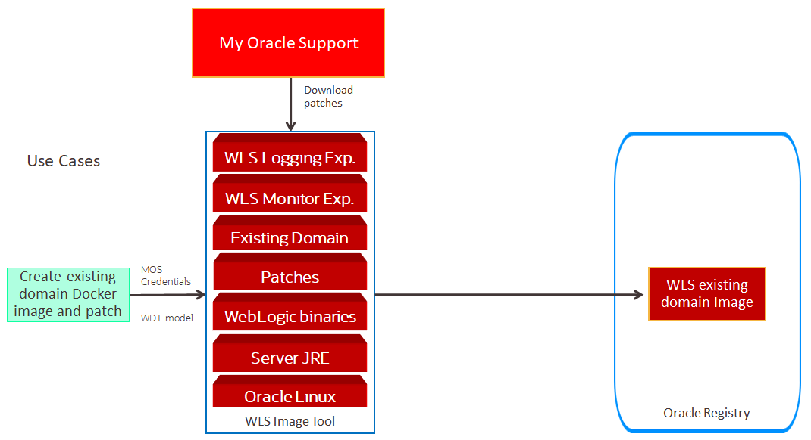

# Create Existing WebLogic domain Docker image using Oracle WebLogic Image Tool #

For the continuation of this Hands on Lab we are going to use the existing WebLogic Domain artifact that was created, an archive and model from WDT script. In this part we will create a docker image that will be added with WebLogic Monitoring Exporter and WebLogic Logging Exporter, also the process will add latest patch then finally will be stored inside OCIR as init image.



### Prerequisites ###

- Access to the bastion OS that will access OKE cluster and OCIR.
- Docker engine enabled OS
- WebLogic and Java SDK binary (from eDelivery)
- Oracle Support ID (email address)

#### Prepare OCIR access from bastion ####

Before you can store docker image to OCIR you need to get your Oracle Container Registry token. Token acts as password to container registry provided by Oracle Cloud Infrastructure.

1.  OCIR Password
    Open your OCI (Oracle Cloud Infrastructure) Console. If necessary Sign in again using your Cloud Services link you got in email during the registration process. Using the OCI console page click the user icon and select **User Settings**. On the left area of the User details page select the **Auth Tokens** item. Click the **Generate Token** to get a new token.

    

    Enter a description which allows you to easily identify the allocated token later. For example if you want to revoke then you have to find the proper token to delete. For example *ocir*.

    

    Now **copy and store(!)** your generated token for later, which will be use in bastion and Oracle Pipeline (Wercker). Click **Close**.

    

2.  OCIR Username 
    Since you are on the User details page please note the proper user name for later usage. You need to use this as part of username in order to login to OCI Registry for push and pull images.

    

    Another part for OCIR username is repository name that can retrieved by opening OCIR in Cloud Console

    
    

    In this case you need to keep value "axrtkaqgdfo8" as part for the login, which will make the username to access OCIR is axrtkaqgdfo8/oracleidentitycloudservice/john.p.smith@xxxx.com
    
3.  OCIR Server Address
    To get OCIR Server address, you must know the tenancy region location of the OCIR and OKE, which can be located on the top right of console then it will need to be combined in format <region-key>.ocir.io, the region-key mapping itself is located [here](https://docs.cloud.oracle.com/en-us/iaas/Content/Registry/Concepts/registryprerequisites.htm#Availab). Below, while creating repository that will be used during Hands on Lab, we can see that Region is US West (Phoenix), which makes the OCIR Server Address is phx.ocir.io
    
    

After all 3 components being gathered you can try to login to the OCIR repository using docker command.
```
docker login phx.ocir.io -u axrtkaqgdfo8/oracleidentitycloudservice/john.p.smith@xxxx.com
```
The expected result will be:
```
Password:
WARNING! Your password will be stored unencrypted in /home/opc/.docker/config.json.
Configure a credential helper to remove this warning. See
https://docs.docker.com/engine/reference/commandline/login/#credentials-store

Login Succeeded
```

#### Prepare Docker in bastion ####

Most of the time, there is no out of the box docker capability, so we need to enable docker engine in the OS, otherwise we cannot login to OCIR repository. To do that you need to have sudo or root privileges, and do the following:
```
yum install -y yum-utils zip unzip
yum-config-manager --enable ol7_optional_latest
yum-config-manager --enable ol7_addons
yum install -y oraclelinux-developer-release-el7
yum-config-manager --enable ol7_developer
yum install -y docker-engine
systemctl enable docker
chkconfig docker on
```
Above commands will enable docker engine capability in bastion and auto start docker engine after reboot. Beside this, you need to check also the firewall and SELinux in the bastion OS, make sure it open the required ports.
