# Oracle WebLogic Operator Tutorial #

### Deploy WebLogic domain  ###

#### Preparing the Kubernetes cluster to run WebLogic domains ####

Create the domain namespace:
```
kubectl create namespace wls-k8s-domain-ns
```
Create a Kubernetes secret containing the Administration Server boot credentials:
```
kubectl -n wls-k8s-domain-ns create secret generic wls-k8s-domain-weblogic-credentials \
  --from-literal=username=weblogic \
  --from-literal=password=welcome1
```
Label the secret with domainUID:
```
kubectl label secret wls-k8s-domain-weblogic-credentials \
  -n wls-k8s-domain-ns \
  weblogic.domainUID=wls-k8s-domain \
  weblogic.domainName=wls-k8s-domain
```
Create OCI image Registry secret to allow Kubernetes to pull you custome WebLogic image. Replace the registry server region code, username and auth token respectively.
WARNING!!! - be careful about username - docker-username parameter should have a value of YOUR_TENACY_NAME/YOUR_OCIR_USERNAME - don't skip YOUR_TENANCY_NAME please.
```
kubectl create secret docker-registry ocirsecret \
  -n wls-k8s-domain-ns \
  --docker-server=YOUR_HOME_REGION_CODE.ocir.io \
  --docker-username='YOUR_TANACY_NAME/YOUR_OCIR_USERNAME' \
  --docker-password='YOUR_OCIR_AUTH_TOKEN' \
  --docker-email='YOUR_EMAIL'
```
For example:
```
$ kubectl create secret docker-registry ocirsecret \
  -n wls-k8s-domain-ns \
  --docker-server=fra.ocir.io \
  --docker-username='johnpsmith/oracleidentitycloudservice/john.p.smith@example.com' \
  --docker-password='my_auth_token_generated_earlier' \
  --docker-email='john.p.smith@example.com'
  secret "ocirsecret" created
```

#### Update WebLogic Operator configuration ####

Once you have your domain namespace (WebLogic domain not yet deployed) you have to update loadbalancer's and operator's configuration about where the domain will be deployed.

Make sure before execute domain `helm` install you are in the WebLogic Operator's local Git repository folder.
```
cd /u01/content/weblogic-kubernetes-operator/
```
To update operator execute the following `helm upgrade` command:
```
helm upgrade \
  --reuse-values \
  --set "domainNamespaces={wls-k8s-domain-ns}" \
  --wait \
  sample-weblogic-operator \
  kubernetes/charts/weblogic-operator
```
Please note the only updated parameter in this case is the domain namespace.

#### Deploy WebLogic domain on Kubernetes ####

To deploy WebLogic domain you need to create a domain resource definition which contains the necessary parameters for the operator to start the WebLogic domain properly.

You can modify the provided sample in the local repository or better if you make a copy first.
```
cp /u01/content/weblogic-kubernetes-operator/kubernetes/samples/scripts/create-weblogic-domain/manually-create-domain/domain.yaml \
/u01/domainKube.yaml
```
Use your favourite text editor to modify domain resource definition values. If necessary remove comment leading character (#) of the parameter to activate. Always enter space before the value, after the colon.

Set the following values:

| Key | Value | Example |
|-|-|-|
|name:|wls-k8s-domain||
|namespace:|wls-k8s-domain-ns||
|weblogic.domainUID:|wls-k8s-domain||
|domainHome:|/u01/oracle/user_projects/domains/wls-k8s-domain||
|image:|YOUR_OCI_REGION_CODE.ocir.io/YOUR_TENANCY_NAME/weblogic-operator-tutorial:latest|"fra.ocir.io/johnpsmith/weblogic-operator-tutorial:latest"|
|imagePullPolicy:|"Always"||
|imagePullSecrets: <br>- name:|imagePullSecrets: <br>- name: ocirsecret||
|webLogicCredentialsSecret: <br>&nbsp;name:|webLogicCredentialsSecret: <br>&nbsp;name: wls-k8s-domain-weblogic-credentials||

Your `domainKube.yaml` should be almost the same what is [available in the imported tutorial repository (click the link if you want to compare and check)](https://github.com/tazlambert/weblogic-operator-tutorial/blob/master/domainKube.yaml).

Upload domainKube.yaml to your Github repository and place it in the root directory:

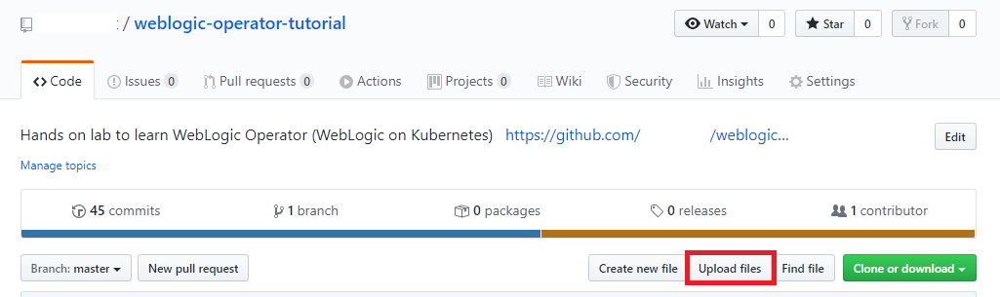
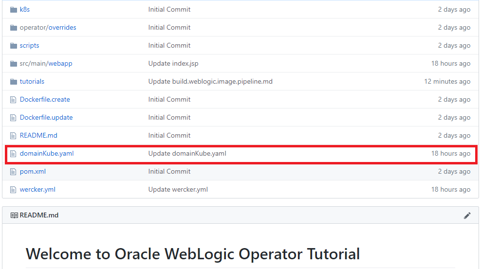

To create domain we need to create new workflow by clicking the **Worklflow** tab and then **Add new pipeline** to enable pipeline defined in *wercker.yml* in this case deploy-to-cluster pipeline.

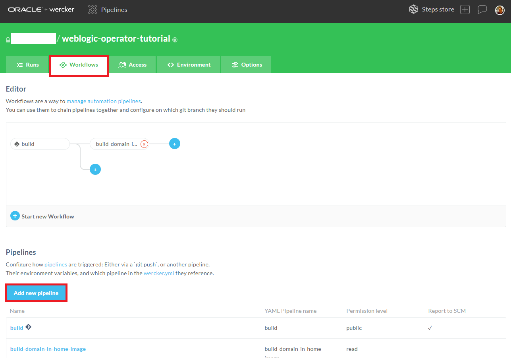

Enter the name of the pipeline and the "YML Pipeline Name" as *deploy-to-cluster*. Please enter exactly this name - because this name is hardcoded in the *wercker.yml*. Click **Create**.

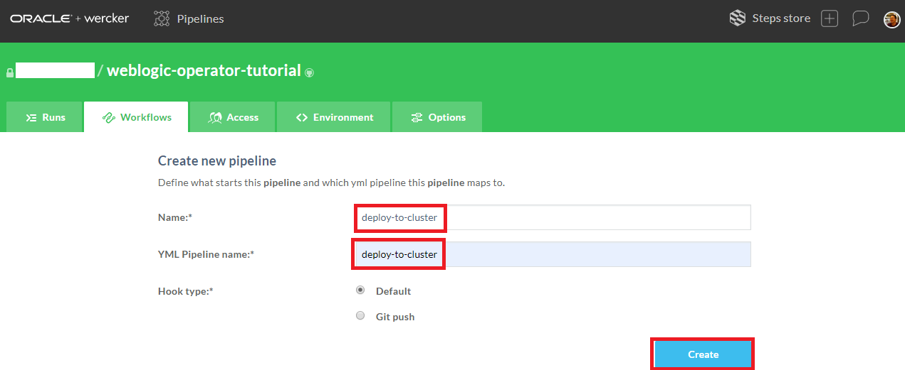

Click again the **Worklflow** tab to get back to the editor page. Click the + sign after the mandatory *build* pipeline.

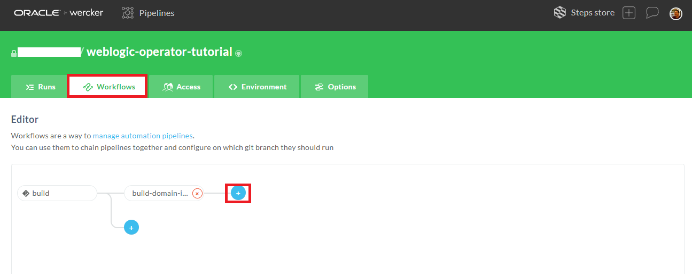

Leave the default branch(es) configuration and select the *deploy-to-cluster* pipeline.

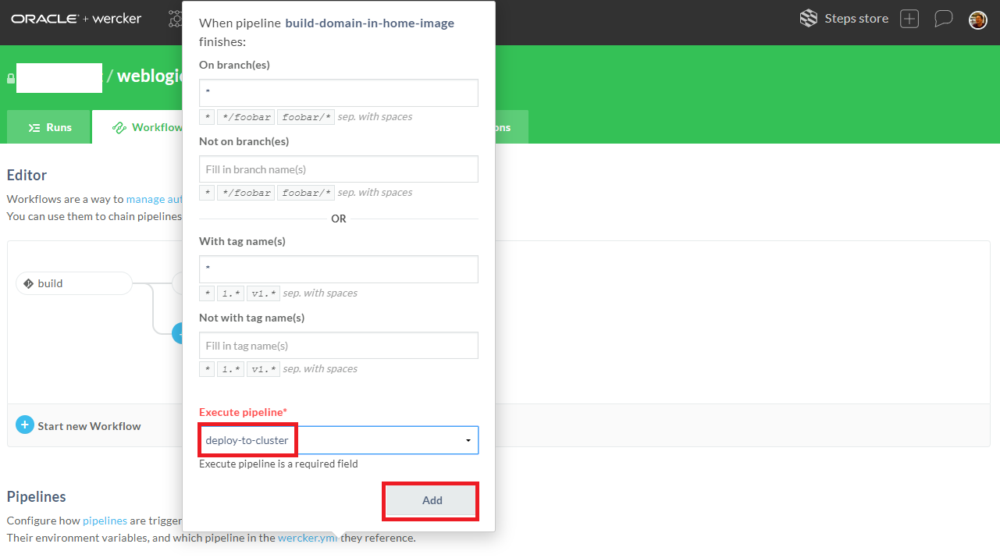

Your final workflow should be similar below:

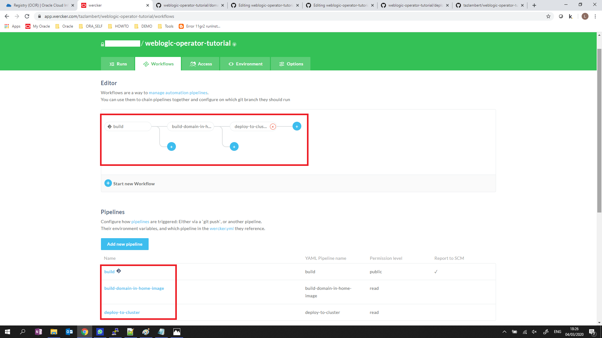

Go to the **Runs** tab and click ***build-domain-in-home-image***.

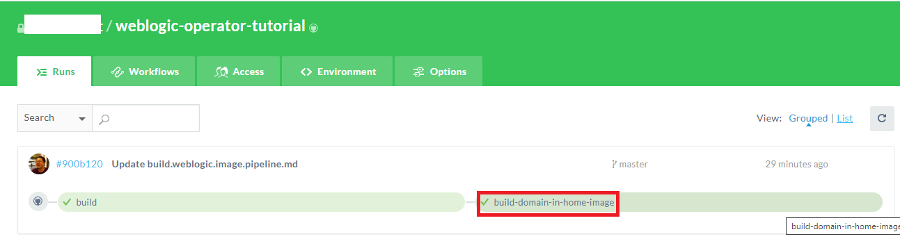

Go click the **Actions** button and click ***deploy-to-cluster***.

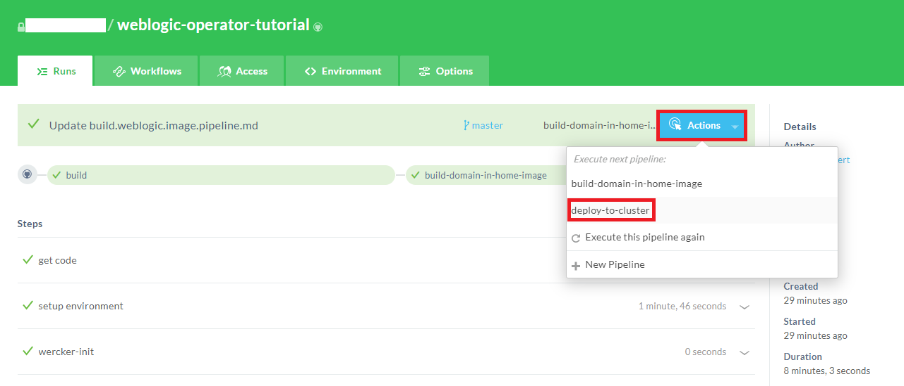

Click **Execute Pipeline** button.

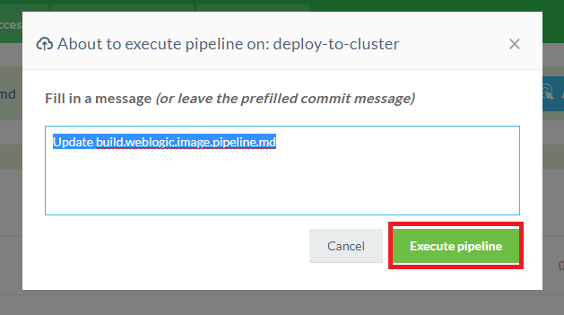

When the workflow is completed the WebLogic is available in the kubernetes cluster.

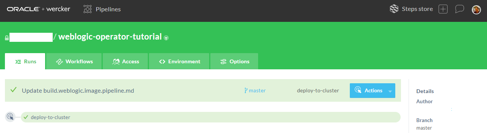

Check the introspector job which needs to be run first:
```
$ kubectl get pod -n wls-k8s-domain-ns
NAME                                         READY     STATUS              RESTARTS   AGE
sample-domain1-introspect-domain-job-kcn4n   0/1       ContainerCreating   0          7s
```
Check periodically the pods in the domain namespace and soon you will see the servers are starting:
```
$ kubectl get po -n wls-k8s-domain-ns -o wide
NAME                             READY     STATUS    RESTARTS   AGE       IP            NODE            NOMINATED NODE
sample-domain1-admin-server      1/1       Running   0          2m        10.244.2.10   130.61.84.41    <none>
sample-domain1-managed-server1   1/1       Running   0          1m        10.244.2.11   130.61.84.41    <none>
sample-domain1-managed-server2   0/1       Running   0          1m        10.244.1.4    130.61.52.240   <none>
```
You have to see three running pods similar to the result above. If you don't see all the running pods please wait and check periodically. The whole domain deployment may take up to 2-3 minutes depending on the compute shapes.
