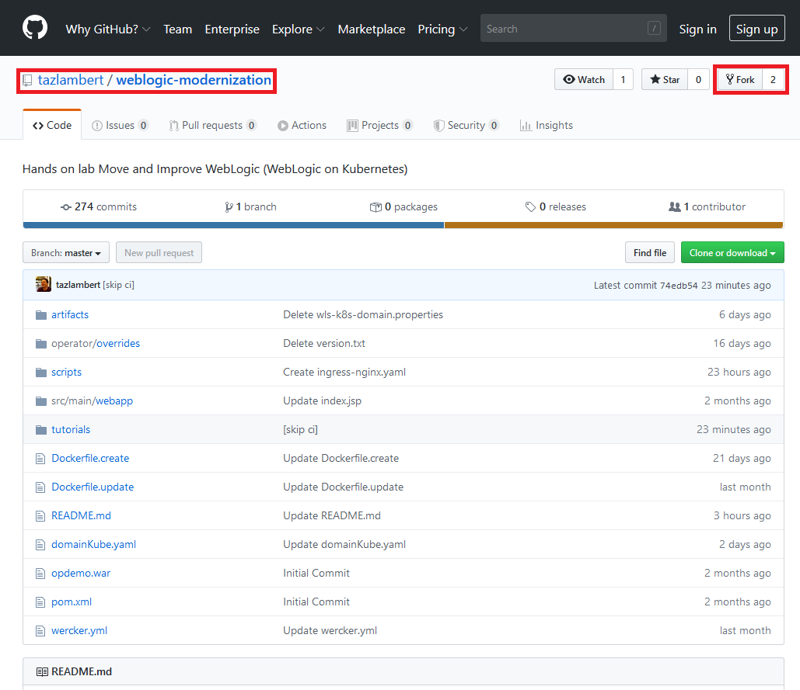
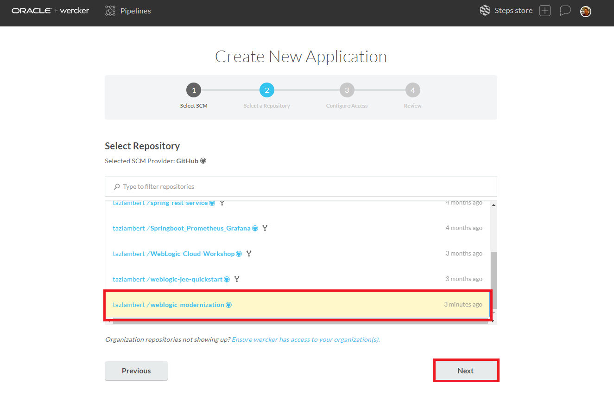
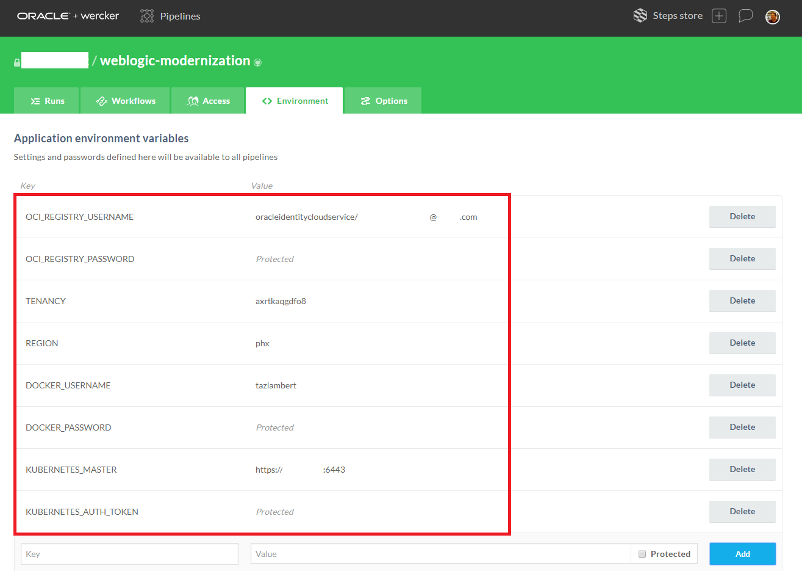
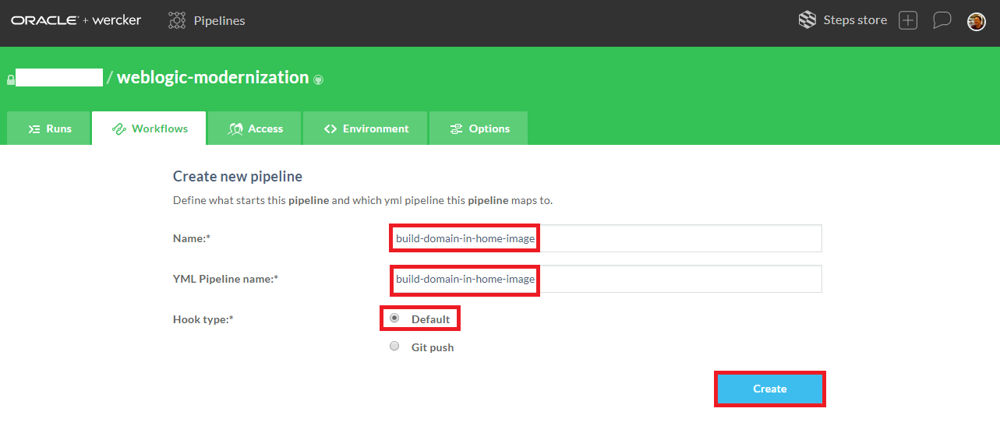
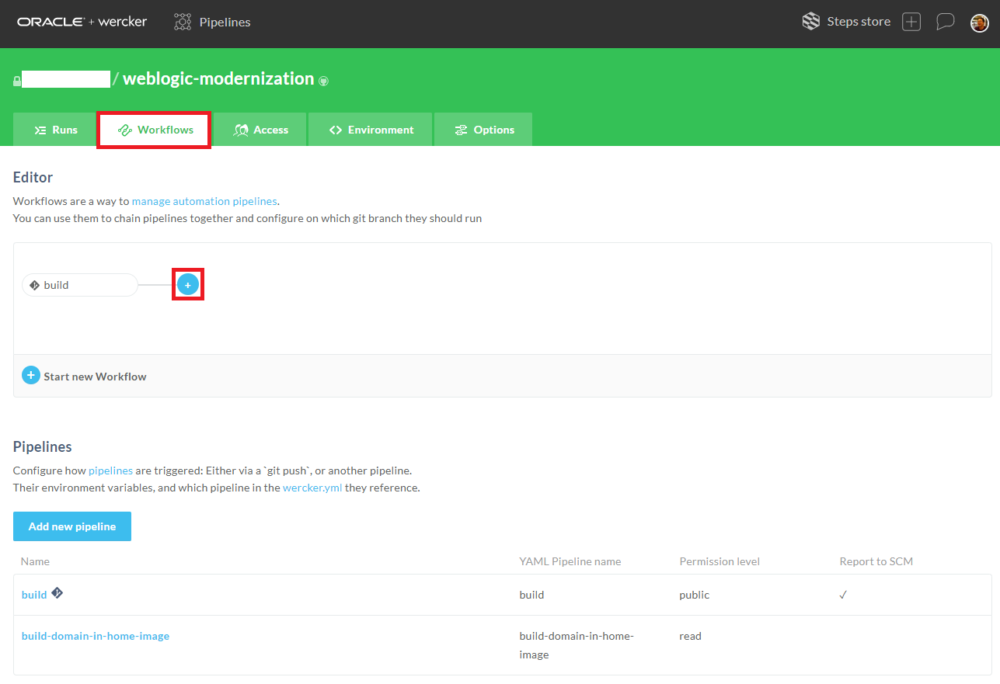
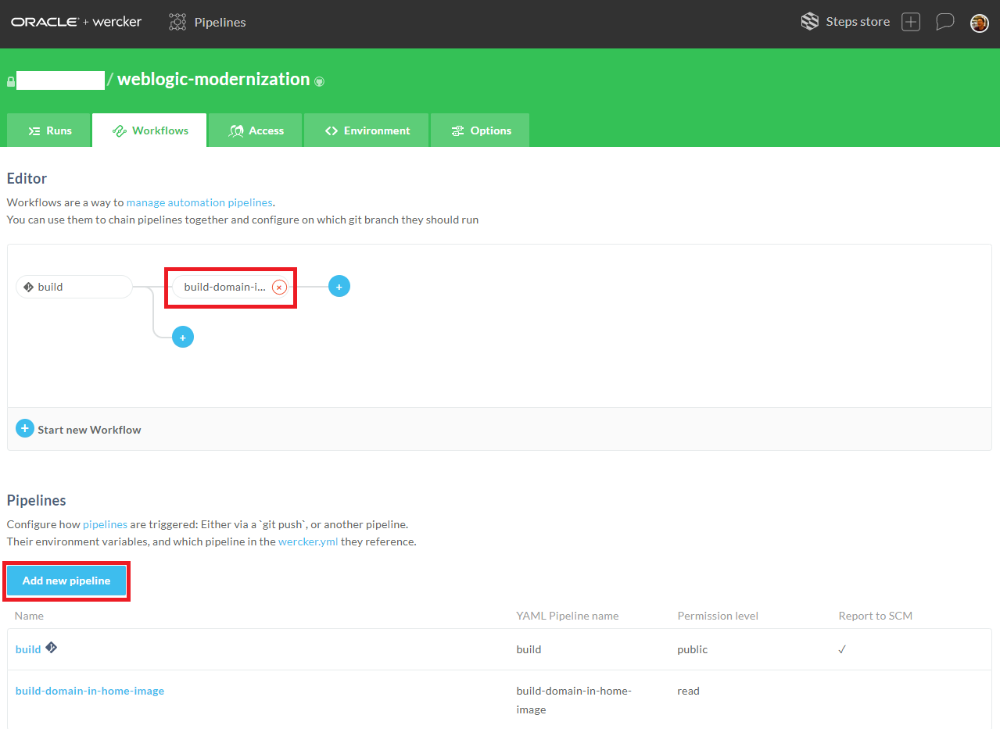

# Setup Oracle Container Pipelines (Wercker) to Enable CI/CD for WebLogic Application #

**Oracle Container Pipelines (Wercker)** is a Docker-Native CI/CD  Automation platform for Kubernetes & Microservice Deployments. Wercker is integrated with Docker containers, which package up application code and can be easily moved from server to server. Each build artifact can be a Docker container. The user can take the container from the Docker Hub or his private registry and build the code before shipping it. Its SaaS platform enables developers to test and deploy code often. They can push software updates incrementally as they are ready, rather than in bundled dumps. 

Oracle Container Pipelines makes it easier for coders to practice continuous integration, a software engineering practice in which each change a developer makes to the codebase is constantly tested in the process so that software doesn’t break when it goes live. Oracle Container Pipelines is based on the concept of pipelines, which are automated workflows. Pipelines take pieces of code and automatically execute a series of steps upon that code.

This hands on labs demonstrates how to create Oracle Container Pipelines application (CI/CD) to update custom WebLogic container image using customized Docker image or build official WebLogic image from Docker Store as base source.

The custom WebLogic Domain has the following components configured/deployed:

- Web Application to demonstrate WebLogic Operator features and application life cycle management
- JDBC DataSource to demonstrate WebLogic Operator override feature

The key components of Oracle Container Pipelines:

+ **Step** is self-contained bash script or compiled binary for accomplishing specific automation tasks.
+ **Pipelines** are a series of steps that are triggered on a git push or the completion of another pipeline.
+ **Workflows** are a set of chained and branched pipelines that allow you to form multi-stage, multi-branch complex CI/CD flows that take your project from code to production.
+ All pipelines execute inside a **Docker container** and every build artefact can be a Docker container.

### Prerequisites ###

- [Oracle Cloud Infrastructure](https://cloud.oracle.com/en_US/cloud-infrastructure) enabled account.
- [Docker](https://hub.docker.com/) account.
- [Github ](sign.up.github.md) account.
- [Oracle Container Pipeline](sign.up.wercker.md)

#### Accept Licence Agreement to use `store/oracle/weblogic:12.2.1.4` image from Docker Store ####

If you have not used the base image [`store/oracle/weblogic:12.2.1.4`](https://store.docker.com/images/oracle-weblogic-server-12c) before, you will need to visit the [Docker Store web interface](https://store.docker.com/images/oracle-weblogic-server-12c) and accept the license agreement before the Docker Store will give you permission to pull that image.

Open [https://store.docker.com/images/oracle-weblogic-server-12c](https://store.docker.com/images/oracle-weblogic-server-12c) in a new browser and click **Log In**.


Enter your account details and click **Login**.


Click **Proceed to Checkout**.


Complete your contact information and accept agreements. Click **Get Content**.


Now you are ready to pull the  image on Docker enabled host after authenticating yourself in Docker Hub using your Docker Hub credentials.


#### Import WebLogic Modernization's source repository into your Github repository ####

In this step you will fork the tutorial's source repository. The source repository contains the demo application deployed on top of WebLogic server, configuration yaml to quickly create Oracle Container Pipelines(CI/CD) application to build custom WebLogic image and few additional Kubernetes configuration files to deploy the custom WebLogic image.

Open the *https://github.com/tazlambert/weblogic-modernization.git* repository in your browser. Click the **Fork** button at the left top area. Sign in to github.com if necessary.



Wait until the fork process is complete.

#### Create Oracle Container Pipelines Application to build custom WebLogic Docker container including demo application ####

First create your Oracle Container Pipelines application. Oracle Container Pipelines acts as continuous integration tool which will produce WebLogic container image and uploads to Oracle Container Registry.

The following pipelines are predefined in the Oracle Container Pipelines configuration file ([wercker.yml](https://github.com/nagypeter/weblogic-operator-tutorial/blob/master/wercker.yml)):

- **build**: Default and mandatory pipeline to start the workflow. It builds the demo Web Application using Maven.
- **build-domain-in-home-image**: Pipeline which runs Docker build to create custom WebLogic container image. 
> When no *latest* image available in repository it uses official WebLogic image from Docker Store as base image and runs WLST script to customise the image. Also copies the demo Web Application into the image and deploys using WLST. 

> When *latest* (tag) of the image is available in the repository then the workflow just builds the Web Application and update the *latest* image with the new application binaries. 

> After the Docker build the pipeline produces a new image and pushes to the image repository (OCIR). Thus every time when changes happen in the sources and committed to Github. The image tag will be the commit hash tag of the source changes  which triggered the new build process. Also the historically latest gets the *latest* tag as well.

- **deploy-to-cluster**: This pipeline will pull the image from image repository (OCIR) and deploy the image to the destined Kubernetes cluster.

[Sign in to Oracle Container Pipelines (former Wercker)](https://app.wercker.com/) and click **Create your first application** button or the **+** icon at the top right corner and select *Add Application*.

NOTE! If you need to sign up to Oracle Container Pipelines do it with your Github account. Click the **LOG IN WITH GITHUB** button and authorise Oracle Container Pipelines application for your Github account. You can revoke Oracle Container Pipelines's authorisation request anytime using your Github's profile settings.


Select the owner of the application. By default it is your Oracle Container Pipelines username, but it can be any organization where you belong to. Make sure the selected SCM is *GitHub*. Click **Next**.


Select *weblogic-mdoernization* repository what you imported previously. Click **Next**.



Leave the default repository access without SSH key. Click **Next**.


If you want you can make your application public if you want to share the application's status otherwise leave the default private settings. Click **Create**.


The repository already contains a necessary `wercker.yml` but before the execution provide the following key/value pairs:

| Key | Value | Note |
|----------------|---------------------------------------------------------------------------|------------------------------------------------------------------------------------------------------------------------------------------------------------------|
| OCI_REGISTRY_USERNAME | your_cloud_username |  The username what you note during user settings. e.g. oracleidentitycloudservice/john.p.smith@example.com |
| OCI_REGISTRY_PASSWORD | OCIR Auth Token | The Auth Token you generated [previously](https://github.com/tazlambert/weblogic-modernization/blob/master/tutorials/create.domain.docker.image.md#prepare-ocir-access-from-bastion) |
| TENANCY | Name of your registry | To store and retrieve image from OCIR that was [generated](https://github.com/tazlambert/weblogic-modernization/blob/master/tutorials/create.domain.docker.image.md#prepare-ocir-access-from-bastion) |
| REGION | The code of your home region. See the [documentation](https://docs.cloud.oracle.com/iaas/Content/Registry/Concepts/registryprerequisites.htm#Availab) to get your region code. | That was generated [previously](https://github.com/tazlambert/weblogic-modernization/blob/master/tutorials/create.domain.docker.image.md#prepare-ocir-access-from-bastion) |
| DOCKER_USERNAME | Your Docker Hub username | Necessary to pull official WebLogic Server image from Docker Store |
| DOCKER_PASSWORD | Your Docker Hub password | Necessary to pull official WebLogic Server image from Docker Store |
| KUBERNETES_MASTER | Your OKE Public IP:Port | Necessary to push modified WebLogic Server image from Image Store (OCIR) |
| KUBERNETES_AUTH_TOKEN | Your OKE-ADMIN Token | Necessary to push modified WebLogic Server image from Image Store (OCIR) |

To define these variables click **<>Environment** tab and enter keys and values. Remember that these values will be visible to anyone to whom you give access to the Oracle Container Pipelines application, therefore select **Protected** for any values that should remain hidden, including all passwords.



Click the **Worklflow** tab and then **Add new pipeline** to enable pipeline defined in *wercker.yml*.


Enter the name of the pipeline and the "YML Pipeline Name" as *build-domain-in-home-image*. Please enter exactly this name - because this name is hardcoded in the *wercker.yml*. Click **Create**.



Click again the **Worklflow** tab to get back to the editor page. Click the + sign after the mandatory *build* pipeline.



Leave the default branch(es) configuration and select the *build-domain-in-home-image* pipeline.


Now your workflow should be similar below, deploy-to-cluster will be added after this by clicking **Add new pipeline** to enable pipeline defined in *wercker.yml* in this case deploy-to-cluster pipeline:



Enter the name of the pipeline and the "YML Pipeline Name" as *deploy-to-cluster*. Please enter exactly this name - because this name is hardcoded in the *wercker.yml*. Click **Create**.


Click again the **Worklflow** tab to get back to the editor page. Click the + sign after the mandatory *build* pipeline.


Leave the default branch(es) configuration and select the *deploy-to-cluster* pipeline.


Your final workflow should be similar below:


---
Above configurations is linkend into wercker.yaml files that located in the root directory of the github repository, the file we can divide into 3 parts, the first one is to build the demo applications using maven
```
no-response-timeout: 15
box: combient/java-mvn
build:
  steps:
    - script:
        name: Maven build - MBean Sample application
        code: mvn clean package
```
The second part is where the Oracle Container Pipeline main task is to update or create Docker image and also store the update Docker image back to OCIR, those Docker image contained custom WebLogic Domain with its application. This part show some easier integration with linux alpine box and docker daemon.
```
build-domain-in-home-image:
  box:
      id: alpine
      cmd: /bin/sh
  docker: true
  steps:
    - script:
        name: Install curl and docker
        code: apk --no-cache add curl docker
    - script:
        name: Build docker image
        code: |
              docker login $REGION.ocir.io -u $TENANCY/$OCI_REGISTRY_USERNAME -p $OCI_REGISTRY_PASSWORD
              if docker pull $REGION.ocir.io/$TENANCY/$WERCKER_APPLICATION_NAME:latest; then
                docker build --file Dockerfile.update \
                    --build-arg SOURCEIMAGE=$REGION.ocir.io/$TENANCY/$WERCKER_APPLICATION_NAME:latest \
                    --force-rm=true \
                    -t $REGION.ocir.io/$TENANCY/$WERCKER_APPLICATION_NAME:$WERCKER_GIT_COMMIT \
                    -t $REGION.ocir.io/$TENANCY/$WERCKER_APPLICATION_NAME:latest .
              else
                docker login -u $DOCKER_USERNAME -p $DOCKER_PASSWORD
                docker build --file Dockerfile.create \
                    --force-rm=true \
                    -t $REGION.ocir.io/$TENANCY/$WERCKER_APPLICATION_NAME:$WERCKER_GIT_COMMIT \
                    -t $REGION.ocir.io/$TENANCY/$WERCKER_APPLICATION_NAME:latest .
              fi
    - script:
        name: Push the image to a repository
        code: |
              docker login $REGION.ocir.io -u $TENANCY/$OCI_REGISTRY_USERNAME -p $OCI_REGISTRY_PASSWORD
              docker push $REGION.ocir.io/$TENANCY/$WERCKER_APPLICATION_NAME:$WERCKER_GIT_COMMIT
              docker push $REGION.ocir.io/$TENANCY/$WERCKER_APPLICATION_NAME:latest
```
The third part is in charge in deploying the Docker image into the destined Kubernetes cluster based on domainKube.yaml file in github repository
```
deploy-to-cluster:
  box:
      id: alpine
      cmd: /bin/sh
  steps:
  - bash-template
  - script:
      name: "Visualise Kubernetes config"
      working-dir: /pipeline/source
      code: cat domainKube.yaml
  - kubectl:
      name: deploy to kubernetes
      server: $KUBERNETES_MASTER
      token: $KUBERNETES_AUTH_TOKEN
      insecure-skip-tls-verify: true
      working-dir: /pipeline/source
      command: apply -f domainKube.yaml
```
With this the Oracle Container Pipeline is ready to do CI/CD for WebLogic Domain.
