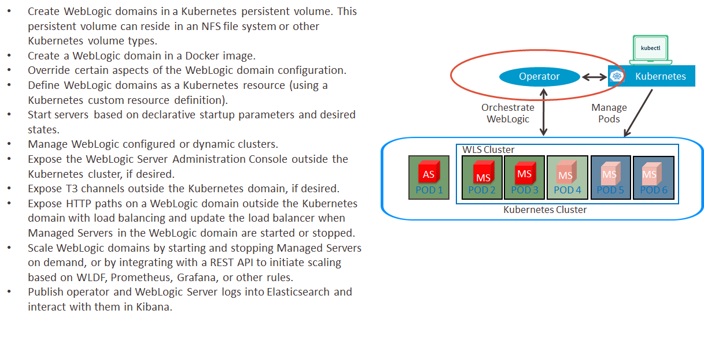

# Setup WebLogic Kubernetes Operator to orchestrate WebLogic in Kubernetes #

Oracle is finding ways for organizations using WebLogic Server to run important workloads, to move those workloads into the cloud. By certifying on industry standards, such as Docker and Kubernetes, WebLogic now runs in a cloud neutral infrastructure. In addition, we've provided an open-source Oracle WebLogic Server Kubernetes Operator (the “operator”) which has several key features to assist you with deploying and managing WebLogic domains in a Kubernetes environment. 



## Install and configure Operator  ##

An operator is an application-specific controller that extends Kubernetes to create, configure, and manage instances of complex applications. The Oracle WebLogic Server Kubernetes Operator (the "operator") simplifies the management and operation of WebLogic domains and deployments. Before we start, we need to clone the WebLogic Operator git repository into the bastion PC.
```
sudo yum install git -y
cd
git clone https://github.com/oracle/weblogic-kubernetes-operator.git  -b release/2.5.0
```

### Install the Elasticsearch and Kibana  ###

When you install the WebLogic Kubernetes Operator Helm chart, you can set elkIntegrationEnabled to true in your values.yaml file to tell the operator to send the contents of the operator’s logs to Elasticsearch. Typically, you would have already configured Elasticsearch and Kibana in the Kubernetes cluster, and also would have specified elasticSearchHost and elasticSearchPort in your values.yaml file to point to where Elasticsearch is already running.
```
cd weblogic-kubernetes-operator/kubernetes/samples/scripts/elasticsearch-and-kibana/
kubectl apply -f elasticsearch_and_kibana.yaml
```
The scripts will create several items like below:
```
deployment.apps/elasticsearch created
service/elasticsearch created
deployment.apps/kibana created
service/kibana created
```
The service that is created a elasticsearch that accessible within the Kubernetes only, and a kibana service that accessible from anywhere through Kubernetes Node, where port 5601 already mapped to other port.
```
[opc@bastion1 elasticsearch-and-kibana]$ kubectl get pods -o wide
NAME                             READY   STATUS    RESTARTS   AGE     IP           NODE        NOMINATED NODE   READINESS GATES
elasticsearch-6858c54456-m2gxm   1/1     Running   0          4m23s   10.244.2.6   10.0.10.4   <none>           <none>
kibana-6d74455686-jc29k          1/1     Running   0          4m23s   10.244.0.6   10.0.10.2   <none>           <none>
[opc@bastion1 elasticsearch-and-kibana]$ kubectl get services
NAME            TYPE        CLUSTER-IP      EXTERNAL-IP   PORT(S)             AGE
elasticsearch   ClusterIP   10.96.236.194   <none>        9200/TCP,9300/TCP   4m46s
kibana          NodePort    10.96.178.103   <none>        5601:32172/TCP      4m46s
kubernetes      ClusterIP   10.96.0.1       <none>        443/TCP             6d
```
From above results kibana can be accessed from 10.0.10.2:32172.

### Install the Operator with a Helm chart ###

Before using helm install it using script https://helm.sh/docs/intro/install/ make sure to choose appropriate version, by sepcifying it in the command 
```
curl -fsSL -o get_helm.sh https://raw.githubusercontent.com/helm/helm/master/scripts/get-helm-3
chmod 755 get_helm.sh
./get_helm.sh --version v2.16.6
sudo ln -s /usr/local/bin/helm /usr/bin/helm
helm init
helm repo add weblogic-operator https://oracle.github.io/weblogic-kubernetes-operator/charts
helm repo list
helm repo update
```
In order to use Helm to install and manage the operator, you need to ensure that the service account that Tiller uses
has the `cluster-admin` role.  The default would be `default` in namespace `kube-system`.  You can give that service
account the necessary permissions with this command:

```
cat << EOF | kubectl apply -f -
apiVersion: rbac.authorization.k8s.io/v1
kind: ClusterRoleBinding
metadata:
  name: helm-user-cluster-admin-role
roleRef:
  apiGroup: rbac.authorization.k8s.io
  kind: ClusterRole
  name: cluster-admin
subjects:
- kind: ServiceAccount
  name: default
  namespace: kube-system
EOF
```
The output has to be the following:

    clusterrolebinding "helm-user-cluster-admin-role" created

Kubernetes distinguishes between the concept of a user account and a service account for a number of reasons. The main reason is that user accounts are for humans while service accounts are for processes, which run in pods. WebLogic Operator also requires service accounts.  If service account not specified, it defaults to default (for example, the namespace's default service account). If you want to use a different service account, then you must create the operator's namespace and the service account before installing the operator Helm chart.

Thus create operator's namespace in advance:

    kubectl create namespace sample-weblogic-operator-ns

Create the service account:

    kubectl create serviceaccount -n sample-weblogic-operator-ns sample-weblogic-operator-sa

Make sure before execute operator `helm` install you are in the WebLogic Operator's local Git repository folder.

    cd /u01/content/weblogic-kubernetes-operator/

Use the `helm install` command to install the operator Helm chart. As part of this, you must specify a "release" name for their operator.

You can override default configuration values in the operator Helm chart by doing one of the following:

- Overriding individual values directly on the Helm command line, using the `--set` option.
- Creating a custom YAML from the [template YAML](https://github.com/oracle/weblogic-kubernetes-operator/blob/master/kubernetes/charts/weblogic-operator/values.yaml) file containing the values to be overridden, and specifying the `--value` option on the Helm command line.
```
serviceAccount: "sample-weblogic-operator-sa"
dedicated: false
domainNamespaces:
  - "default"
image: "oracle/weblogic-kubernetes-operator:2.5.0"
imagePullPolicy: "IfNotPresent"
externalRestEnabled: false
externalRestHttpsPort: 31001
remoteDebugNodePortEnabled: false
suspendOnDebugStartup: false
internalDebugHttpPort: 30999
externalDebugHttpPort: 30999
javaLoggingLevel: "INFO"
elkIntegrationEnabled: true
logStashImage: "logstash:6.6.0"
elasticSearchHost: "elasticsearch.default.svc.cluster.local"
elasticSearchPort: 9200
istioEnabled: false
```
For this lab we are going to use custom Value from above and save it as wkoValues.yaml and save it inside weblogic-kubernetes-operator directory.

Note the values:

- **name**: name of the resource
- **namespace**: where the operator deployed
- **values**: custom values for WebLogic Operator parameter, especially connecting it to elasticsearch.

Execute the following `helm install`:
```
helm install kubernetes/charts/weblogic-operator --name sample-weblogic-operator --namespace sample-weblogic-operator-ns --values=wkoValues.yaml
```
The result has to be similar:
```
NAME:   sample-weblogic-operator
LAST DEPLOYED: Sat May  2 10:44:22 2020
NAMESPACE: sample-weblogic-operator-ns
STATUS: DEPLOYED

RESOURCES:
==> v1/ClusterRole
NAME                                                                      AGE
sample-weblogic-operator-ns-weblogic-operator-clusterrole-domain-admin    0s
sample-weblogic-operator-ns-weblogic-operator-clusterrole-general         0s
sample-weblogic-operator-ns-weblogic-operator-clusterrole-namespace       0s
sample-weblogic-operator-ns-weblogic-operator-clusterrole-nonresource     0s
sample-weblogic-operator-ns-weblogic-operator-clusterrole-operator-admin  0s

==> v1/ClusterRoleBinding
NAME                                                                             AGE
sample-weblogic-operator-ns-weblogic-operator-clusterrolebinding-auth-delegator  0s
sample-weblogic-operator-ns-weblogic-operator-clusterrolebinding-discovery       0s
sample-weblogic-operator-ns-weblogic-operator-clusterrolebinding-general         0s
sample-weblogic-operator-ns-weblogic-operator-clusterrolebinding-nonresource     0s

==> v1/ConfigMap
NAME                  DATA  AGE
weblogic-operator-cm  3     0s

==> v1/Deployment
NAME               READY  UP-TO-DATE  AVAILABLE  AGE
weblogic-operator  0/1    0           0          0s

==> v1/Role
NAME                    AGE
weblogic-operator-role  0s

==> v1/RoleBinding
NAME                                     AGE
weblogic-operator-rolebinding            0s
weblogic-operator-rolebinding-namespace  0s

==> v1/Secret
NAME                       TYPE    DATA  AGE
weblogic-operator-secrets  Opaque  0     0s

==> v1/Service
NAME                            TYPE       CLUSTER-IP   EXTERNAL-IP  PORT(S)   AGE
internal-weblogic-operator-svc  ClusterIP  10.96.24.39  <none>       8082/TCP  0s
```

Check the operator pod, supposed there are 2 component inside; weblogic-operator and logstash:
```
[opc@bastion1 weblogic-kubernetes-operator]$ kubectl get po -n sample-weblogic-operator-ns
NAME                                 READY   STATUS    RESTARTS   AGE
weblogic-operator-5bb44c9bd4-9m7rr   2/2     Running   0          15m
```
Check the operator helm chart:
```
[opc@bastion1 weblogic-kubernetes-operator]$ helm list sample-weblogic-operator
NAME                            REVISION        UPDATED                         STATUS          CHART                   APP VERSION     NAMESPACE
sample-weblogic-operator        1               Sat May  2 10:44:22 2020        DEPLOYED        weblogic-operator-2.5.0                 sample-weblogic-operator-ns
```

The WebLogic Operator has been installed. You can continue with next tutorial module.
