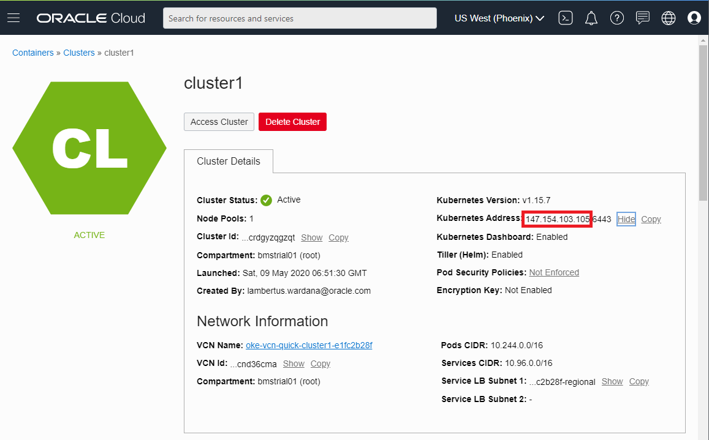
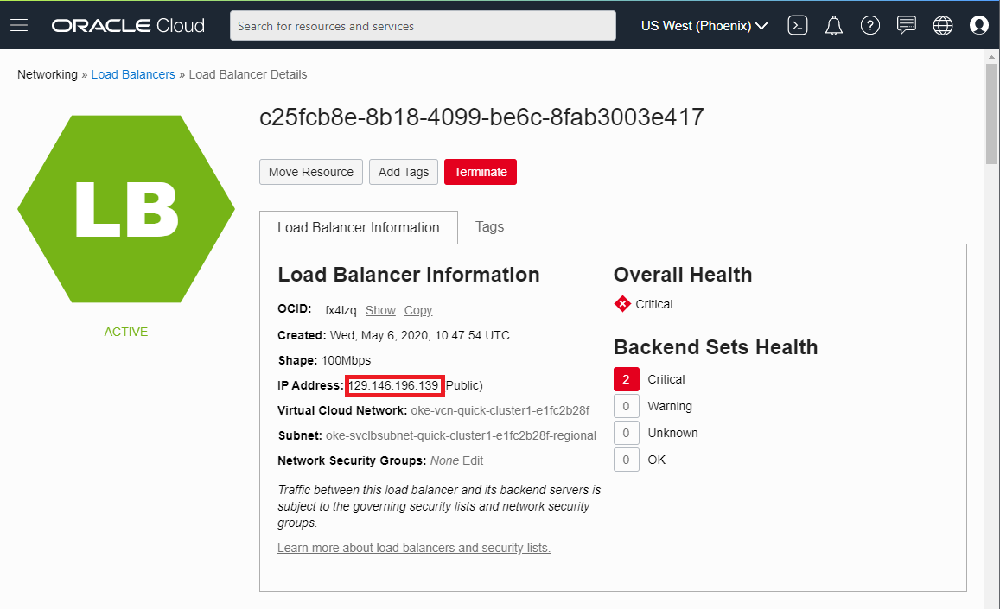
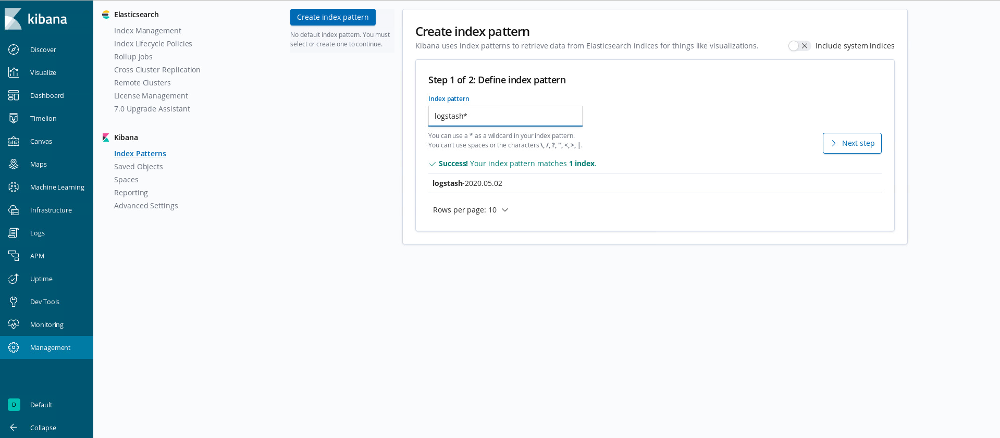
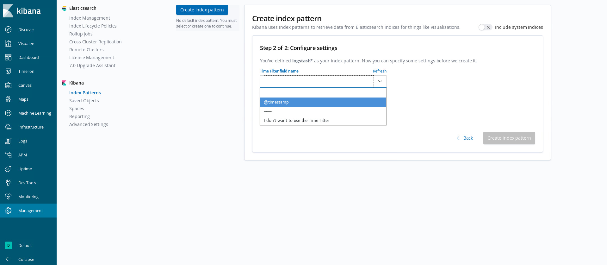
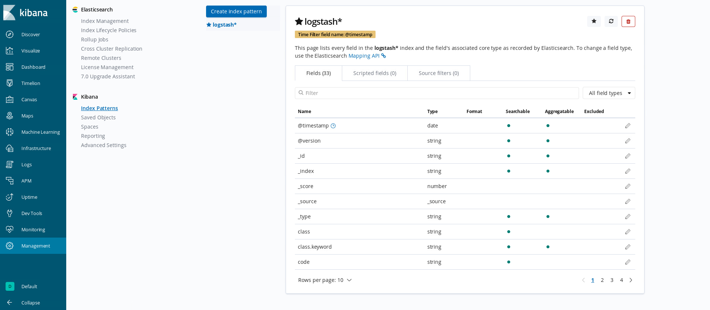
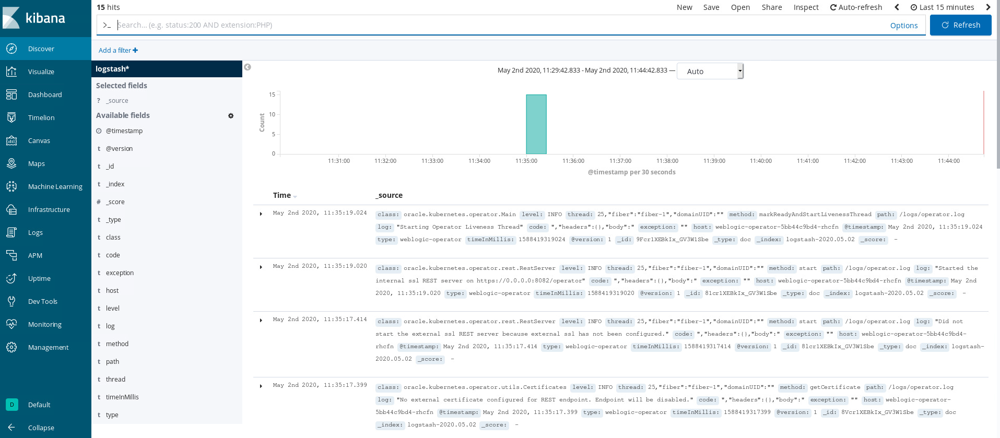

# Setup WebLogic Kubernetes Operator to orchestrate WebLogic in Kubernetes #

Oracle is finding ways for organizations using WebLogic Server to run important workloads, to move those workloads into the cloud. By certifying on industry standards, such as Docker and Kubernetes, WebLogic now runs in a cloud neutral infrastructure. In addition, we've provided an open-source Oracle WebLogic Server Kubernetes Operator (the “operator”) which has several key features to assist you with deploying and managing WebLogic domains in a Kubernetes environment. 


## Install and configure Operator  ##

An operator is an application-specific controller that extends Kubernetes to create, configure, and manage instances of complex applications. The Oracle WebLogic Server Kubernetes Operator (the "operator") simplifies the management and operation of WebLogic domains and deployments. Before we start, we need to clone the WebLogic Operator git repository into the bastion PC.
```
sudo yum install git -y
cd
git clone https://github.com/oracle/weblogic-kubernetes-operator.git  -b release/2.5.0
```

### Install the Elasticsearch and Kibana  ###

When you install the WebLogic Kubernetes Operator Helm chart, you can set elkIntegrationEnabled to true in your values.yaml file to tell the operator to send the contents of the operator’s logs to Elasticsearch. Typically, you would have already configured Elasticsearch and Kibana in the Kubernetes cluster, and also would have specified elasticSearchHost and elasticSearchPort in your values.yaml file to point to where Elasticsearch is already running.
```
cd weblogic-kubernetes-operator/kubernetes/samples/scripts/elasticsearch-and-kibana/
kubectl apply -f elasticsearch_and_kibana.yaml
```
The scripts will create several items like below:
```
deployment.apps/elasticsearch created
service/elasticsearch created
deployment.apps/kibana created
service/kibana created
```
The service that is created a elasticsearch that accessible within the Kubernetes only, and a kibana service that accessible from anywhere through Kubernetes Node, where port 5601 already mapped to other port.
```
[opc@bastion1 elasticsearch-and-kibana]$ kubectl get pods -o wide
NAME                             READY   STATUS    RESTARTS   AGE     IP           NODE        NOMINATED NODE   READINESS GATES
elasticsearch-6858c54456-m2gxm   1/1     Running   0          4m23s   10.244.2.6   10.0.10.4   <none>           <none>
kibana-6d74455686-jc29k          1/1     Running   0          4m23s   10.244.0.6   10.0.10.2   <none>           <none>
```
```
[opc@bastion1 elasticsearch-and-kibana]$ kubectl get services
NAME            TYPE        CLUSTER-IP      EXTERNAL-IP   PORT(S)             AGE
elasticsearch   ClusterIP   10.96.236.194   <none>        9200/TCP,9300/TCP   4m46s
kibana          NodePort    10.96.178.103   <none>        5601:32172/TCP      4m46s
kubernetes      ClusterIP   10.96.0.1       <none>        443/TCP             6d
```
From above results kibana can be accessed from 10.0.10.2:32172.

### Create Self Signed Certificate for External REST Port ###

First create operator's namespace in advance:

    kubectl create namespace weblogic-operator-ns
    
This sample script generates a self-signed certificate and private key that can be used for the operator's external REST api when experimenting with the operator. They should not be used in a production environment.

    $ kubernetes/samples/scripts/rest/generate-external-rest-identity.sh <SANs> -n <namespace> [-s <secret-name> ]

Where <SANs> lists the subject alternative names to put into the generated self-signed certificate for the external WebLogic Operator REST HTTPS interface, should match the namespace where the operator will be installed, and optionally the secret name, which defaults to weblogic-operator-external-rest-identity. Each must be prefaced by DNS: (for a name) or IP: (for an address), for example:
    
    DNS:myhost,DNS:localhost,IP:127.0.0.1
    
You should include the addresses of all masters and load balancers in this list. To find OKE Master IP address click burger menu, click Developer Service, click Container Clusters (OKE), click your OKE cluster (cluster1)



While the Load Balancer IP can be looked up by click burger menu, click Networking, click Load Balancers, pick the load balancer that use the same VCN as our OKE Cluster.



And we need to include also the IP of each Kubernetes Cluster Nodes into the certificate:
```
[opc@bastion1 ~]$ kubectl get nodes
NAME         STATUS   ROLES   AGE     VERSION
10.0.10.15   Ready    node    3m4s    v1.15.7
10.0.10.16   Ready    node    3m10s   v1.15.7
```
The certificate cannot be conveniently changed after installation of the operator. The script creates the secret in the weblogic-operator namespace with the self-signed certificate and private key.

    ./generate-external-rest-identity.sh DNS:localhost,IP:127.0.0.1,IP:129.146.196.139,IP:147.154.103.105,IP:10.0.10.15,IP:10.0.10.16 -n weblogic-operator-ns > selfsignedcert.yaml

The result of above script will be like this:

    externalRestIdentitySecret: weblogic-operator-external-rest-identity

Above value will be put inside the wkoValue.yaml

### Install the Operator with a Helm chart ###

Before using helm install it using script https://helm.sh/docs/intro/install/ make sure to choose appropriate version, by sepcifying it in the command 
```
curl -fsSL -o get_helm.sh https://raw.githubusercontent.com/helm/helm/master/scripts/get-helm-3
chmod 755 get_helm.sh
./get_helm.sh
sudo ln -s /usr/local/bin/helm /usr/bin/helm
helm repo add weblogic-operator https://oracle.github.io/weblogic-kubernetes-operator/charts
helm repo list
helm repo update
```
Kubernetes distinguishes between the concept of a user account and a service account for a number of reasons. The main reason is that user accounts are for humans while service accounts are for processes, which run in pods. WebLogic Operator also requires service accounts.  If service account not specified, it defaults to default (for example, the namespace's default service account). If you want to use a different service account, then you must create the operator's namespace and the service account before installing the operator Helm chart.

Create the service account:

    kubectl create serviceaccount -n weblogic-operator-ns weblogic-operator-sa

Make sure before execute operator `helm` install you are in the WebLogic Operator's local Git repository folder.

    cd
    cd weblogic-kubernetes-operator/

Use the `helm install` command to install the operator Helm chart. As part of this, you must specify a "release" name for their operator.

You can override default configuration values in the operator Helm chart by doing one of the following:

- Overriding individual values directly on the Helm command line, using the `--set` option.
- Creating a custom YAML from the [template YAML](https://github.com/oracle/weblogic-kubernetes-operator/blob/master/kubernetes/charts/weblogic-operator/values.yaml) file containing the values to be overridden, and specifying the `--value` option on the Helm command line.
```
serviceAccount: "weblogic-operator-sa"
dedicated: false
domainNamespaces:
  - "default"
image: "oracle/weblogic-kubernetes-operator:2.5.0"
imagePullPolicy: "IfNotPresent"
remoteDebugNodePortEnabled: false
suspendOnDebugStartup: false
internalDebugHttpPort: 30999
externalDebugHttpPort: 30999
javaLoggingLevel: "INFO"
# External REST Enabled
externalRestEnabled: true 
externalRestHttpsPort: 31001
externalRestIdentitySecret: weblogic-operator-external-rest-identity
# ELK Integration Part
elkIntegrationEnabled: true
logStashImage: "logstash:6.6.0"
elasticSearchHost: "elasticsearch.default.svc.cluster.local"
elasticSearchPort: 9200
# Istio Experimental Part
istioEnabled: false
```
For this lab we are going to use custom Value from above and save it as wkoValues.yaml and save it inside weblogic-kubernetes-operator directory.

Note the values:

- **name**: name of the resource
- **namespace**: where the operator deployed
- **values**: files contain custom values for WebLogic Operator parameter, named wkoValues.yaml where 3 optional parts configured here: External REST Enabled, ELK integration part, and Istio Experimental Part

Execute the following `helm install`:
```
helm install weblogic-operator kubernetes/charts/weblogic-operator --namespace weblogic-operator-ns --values=wkoValues.yaml --wait
```
The result has to be similar:
```
NAME: weblogic-operator
LAST DEPLOYED: Sat May  9 08:45:31 2020
NAMESPACE: weblogic-operator-ns
STATUS: deployed
REVISION: 1
TEST SUITE: None
```

Check the operator pod, supposed there are 2 component inside; weblogic-operator and logstash:
```
[opc@bastion1 weblogic-kubernetes-operator]$ kubectl get po -n weblogic-operator-ns
NAME                                 READY   STATUS    RESTARTS   AGE
weblogic-operator-5bb44c9bd4-9m7rr   2/2     Running   0          15m
```
From the service part we can see two services created, one is external for RET API and the other is for internal communication: 
```
[opc@bastion1 weblogic-kubernetes-operator]$ kubectl get svc -n weblogic-operator-ns
NAME                             TYPE        CLUSTER-IP      EXTERNAL-IP   PORT(S)          AGE
external-weblogic-operator-svc   NodePort    10.96.233.80    <none>        8081:31001/TCP   58s
internal-weblogic-operator-svc   ClusterIP   10.96.218.169   <none>        8082/TCP         58s
```
#### ELK Log Index Creation ####

The WebLogic Operator has been installed. You can also check if the log of WebLogic Operator already sent to elasticsearch and kibana, by accessing the kibana dashboard, click discover menu and create index pattern to process log from WebLogic Operator, but typing logstash and click Next Step:


Next is to pick timestamp value, in this case @timestamp form the drop list, then click Create Index Pattern.


The result of the log index configuration is like below:


To check if the log from WebLogic Operator can be seen from kibana or not, click discover and the result suppose to be like below:

