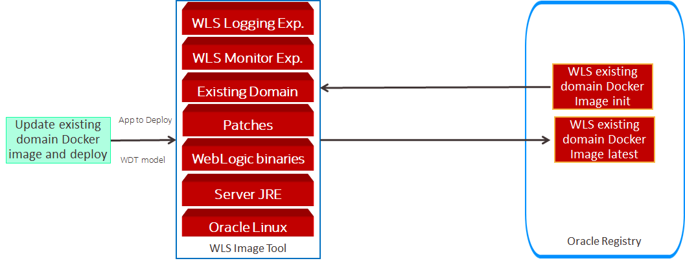
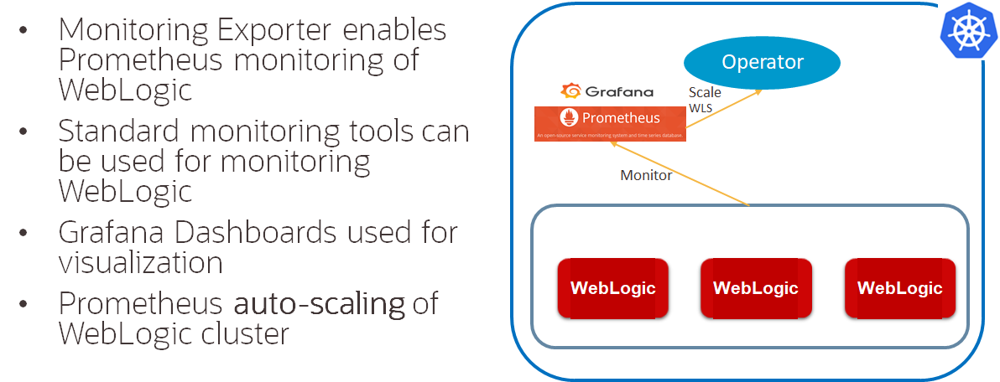
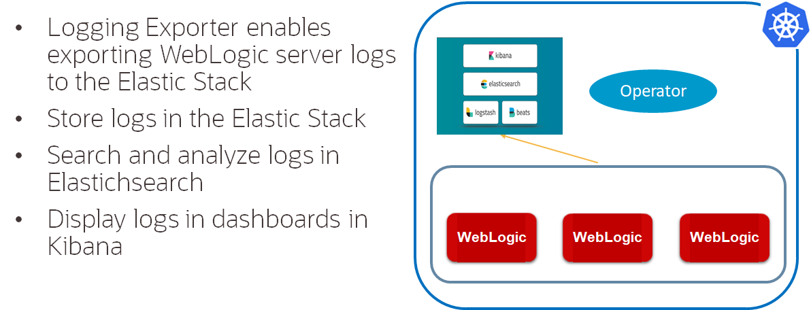

# Update Docker image to improve existing WebLogic domain #

For this Hands on Lab we are going to improve the existing Docker image of existing WebLogic Domain that was created, with init tag. In this part we will update a docker image using WebLogic Image Tool and WebLogic Deploy Tool, and the improvement part comes by adding WebLogic Monitoring Exporter and WebLogic Logging Exporter into the WebLogic Domain, the illustration like below:



### Prerequisites ###

- Access to the bastion OS that will access OKE cluster and OCIR
- Download binaries and configuration files of WebLogic Exporter, and WebLogic Logging

### Update init Docker Image in bastion ###

Check if bastion pc still get ini docker image;
```  
docker image ls
```
The expected result will be:
```
REPOSITORY                                  TAG                 IMAGE ID            CREATED             SIZE
phx.ocir.io/axrtkaqgdfo8/wls-modernization  init                a91e54a367c3        2 days ago          1.46GB
oraclelinux                                 7-slim              f23503228fa1        3 weeks ago         120MB
```
Otherwise, do a docker pull image from OCIR, just make sure we already logged in:
```
docker login phx.ocir.io -u axseivdauftz/oracleidentitycloudservice/john.p.smith@testing.com
docker pull phx.ocir.io/axseivdauftz/wls-modernization:init
```
After checking the availability of the init Docker image then we need to download the binary and configurationg files, and we need to put those files inside one directory;
```
cd
mkdir update
```
Several files for WebLogic Domain WDT archive and model need to be uploaded to /home/opc/upload directory:
```
-rw-rw-r--   1 opc opc    3353 May  1 08:48 updateDomain.yaml
-rw-rw-r--   1 opc opc   87761 May  3 08:56 updateDomain.zip
```
#### Preparing WebLogic Monitoring Exporter ####



Create WebLogic Monitoring Exporter config file from [template](https://github.com/oracle/weblogic-monitoring-exporter/blob/master/samples/kubernetes/end2end/dashboard/exporter-config.yaml) Download the binary file for WebLogic Monitoring Exporter:
```
curl -L -O https://github.com/oracle/weblogic-monitoring-exporter/releases/download/v1.1.2/wls-exporter.war
vi exporter-config.yaml
```
This example WebLogic Monitoring Exporter config will export all the metrics from the WebLogic domain:
```
# Copyright 2019, Oracle Corporation and/or its affiliates. All rights reserved.
# Licensed under the Universal Permissive License v 1.0 as shown at http://oss.oracle.com/licenses/upl.

domainQualifier: true
metricsNameSnakeCase: true
queries:
- key: name
  keyName: location
  prefix: wls_server_
  applicationRuntimes:
    key: name
    keyName: app
    componentRuntimes:
      prefix: wls_webapp_config_
      type: WebAppComponentRuntime
      key: name
      values: [deploymentState, contextRoot, sourceInfo, sessionsOpenedTotalCount, openSessionsCurrentCount, openSessionsHighCount]
      servlets:
        prefix: wls_servlet_
        key: servletName
- JVMRuntime:
    prefix: wls_jvm_
    key: name
- executeQueueRuntimes:
    prefix: wls_socketmuxer_
    key: name
    values: [pendingRequestCurrentCount]
- workManagerRuntimes:
    prefix: wls_workmanager_
    key: name
    values: [stuckThreadCount, pendingRequests, completedRequests]
- threadPoolRuntime:
    prefix: wls_threadpool_
    key: name
    values: [executeThreadTotalCount, queueLength, stuckThreadCount, hoggingThreadCount]
- JMSRuntime:
    key: name
    keyName: jmsruntime
    prefix: wls_jmsruntime_
    JMSServers:
      prefix: wls_jms_
      key: name
      keyName: jmsserver
      destinations:
        prefix: wls_jms_dest_
        key: name
        keyName: destination

- persistentStoreRuntimes:
    prefix: wls_persistentstore_
    key: name
- JDBCServiceRuntime:
    JDBCDataSourceRuntimeMBeans:
      prefix: wls_datasource_
      key: name
- JTARuntime:
    prefix: wls_jta_
    key: name
```
So here are several files for WebLogic Monitoring Exporter in /home/opc/upload directory:
```
-rw-rw-r--   1 opc opc    1586 May  3 05:30 exporter-config.yaml
-rw-rw-r--   1 opc opc    3353 May  1 08:48 updateDomain.yaml
-rw-rw-r--   1 opc opc   87761 May  3 08:56 updateDomain.zip
-rw-rw-r--   1 opc opc 2066715 May  3 05:29 wls-exporter.war
```
Update the archive with config file:
```
mv exporter-config.yaml config.yml
zip -u wls-exporter.war config.yml
mkdir -p wlsdeploy/applications/
cp wls-exporter.war wlsdeploy/applications/
zip -u updateDomain.zip wlsdeploy/applications/wls-exporter.war
```
The new list of files in /home/opc/upload directory after update:
```
-rw-rw-r--   1 opc opc    1586 May  3 05:30 exporter-config.yaml
-rw-rw-r--   1 opc opc    3353 May  1 08:48 updateDomain.yaml
-rw-rw-r--   1 opc opc 2154228 May  3 08:59 updateDomain.zip
-rw-rw-r--   1 opc opc 2066715 May  3 05:29 wls-exporter.war
```
#### Preparing WebLogic Logging Exporter ####



Create WebLogic Logging Exporter config file from [template](https://github.com/oracle/weblogic-logging-exporter/blob/master/samples/WebLogicLoggingExporter.yaml) Download the binary file for WebLogic Logging Exporter 
```
curl -L -O https://github.com/oracle/weblogic-logging-exporter/releases/download/v1.0.0/weblogic-logging-exporter-1.0.0.jar
vi WebLogicLoggingExporter.yaml
```
This example WebLogic Logging Exporter config will export WebLogic domain Server Log to elasticsearch that was installed before, the doamin will have UID wls-k8s-domain:
```
weblogicLoggingIndexName: wls
publishHost: elasticsearch.default.svc.cluster.local
publishPort: 9200
domainUID: wls-k8s-domain
weblogicLoggingExporterEnabled: true
weblogicLoggingExporterSeverity: Info
weblogicLoggingExporterBulkSize: 1
```
Beside that we need to create 1 file named setUserOverridesLate.sh that will be used to insert WebLogic Logging Exporter library that will be put into WebLogic Domain lib directory, into the domain classpath, the content will be:
```
export CLASSPATH="/u01/oracle/user_projects/domains/wls-k8s-domain/lib/weblogic-logging-exporter-1.0.0.jar:/u01/oracle/user_projects/domains/wls-k8s-domain/lib/
snakeyaml-1.23.jar:$CLASSPATH"
```
Here are list of files for WebLogic Logging Exporter for /home/opc/upload directory:
```
-rwxr-xr-x   1 opc opc     191 May  3 09:24 setUserOverridesLate.sh
-rw-rw-r--   1 opc opc  301298 May  3 05:29 snakeyaml-1.23.jar
-rw-rw-r--   1 opc opc   19794 May  3 05:29 weblogic-logging-exporter-1.0.0.jar
-rw-rw-r--   1 opc opc     207 May  3 08:07 WebLogicLoggingExporter.yaml
```
#### Preparing WebLogic Domain WDT ####

Then we need to re-configured the [original WDT model](https://github.com/tazlambert/weblogic-move-improve/blob/master/tutorials/create.domain.artifact.md#original-wdt-model) file to include new application deployment and startup class:
```
domainInfo:
    AdminUserName: 'weblogic'
    AdminPassword: 'welcome1'
topology:
    Name: 'wls-k8s-domain'
    AdminServerName: 'admin-server'
    ProductionModeEnabled: true
    NMProperties:
        JavaHome: /u01/jdk
        weblogic.StartScriptName: startWebLogic.sh
    Cluster:
        'cluster-1':
            DynamicServers:
                ServerNamePrefix: 'managed-server'
                MaxDynamicClusterSize: 5
                CalculatedListenPorts: false
                ServerTemplate: 'cluster-1-template'
                DynamicClusterSize: 5
    Server:
        'admin-server':
            NetworkAccessPoint:
                T3Channel:
                    PublicPort: 30012
                    ListenPort: 30012
                    PublicAddress: kubernetes
    ServerTemplate:
        'cluster-1-template':
            ListenPort: 8001
            Cluster: 'cluster-1'
            SSL:
                ListenPort: 8100
    SecurityConfiguration:
        Realm:
            myrealm:
                Adjudicator:
                    DefaultAdjudicator:
                        DefaultAdjudicator:
                AuthenticationProvider:
                    DefaultAuthenticator:
                        DefaultAuthenticator:
                    DefaultIdentityAsserter:
                        DefaultIdentityAsserter:
                            ActiveType: [ AuthenticatedUser, 'weblogic-jwt-token' ]
                Authorizer:
                    XACMLAuthorizer:
                        XACMLAuthorizer:
                            PolicyDeploymentEnabled: true
                CertPathProvider:
                    WebLogicCertPathProvider:
                        WebLogicCertPathProvider:
                CredentialMapper:
                    DefaultCredentialMapper:
                        DefaultCredentialMapper:
                PasswordValidator:
                    SystemPasswordValidator:
                        SystemPasswordValidator:
                            MinNumericOrSpecialCharacters: 0
                            MinPasswordLength: 0
                RoleMapper:
                    XACMLRoleMapper:
                        XACMLRoleMapper:
resources:
StartupClass:
        'weblogic-logging-exporter':
            ClassName: weblogic.logging.exporter.Startup
            Target: 'admin-server,cluster-1'

JDBCSystemResource:
        testDatasource:
            Target: 'cluster-1,admin-server'
            JdbcResource:
                JDBCConnectionPoolParams:
                    InitialCapacity: 0
                    TestTableName: SQL SELECT 1 FROM DUAL
                JDBCDataSourceParams:
                    JNDIName: jdbc/testDatasource
                JDBCDriverParams:
                    URL: 'jdbc:oracle:thin:@//xxx.xxx.x.xxx:1521/ORCLCDB'
                    PasswordEncrypted: 'welcome1'
                    DriverName: oracle.jdbc.OracleDriver
                    Properties:
                        user:
                            Value: scott
appDeployments:
    Application:
        testwebapp:
            SourcePath: wlsdeploy/applications/opdemo.war
            ModuleType: war
            Target: 'cluster-1'
        'wls-exporter':
            SourcePath: 'wlsdeploy/applications/wls-exporter.war'
            ModuleType: war
            Target: 'admin-server,cluster-1'            
```
To update the Docker image we will require to have additional build [commands](https://github.com/oracle/weblogic-image-tool/blob/master/site/update-image.md#--additionalbuildcommands) and [files](https://github.com/oracle/weblogic-image-tool/blob/master/site/update-image.md#--additionalbuildfiles) that functioned to copy all the necessary files into the docker image:
```
[before-wdt-command]
USER root
COPY --chown=oracle:oracle files/snakeyaml-1.23.jar $DOMAIN_HOME/lib
COPY --chown=oracle:oracle files/weblogic-logging-exporter-1.0.0.jar $DOMAIN_HOME/lib
COPY --chown=oracle:oracle files/setUserOverridesLate.sh $DOMAIN_HOME/bin
COPY --chown=oracle:oracle files/WebLogicLoggingExporter.yaml $DOMAIN_HOME/config
```
We can save it as addBuildCommand.docker, which will make the update directory structure like below:
```
drwxrwxr-x   2 opc opc    4096 May  3 09:11 .
drwx------. 30 opc opc    4096 May  3 09:11 ..
-rw-rw-r--   1 opc opc     342 May  3 09:11 addBuildCommand.docker
-rw-rw-r--   1 opc opc    1586 May  3 05:30 config.yml
-rwxr-xr-x   1 opc opc     191 May  3 09:24 setUserOverridesLate.sh
-rw-rw-r--   1 opc opc  301298 May  3 05:29 snakeyaml-1.23.jar
-rw-rw-r--   1 opc opc    3353 May  1 08:48 updateDomain.yaml
-rw-rw-r--   1 opc opc 2154228 May  3 08:59 updateDomain.zip
-rw-rw-r--   1 opc opc   19794 May  3 05:29 weblogic-logging-exporter-1.0.0.jar
-rw-rw-r--   1 opc opc     207 May  3 08:07 WebLogicLoggingExporter.yaml
-rw-rw-r--   1 opc opc 2066988 May  3 08:51 wls-exporter.war
```
Then we need to check WebLogic Image Tool cache list using command:
```
./imagetool.sh cache listItems
```
The result suppose to be like below:
```
Cache contents
cache.dir=/home/opc/cache
wdt_1.7.3=/home/opc/mnt/weblogic-deploy.zip
wls_12.2.1.4.0=/home/opc/mnt/fmw_12.2.1.4.0_wls.jar
jdk_8u251=/home/opc/mnt/jdk-8u251-linux-x64.tar.gz
```
And this is the command that will be used to update the Docker image with WebLogic Monitoring Exporter and WebLogic Logging Exporter:
```
./imagetool.sh update --tag phx.ocir.io/axrtkaqgdfo8/wls-move-improve:latest --fromImage phx.ocir.io/axrtkaqgdfo8/wls-move-improve:init --wdtDomainHome /u01/oracle/user_projects/domains/wls-k8s-domain --wdtOperation deploy --wdtArchive updateDomain.zip --wdtModel updateDomain.yaml --wdtVersion 1.7.3 --additionalBuildCommands addBuildCommand.docker --additionalBuildFiles snakeyaml-1.23.jar  --additionalBuildFiles weblogic-logging-exporter-1.0.0.jar --additionalBuildFiles setUserOverridesLate.sh --additionalBuildFiles WebLogicLoggingExporter.yaml
```
| Key | Value | Note |
|----------------|---------------------------------------------------------------------------|------------------------------------------------------------------------------------------------------------------------------------------------------------------|
| imagetool.sh | update | Update Docker image |
| tag | phx.ocir.io/axrtkaqgdfo8/wls-modernization:latest | New Docker image tag |
| fromImage | phx.ocir.io/axrtkaqgdfo8/wls-modernization:init | Source Docker image tag |
| wdtDomainHome | /u01/oracle/user_projects/domains/wls-k8s-domain | Existing WebLogic Domain home directory  |
| wdtOperation | deploy | WebLogic Deploy Tool mode |
| wdtArchive | updateDomain.zip | WebLogic Deploy Tool archive containing new application |
| wdtModel | updateDomain.yaml | WebLogic Deploy Tool model containing new application startup class |
| wdtVersion | 1.8.1 | WebLogic Deploy Tool version |
| additionalBuildCommands | addBuildCommand.docker | WebLogic Deploy Tool additional command to update WebLogic Domain |
| additionalBuildFiles | snakeyaml-1.23.jar | WebLogic Deploy Tool additional file for WebLogic Logging Exporter |
| additionalBuildFiles | weblogic-logging-exporter-1.0.0.jar | WebLogic Deploy Tool additional file for WebLogic Logging Exporter |
| additionalBuildFiles | setUserOverridesLate.sh | WebLogic Deploy Tool additional file for WebLogic Logging Exporter |
| additionalBuildFiles | WebLogicLoggingExporter.yaml | WebLogic Deploy Tool additional file for WebLogic Logging Exporter |

The expected result from the scripts will be:
```
[INFO   ] Image Tool build ID: b953c442-6164-4471-93a1-27276265db36
[INFO   ] Temporary directory used for docker build context: /home/opc/wlsimgbuilder_temp8402407025408780403
[INFO   ] copying snakeyaml-1.23.jar to build context folder.
[INFO   ] copying weblogic-logging-exporter-1.0.0.jar to build context folder.
[INFO   ] copying setUserOverridesLate.sh to build context folder.
[INFO   ] copying WebLogicLoggingExporter.yaml to build context folder.
[INFO   ] copying /home/opc/mnt/weblogic-deploy.zip to build context folder.
[INFO   ] docker cmd = docker build --force-rm=true --no-cache --tag phx.ocir.io/axrtkaqgdfo8/wls-move-improve:latest /home/opc/wlsimgbuilder_temp8402407025408780403
Sending build context to Docker daemon  3.551MB

Step 1/25 : FROM phx.ocir.io/axrtkaqgdfo8/wls-move-improve:init as WDT_BUILD
 ---> a91e54a367c3
Step 2/25 : ARG WDT_ENCRYPTION_KEY
 ---> Running in 255d1f10256a
Removing intermediate container 255d1f10256a
 ---> 98b624f4b369
Step 3/25 : LABEL com.oracle.weblogic.imagetool.buildid="b953c442-6164-4471-93a1-27276265db36"
 ---> Running in fa21abae9118
Removing intermediate container fa21abae9118
 ---> 040f0cd7f235
Step 4/25 : ENV WLSDEPLOY_PROPERTIES=         LC_ALL=${DEFAULT_LOCALE:-en_US.UTF-8}         DOMAIN_HOME=/u01/oracle/user_projects/domains/wls-k8s-domain         PATH=${PATH}:/u01/jdk/bin:/u01/oracle/oracle_common/common/bin:/u01/oracle/wlserver/common/bin:/u01/oracle/user_projects/domains/wls-k8s-domain/bin:/u01/oracle
 ---> Running in bb208ec6824a
Removing intermediate container bb208ec6824a
 ---> a76489f6422e
Step 5/25 : USER root
 ---> Running in 8d664198b53f
Removing intermediate container 8d664198b53f
 ---> 9d7d8de8516f
Step 6/25 : COPY --chown=oracle:oracle weblogic-deploy.zip /tmp/imagetool/
 ---> bb2d19405e31
Step 7/25 : RUN mkdir -p /u01/wdt     && chown oracle:oracle /u01/wdt
 ---> Running in 6d3368fbd85a
Removing intermediate container 6d3368fbd85a
 ---> 189c3c90fffb
Step 8/25 : USER oracle
 ---> Running in d32ec7ec27dd
Removing intermediate container d32ec7ec27dd
 ---> ec0583239f1c
Step 9/25 : RUN cd /u01/wdt     && mkdir models     && mkdir -p $(dirname /u01/oracle/user_projects/domains/wls-k8s-domain)
 ---> Running in 3e293e03e873
Removing intermediate container 3e293e03e873
 ---> a4cdb03cb3f6
Step 10/25 : COPY --chown=oracle:oracle updateDomain.yaml /u01/wdt/models/
 ---> 055c5718ed6a
Step 11/25 : COPY --chown=oracle:oracle updateDomain.zip /u01/wdt/models/
 ---> 54777f3e9c94
Step 12/25 : USER root
 ---> Running in 8344367740e6
Removing intermediate container 8344367740e6
 ---> 99c2d6648009
Step 13/25 : COPY --chown=oracle:oracle files/snakeyaml-1.23.jar $DOMAIN_HOME/lib
 ---> ec97c5e45885
Step 14/25 : COPY --chown=oracle:oracle files/weblogic-logging-exporter-1.0.0.jar $DOMAIN_HOME/lib
 ---> d0f040f17c50
Step 15/25 : COPY --chown=oracle:oracle files/setUserOverridesLate.sh $DOMAIN_HOME/bin
 ---> 87a929558422
Step 16/25 : COPY --chown=oracle:oracle files/WebLogicLoggingExporter.yaml $DOMAIN_HOME/config
 ---> cd5ac688db6b
Step 17/25 : RUN cd /u01/wdt     && jar xf /tmp/imagetool/weblogic-deploy.zip
 ---> Running in 34a79f07673a
Removing intermediate container 34a79f07673a
 ---> e12d179e9361
Step 18/25 : RUN cd /u01/wdt         && cd weblogic-deploy/bin         && chmod u+x ./*.sh         &&  ./deployApps.sh         -oracle_home /u01/oracle         -domain_home /u01/oracle/user_projects/domains/wls-k8s-domain         -domain_type WLS          -model_file /u01/wdt/models/updateDomain.yaml -archive_file /u01/wdt/models/updateDomain.zip
 ---> Running in 3489543a1ea4
JDK version is 1.8.0_251-b08
JAVA_HOME = /u01/jdk
WLST_EXT_CLASSPATH = /u01/wdt/weblogic-deploy/lib/weblogic-deploy-core.jar
CLASSPATH = /u01/wdt/weblogic-deploy/lib/weblogic-deploy-core.jar
WLST_PROPERTIES = -Djava.util.logging.config.class=oracle.weblogic.deploy.logging.WLSDeployCustomizeLoggingConfig -Dcom.oracle.cie.script.throwException=true
/u01/oracle/oracle_common/common/bin/wlst.sh /u01/wdt/weblogic-deploy/lib/python/deploy.py -oracle_home /u01/oracle -domain_home /u01/oracle/user_projects/domains/wls-k8s-domain -domain_type WLS -model_file /u01/wdt/models/updateDomain.yaml -archive_file /u01/wdt/models/updateDomain.zip

Initializing WebLogic Scripting Tool (WLST) ...

Jython scans all the jar files it can find at first startup. Depending on the system, this process may take a few minutes to complete, and WLST may not return a prompt right away.

Welcome to WebLogic Server Administration Scripting Shell

Type help() for help on available commands

####<May 3, 2020 9:34:33 AM> <INFO> <WebLogicDeployToolingVersion> <logVersionInfo> <WLSDPLY-01750> <The WebLogic Deploy Tooling deployApps version is 1.7.3:master.4f1ebfc:Apr 03, 2020 18:05 UTC>
####<May 3, 2020 9:34:35 AM> <INFO> <Validator> <__validate_model_file> <WLSDPLY-05002> <Performing validation in TOOL mode for WebLogic Server version 12.2.1.4.0 and WLST OFFLINE mode>
####<May 3, 2020 9:34:35 AM> <INFO> <Validator> <__validate_model_file> <WLSDPLY-05003> <Performing model validation on the /u01/wdt/models/updateDomain.yaml model file>
####<May 3, 2020 9:34:35 AM> <INFO> <Validator> <__validate_model_file> <WLSDPLY-05005> <Performing archive validation on the /u01/wdt/models/updateDomain.zip archive file>
####<May 3, 2020 9:34:35 AM> <INFO> <Validator> <__validate_model_section> <WLSDPLY-05008> <Validating the domainInfo section of the model file>
####<May 3, 2020 9:34:35 AM> <INFO> <Validator> <__validate_model_section> <WLSDPLY-05008> <Validating the topology section of the model file>
####<May 3, 2020 9:34:41 AM> <INFO> <Validator> <__validate_model_section> <WLSDPLY-05008> <Validating the resources section of the model file>
####<May 3, 2020 9:34:41 AM> <INFO> <Validator> <__validate_model_section> <WLSDPLY-05008> <Validating the appDeployments section of the model file>
####<May 3, 2020 9:34:41 AM> <INFO> <Validator> <__validate_model_section> <WLSDPLY-05008> <Validating the kubernetes section of the model file>
####<May 3, 2020 9:34:41 AM> <INFO> <Validator> <__validate_model_section> <WLSDPLY-05009> <Model file /u01/wdt/models/updateDomain.yaml does not contain a kubernetes section, validation of kubernetes was skipped.>
####<May 3, 2020 9:34:41 AM> <INFO> <filter_helper> <apply_filters> <WLSDPLY-20017> <No filter configuration file /u01/wdt/weblogic-deploy/lib/model_filters.json>
####<May 3, 2020 9:34:41 AM> <INFO> <deploy> <__deploy_offline> <WLSDPLY-09010> <Reading domain from /u01/oracle/user_projects/domains/wls-k8s-domain...>
####<May 3, 2020 9:35:06 AM> <INFO> <DatasourceDeployer> <_add_named_elements> <WLSDPLY-09608> <Updating JDBCSystemResource testDatasource>
####<May 3, 2020 9:35:06 AM> <INFO> <DatasourceDeployer> <_add_model_elements> <WLSDPLY-09604> <Updating JdbcResource for JDBCSystemResource testDatasource>
####<May 3, 2020 9:35:06 AM> <INFO> <DatasourceDeployer> <_add_model_elements> <WLSDPLY-09603> <Updating JDBCConnectionPoolParams for JdbcResource>
####<May 3, 2020 9:35:07 AM> <INFO> <DatasourceDeployer> <_add_model_elements> <WLSDPLY-09603> <Updating JDBCDataSourceParams for JdbcResource>
####<May 3, 2020 9:35:07 AM> <INFO> <DatasourceDeployer> <_add_model_elements> <WLSDPLY-09603> <Updating JDBCDriverParams for JdbcResource>
####<May 3, 2020 9:35:07 AM> <INFO> <DatasourceDeployer> <_add_named_elements> <WLSDPLY-09609> <Updating Properties user in JDBCDriverParams>
####<May 3, 2020 9:35:07 AM> <INFO> <ResourcesDeployer> <_add_named_elements> <WLSDPLY-09605> <Adding StartupClass weblogic-logging-exporter>
####<May 3, 2020 9:35:07 AM> <INFO> <ApplicationDeployer> <__add_applications> <WLSDPLY-09301> <Adding Application testwebapp to Domain wls-k8s-domain>
####<May 3, 2020 9:35:08 AM> <INFO> <ApplicationDeployer> <__add_applications> <WLSDPLY-09301> <Adding Application wls-exporter to Domain wls-k8s-domain>

Issue Log for deployApps version 1.7.3 running WebLogic version 12.2.1.4.0 offline mode:

Total:       WARNING :     0    SEVERE :     0

deployApps.sh completed successfully (exit code = 0)
Removing intermediate container 3489543a1ea4
 ---> 5573c1e5feeb
Step 19/25 : FROM phx.ocir.io/axrtkaqgdfo8/wls-move-improve:init as FINAL_BUILD
 ---> a91e54a367c3
Step 20/25 : USER root
 ---> Running in 87fb3d64ab44
Removing intermediate container 87fb3d64ab44
 ---> a6b1102dc6be
Step 21/25 : ENV OPATCH_NO_FUSER=true
 ---> Running in 8d983045db73
Removing intermediate container 8d983045db73
 ---> 8d3dbc3a1d0e
Step 22/25 : ENV ADMIN_NAME=${ADMIN_NAME:-admin-server}     ADMIN_HOST=${ADMIN_HOST:-wlsadmin}     ADMIN_PORT=${ADMIN_PORT:-7001}     MANAGED_SERVER_NAME=${MANAGED_SERVER_NAME:-}     MANAGED_SERVER_PORT=${MANAGED_SERVER_PORT:-8001}     DOMAIN_HOME=/u01/oracle/user_projects/domains/wls-k8s-domain     PATH=${PATH}:/u01/oracle/user_projects/domains/wls-k8s-domain/bin
 ---> Running in 388f9c6b9574
Removing intermediate container 388f9c6b9574
 ---> 34d967dee162
Step 23/25 : LABEL com.oracle.weblogic.imagetool.buildid="b953c442-6164-4471-93a1-27276265db36"
 ---> Running in c98757e2ab89
Removing intermediate container c98757e2ab89
 ---> d425ebe48305
Step 24/25 : USER oracle
 ---> Running in f8881a045a89
Removing intermediate container f8881a045a89
 ---> f64a3e91aa74
Step 25/25 : COPY --from=WDT_BUILD --chown=oracle:oracle /u01/oracle/user_projects/domains/wls-k8s-domain /u01/oracle/user_projects/domains/wls-k8s-domain/
 ---> 8a20216dd9a1
Successfully built 8a20216dd9a1
Successfully tagged phx.ocir.io/axrtkaqgdfo8/wls-move-improve:latest
[INFO   ] Build successful. Build time=325s. Image tag=phx.ocir.io/axrtkaqgdfo8/wls-move-improve:latest
```
With the update process being successfull then we can start with the next part of the lab with to topic to automate code changes and deployment.
