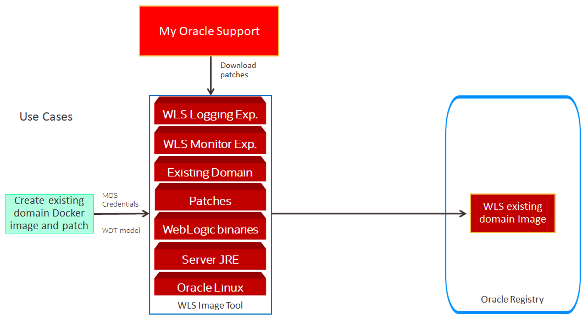

# Update Docker image to improve existing WebLogic domain #

For this Hands on Lab we are going to improve the existing Docker image of existing WebLogic Domain that was created, with init tag. In this part we will update a docker image using WebLogic Image Tool and WebLogic Deploy Tool, and the improvement part comes by adding WebLogic Monitoring Exporter and WebLogic Logging Exporter into the WebLogic Domain, the illustration like below:



```
bcdedit /set hypervisorlaunchtype off
```
and run the follofing command in PowerShell (with Admin right)
```
Disable-WindowsOptionalFeature -Online -FeatureName Microsoft-Hyper-V-Hypervisor
```

If the image still doesn't run then follow this tutorial below and install necessary tools.

### Setup Windows 10 desktop ###

OCI CLI - `oci`

https://docs.cloud.oracle.com/iaas/Content/API/SDKDocs/cliinstall.htm

---

Kubernetes CLI - `kubectl`

https://kubernetes.io/docs/tasks/tools/install-kubectl/#install-with-powershell-from-psgallery

---

Helm - `helm`

https://storage.googleapis.com/kubernetes-helm/helm-v2.8.2-windows-amd64.tar.gz

You need to unzip and when you have access(!) to your Kubernetes cluster (`kubectl` configured - follow the tutorial) then type: `helm init`

---

Git - `git`

https://git-scm.com/download/win

Execute the installer.

To clone WebLogic Operator git repository execute:
```
git clone https://github.com/oracle/weblogic-kubernetes-operator.git  -b 2.0
```
